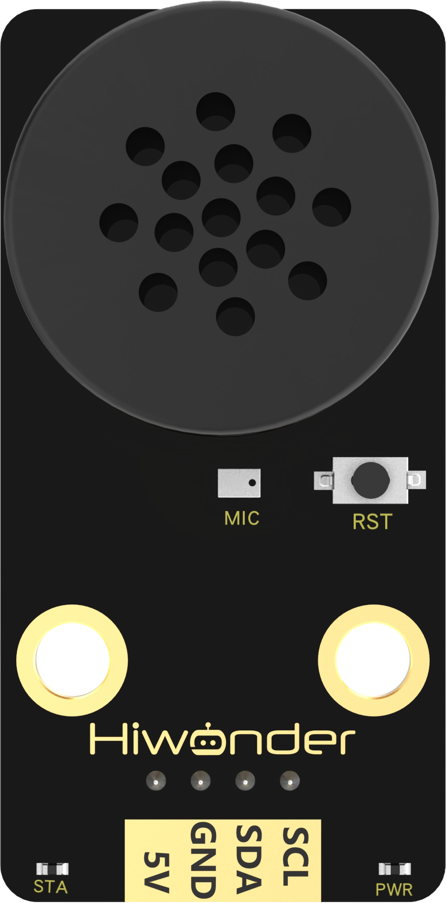
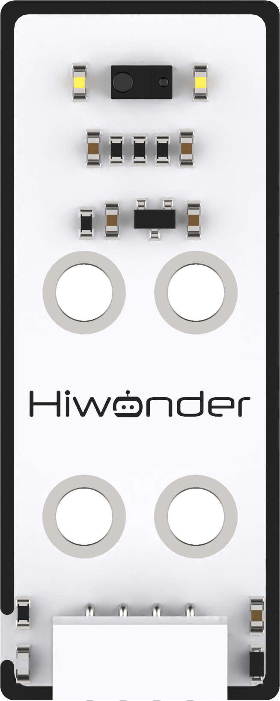

# 1. Get Started

## 1.1 Introduction to Spiderbot

**1.1.1 Introduction**

Spiderbot is a programmable hexapod robot equipped with glowing ultrasonic sensors and an accelerometer, enabling it to perform functions such as distance measurement, obstacle avoidance, and inverted walking. It features 18 intelligent bus servos that allow it to execute complex movements like walking, climbing, battling, and dancing. You can control the robot via a mobile app to switch between different walking gaits.

An optional voice interaction module is also available, enabling features such as distance measurement with voice feedback, human-robot interaction, and voice command control.

**1.1.2 Notes**

Please observe the following guidelines when using and storing Spiderbot:

(1) Spiderbot contains small parts and sharp pins, making it unsuitable for children under 12 years old.

(2) Minors must use this product under the supervision and guidance of an adult.

(3) Small and pointed components may pose a choking or injury risk. Do not put them in your mouth or apply pressure.

(4) Spiderbot includes conductive components. Do not touch it with metal objects while powered on.

(5) Do not forcefully twist or move the robot's legs after powering it on, as this may damage the servos.

(6) If the product will not be used for an extended period, fully charge the battery, remove it, and store it in a cool, dry place.

(7) When the robot is equipped with servos and powered on, stop operation immediately if any servo's output shaft is obstructed from rotating freely. Continued operation under such conditions can cause the servo to stall, dramatically increasing current and potentially leading to severe damage or burnout.

(8) **Damage to servos caused by stalling, overloading, or improper installation is not covered under warranty.** It is essential to follow proper operating procedures and avoid overloading to ensure the safe and reliable performance of both the robot and its servos.

**1.1.3 Copyright Notice**

This manual is the intellectual property of Shenzhen Hiwonder Technology Co., Ltd. No part of this document may be copied, reproduced, translated, or distributed without prior written permission.

Any unauthorized use or infringement will be subject to legal action.

**1.1.4 Disclaimer**

The products described in this manual are provided on an "**as-is**" basis, including hardware, software, etc. While every effort has been made to ensure the accuracy of the content at the time of writing, we do not guarantee that the manual is completely free of errors or omissions. The material will be periodically reviewed, and we encourage users to provide feedback for improvements.

As the product is updated with new versions, its features and specifications may change. Please contact customer service at the time of purchase for the latest product information. 

Furthermore, Hiwonder is not responsible for any malfunctions or damages caused by using the product in extreme conditions unless explicitly stated by Hiwonder as suitable for such use.

## 1.2 Packing List

(1) Spiderbot Standard Kit Packing List

| **No.** |            **Components**             | **Quantity** |                                  **Picture**                                   |
|:-------:|:-------------------------------------:|:------------:|:------------------------------------------------------------------------------:|
|    1    |               Spiderbot               |      1       |  |
|    2    |            Wireless handle            |      1       |  |
|    3    |           12.6V 2A charger            |      1       |  |
|    4    |               USB cable               |      1       |  |
|    5    |             Type-B cable              |      1       |  |
|    6    |              Screwdriver              |      1       |  |
|    7    | Screw bag Servo horn Foot pad |      1       |  |

(2)  Spiderbot Advanced Kit Packing List 

| **No.** |             **Components**             | **Quantity** |                                   **Picture**                                   |
|:-------:|:--------------------------------------:|:------------:|:-------------------------------------------------------------------------------:|
|    1    |               Spiderbot               |      1       |   |
|    2    |            Wireless handle            |      1       |   |
|    3    |           12.6V 2A charger            |      1       |   |
|    4    |               USB cable               |      1       |   |
|    5    |             Type-B cable              |      1       |   |
|    6    |              Screwdriver              |      1       |   |
|    7    |     Screw bog Servo horn Foot pad      |      1       |   |
|    8    | WonderEcho AI Voice Recognition Module |      1       |    |
|    9    |              Sound sensor              |      1       |    |
|   10    |   Infrared obstacle avoidance sensor   |      2       |   |
|   11    |              Color sensor              |      1       |   |
|   12    |              Touch sensor              |      1       |   |
|   13    |               Screw bag                |      1       |  |

## 1.3 Battery Charging and Usage Precautions

**1.3.1 Charging Instructions**

Step 1: Before charging, connect the battery using the provided connector. Connect the red wire to the red terminal and the black wire to the black terminal. 

:::{Note}

The battery adopts a reverse-polarity protection design.

:::

Step 2: Insert the charger plug into the battery's round DC port.

Step 3: A red indicator light means charging is in progress. A green light indicates charging is complete. A full charge typically requires approximately 3 hours.

**1.3.2 Battery Usage Guidelines**

(1) Use only the charger included with the kit to charge the battery.

(2) If the battery voltage is too low, the robot's performance may be affected. Try to keep the battery voltage above 10V for optimal operation.

(3) While charging, the indicator light will be red, and it will turn green when fully charged. Please unplug the charger promptly after the battery is fully charged to avoid overcharging.

(4) If the robot will not be used for an extended period, fully charge the battery, disconnect it from the connector, and store it in a cool, dry place.

(5) Do not attempt to modify, solder, or alter the battery or charger in any way.

(6) Keep batteries away from high temperatures and liquids to avoid overheating, fire hazards, or moisture-related damage.

**Important Notice:** Hiwonder is not responsible for any damage, economic loss, or safety incidents resulting from improper use of the product that does not follow the instructions outlined in this manua

**1.3.3 Spiderbot Usage Guidelines**

(1) Do not forcibly twist or move the servos after powering on the robot, as this may damage the servo motors. 

(2) Avoid keeping the servos at their limit positions for extended periods to prevent stalling or burnout.

(3) Keep your fingers away from the robot's joint areas during operation to avoid potential injury.

(4) Servos are precision components and subject to wear，long-term or excessive use may require replacement.

(5) Do not continuously use the ultrasonic sensor to detect objects at very close range.

(6) Be cautious when operating the robot near edges or elevated surfaces to prevent falls.

(7) If the robot operates for an extended period, the servos may become hot. Allow the system to cool down before continuing use.

(8) When installing the mobile app, ensure all permissions are granted and connect to the robot through the app interface.

(9) If you need to copy the program to another location, make sure to copy the entire folder. Failure to include all necessary library files may result in errors during program upload.