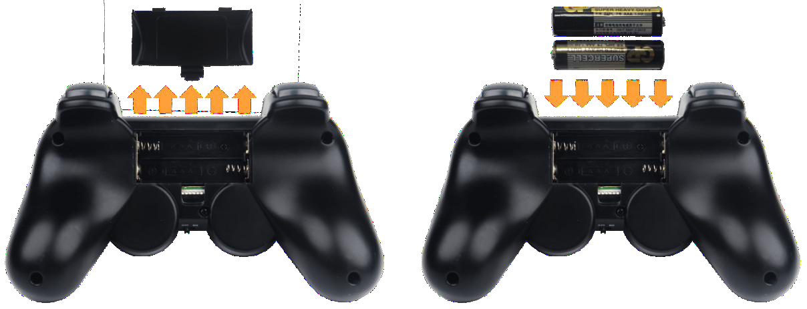
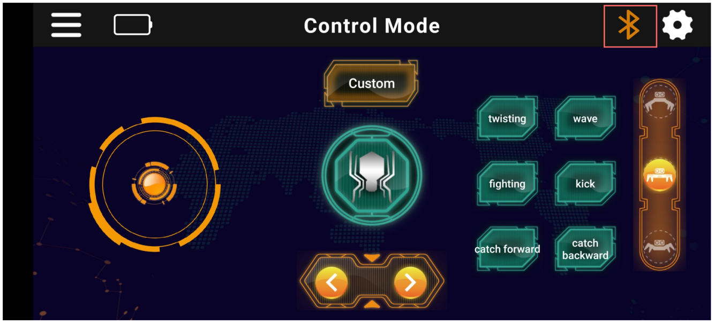
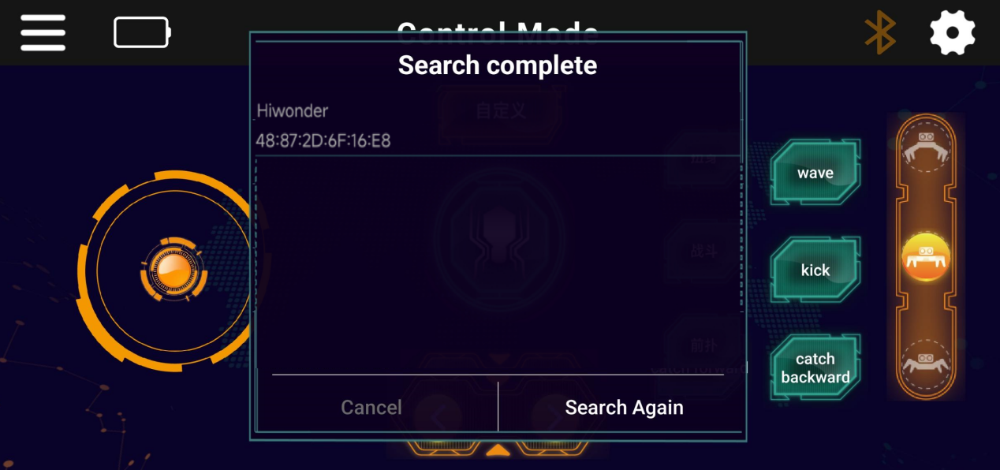
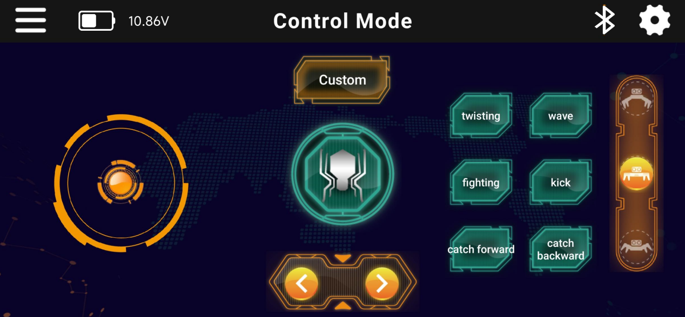
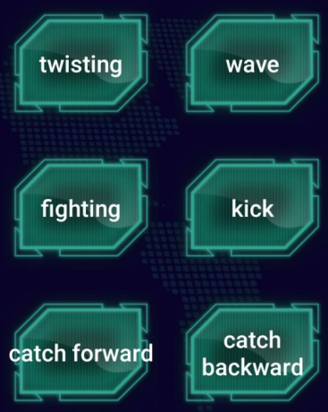

# 2. Remote Control

## 2.1 Wireless PS2 Controller

### 2.1.1 Getting Started

The wireless receiver for the controller is pre-installed in the robot at the time of shipment. To power the controller, insert two AAA batteries into the battery compartment on the back of the controller.

:::{Note}

Be sure to match the positive (+) and negative (–) terminals correctly to avoid damage.

:::

### 2.1.2 Device Connection

Step 1: Turn on the Spiderbot using the power switch.

Step 2: Turn on the controller. The red and green LED indicators on the controller will begin flashing simultaneously.

Step 3: Wait a few seconds. The robot and controller will automatically pair. Once pairing is successful, the green LED will remain solid.

Step 4: If the connection fails, turn off both the robot and the controller. Then repeat the steps above.

Sleep Mode: If the controller is not connected to the robot within 30 seconds after being powered on, or if there is no user input for 5 minutes after connection, the controller will enter sleep mode. To wake the controller, simply press the “START” button.

### 2.1.3 Button Instruction

| Button   | Function                         |
| :------- | :------------------------------- |
| START    | Attention                        |
| ↑        | Forward(small step)              |
| ↓        | Backward (small step)            |
| ←        | Turn Left (medium height stance) |
| →        | Turn Right                       |
| △        | Attack                           |
| ×        | Retreat                          |
| ◻        | Slide to Left                    |
| ○        | Slide to Right                   |
| L1       | Turn Around                      |
| R1       | Fighting                         |
| L2       | Kicking                          |
| R2       | Greeting                         |
| SELECT+△ | Defense                          |
| SELECT+× | Hurdle                           |

## 2.2 APP Control

### 2.2.1  APP Installation

iOS users: Search for "[**Wonderbot**](https://apps.apple.com/us/app/wonderbot-robot/id1519146341)" in the App Store and download the app directly.

Android users: Locate the "[**Wonderbot**](https://play.google.com/store/apps/details?id=com.Wonder.bot)" APK file in the provided resource package and install it manually on your phone.

**Important for Android users: During installation, make sure to grant all permissions to the app. Failure to do so may result in improper functionality during later operation.**

### 2.2.2 Device Connection

:::{Note}

Please note the following before connecting:

* Ensure that both Bluetooth and Location Services are enabled in your phone’s settings before launching the app.

* Do not pair the device manually via system Bluetooth settings. Instead, use the Bluetooth button within the app to initiate pairing and connection.

* This section uses the iOS version of the app as an example. The Android version follows the same procedure.

:::

(1) Launch the Wonderbot app on your phone.

(2) On the main interface, tap the flashing Bluetooth icon to enter device search mode. After a short wait, select the device named “Hiwonder” from the list.

(3) Once connected successfully, the Bluetooth icon will remain solid and the robot’s battery level will be displayed in the top-left corner of the screen.

### 2.2.3 APP Button Function Instruction

Buttons Function:

<table  class="docutils-nobg"  border="1">
<colgroup>
<col  />
<col  />
</colgroup>
<tbody>
<tr>
<td><strong>Icon</strong></td>
<td><strong>Function</strong></td>
</tr>
<tr>
<td></td>
<td>Drag upward to make the robot move forward; drag downward to move backward; drag left to turn left; drag right to turn right.</td>
</tr>
<tr>
<td></td>
<td>Control the robot's lateral movement to the left or right.</td>
</tr>
<tr>
<td></td>
<td>Tap to perform a predefined action once.</td>
</tr>
<tr>
<td></td>
<td>
Tap the top of the slider to switch to high stance.

Tap the middle to switch to medium stance.

Tap the bottom to switch to low stance.
</td>
</tr>
<tr>
<td></td>
<td>Tap to stop the current action and return the robot to the set stance, Stand at attention.</td>
</tr>
<tr>
<td></td>
<td>Tap to enter the device search list. Once the device is connected successfully, the Bluetooth icon will remain solid. Tap again to disconnect the device.</td>
</tr>
<tr>
<td></td>
<td>Display the robot’s current battery level.</td>
</tr>
<tr>
<td></td>
<td>Tap to access and play action group files that have been downloaded to the robot.</td>
</tr>
<tr>
<td></td>
<td>Tap to view the app version and restore factory default settings.</td>
</tr>
</tbody>
</table>