# 3. PC Software Control

## 3.1 PC Software Introduction

### 3.1.1 PC Software Installation

(1) Open the installation file under the same directory of this document.

(2) Choose the language and click **"OK"**.

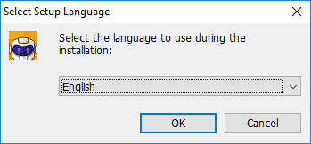

(3) **"Create desktop shortcut"** is automatically checked by default, and then click **"Next"**.

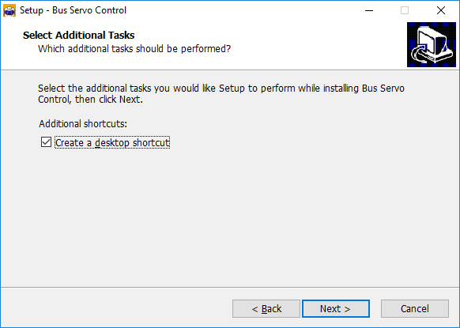

(4) Wait for the installation to complete, then click **"Finish"** on the pop-up window.

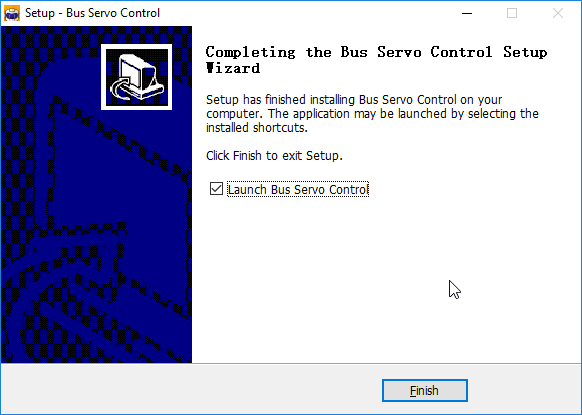

### 3.1.2 Device Connection

(1) Ensure the battery is fully charged and confirm that the power cables are properly connected. Make sure to connect the red wire to the red terminal and the black wire to the black terminal if the connection is incomplete.

(2) Use a micro-USB cable to connect the robot controller to your computer. Flip the power switch to turn on the device.

(3) Double-click to launch the PC software, then click **"Spider Mode"** at the top of the interface.

(4) Once the robot is powered on, the software will automatically attempt to connect. If successful, the upper right corner of the main interface will display "**Wire Connect**", and the indicator of the glowy ultrasonic sensor will light up green.

:::{Note}

Upon connection, the system will automatically recognize the device and install the necessary driver.

:::

### 3.1.3 Function Introduction

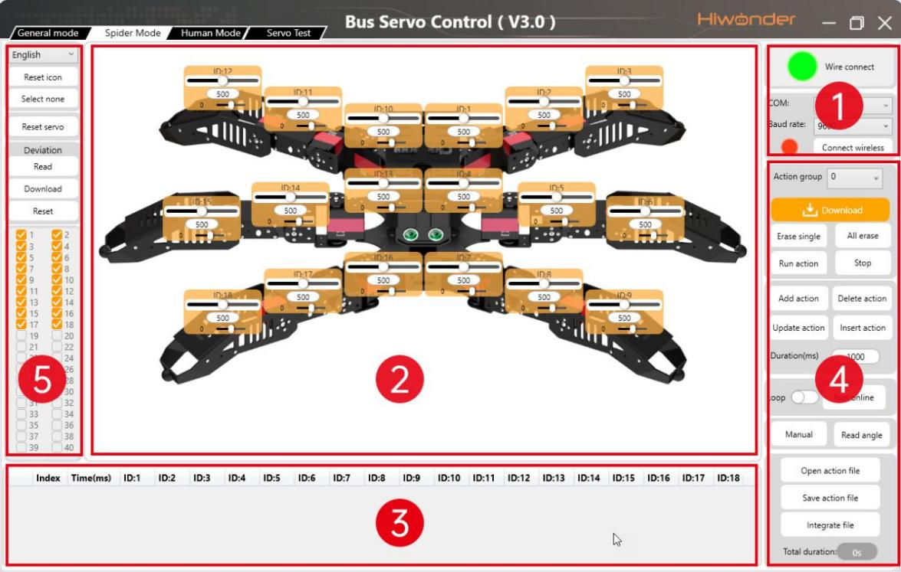

① Device Connection Area

| **Icon**                                                     | **Function**                                                 |
| :----------------------------------------------------------- | :----------------------------------------------------------- |
| 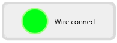 | Displays the current connection status of the device. The icon turns green indicating that the device is successfully connected, while red indicating that the device is disconnected or not detected and the message "**Disconnect**" will appear. |

② Servo Control Area

The servo control area displays the icons of the selected servos. By adjusting the corresponding slider values, you can directly control the position of each servo.

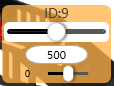

| Icon                                                         | Function                                                     |
| :----------------------------------------------------------- | :----------------------------------------------------------- |
|  | Indicates the servo ID number, for example, 9 is the servo's ID here. |
|  | Adjust the servo position, with a range from 0 to 1000.      |
|  | Adjust the servo deviation, with a range from -100 to 100.   |

③ Action Details List Area

This section displays the details of the current action group, including the execution time for each action and the values of all involved servos.

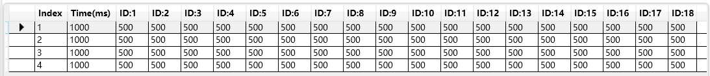

| Icon                                                         | Function                                                                                                                                                                                                                                  |
| :----------------------------------------------------------- |:------------------------------------------------------------------------------------------------------------------------------------------------------------------------------------------------------------------------------------------|
|  | Indicates the action group number. There are 230 available action groups, each capable of containing up to 510 actions. If this limit is exceeded, the system will notify that the group can only be run online and cannot be downloaded. |
| 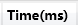 | Indicates the execution time for the corresponding action.                                                                                                                                                                                |
| 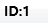 | Displays the servo's value in the current action. You can double-click a value  to directly modify it.                                                               |

④: Action Group Settings Area

<table  class="docutils-nobg" border="1">
<colgroup>
<col style="width: 42%" />
<col style="width: 57%" />
</colgroup>
<tbody>
<tr>
<td style="text-align: left;">Icon</td>
<td style="text-align: left;">Function</td>
</tr>
<tr>
<td style="text-align: left;">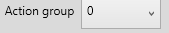</td>
<td style="text-align: left;">Dropdown menu to select Action group number. Allows selection of an action group from 0 to 230. Action Group 0 is set by default for action of Stand at attention.</td>
</tr>
<tr>
<td style="text-align: left;"></td>
<td style="text-align: left;">Download the current list of actions to the controller, which will overwrite the original actions in the selected action group.</td>
</tr>
<tr>
<td style="text-align: left;">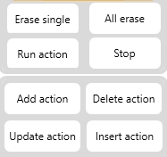</td>
<td style="text-align: left;">Erase all actions in the currently selected action group. Use with caution! Click to erase all actions in groups 0 to 230.</td>
</tr>
<tr>
<td style="text-align: left;"></td>
<td style="text-align: left;">Execute the selected action group once.</td>
</tr>
<tr>
<td style="text-align: left;"></td>
<td style="text-align: left;">Stop the currently running action group.</td>
</tr>
<tr>
<td style="text-align: left;"></td>
<td style="text-align: left;">Add the current servo values from the Servo Control Area as a new action to the last row of the Action Details List.</td>
</tr>
<tr>
<td style="text-align: left;"></td>
<td style="text-align: left;">Delete the selected action from the Action Details List.</td>
</tr>
<tr>
<td style="text-align: left;"></td>
<td style="text-align: left;">
Replace the selected angle values in the Action Details List.

The angle values will be replaced with those in the center Servo Control Area, and the duration will be replaced by the value in "<strong>Duration(ms)</strong>".
</td>
</tr>
<tr>
<td style="text-align: left;"></td>
<td style="text-align: left;">
Insert a new action above the selected action.

The inserted action will use the servo values from the center Servo Control Area and the duration set in "<strong>Duration(ms)</strong>".
</td>
</tr>
<tr>
<td style="text-align: left;">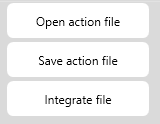</td>
<td style="text-align: left;">
Click and select an action group file to load its data into the Action Details List.

The path to the action group files we provide is located in "<a href="">Appendix → Action Group Files</a>".
</td>
</tr>
<tr>
<td style="text-align: left;"></td>
<td style="text-align: left;">Save the actions currently in the Action Details List to a specified location.</td>
</tr>
<tr>
<td style="text-align: left;"></td>
<td style="text-align: left;">After opening one action group file, click the "<strong>Integrate File</strong>" button to load another file and combine the two into a new group.</td>
</tr>
<tr>
<td style="text-align: left;">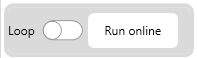</td>
<td style="text-align: left;">Click to run the actions in Action Details List once. If "<strong>Loop</strong>" is checked, the robot will repeat the sequence.</td>
</tr>
<tr>
<td style="text-align: left;">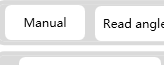</td>
<td style="text-align: left;">Click the button will relax the joints of the robotic arm, allowing it to be manually positioned into the desired pose.</td>
</tr>
<tr>
<td style="text-align: left;">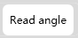</td>
<td style="text-align: left;">Read the current servo angle values from the robot's physical pose. Must be used in conjunction with the "<strong>Manual</strong>" button.</td>
</tr>
</tbody>
</table>

⑤: Servo Settings (For Reference)

<table  class="docutils-nobg" border="1">
<colgroup>
<col style="width: 42%" />
<col style="width: 57%" />
</colgroup>
<tbody>
<tr>
<td style="text-align: left;">Icon</td>
<td style="text-align: left;">Function</td>
</tr>
<tr>
<td style="text-align: left;">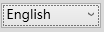</td>
<td style="text-align: left;">Set the interface language. Click to choose from Simplified Chinese / Traditional Chinese / English.</td>
</tr>
<tr>
<td style="text-align: left;">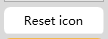</td>
<td style="text-align: left;">If the servo icons are misplaced, click this button to restore the default layout. Applicable in General Mode.</td>
</tr>
<tr>
<td style="text-align: left;">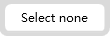</td>
<td style="text-align: left;">Click to deselect all selected servos. Applicable in General Mode.</td>
</tr>
<tr>
<td style="text-align: left;">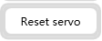</td>
<td style="text-align: left;">Click to return all servos to central position.</td>
</tr>
<tr>
<td style="text-align: left;">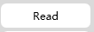</td>
<td style="text-align: left;">Click to automatically read the saved deviation values from the controller.</td>
</tr>
<tr>
<td style="text-align: left;">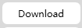</td>
<td style="text-align: left;">Click to upload the adjusted deviation values from the software to the robot.</td>
</tr>
<tr>
<td style="text-align: left;">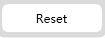</td>
<td style="text-align: left;">Click to clear the software's deviation data, which will not affect the deviation data stored in the controller.</td>
</tr>
<tr>
<td style="text-align: left;">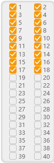</td>
<td style="text-align: left;">
This number indicates the Servo ID. If the checkbox in front of the number is selected, the corresponding servo's control icon will appear in the Servo Control Area.

Spiderbot uses servos with ID numbers 1 to 18. Other IDs cannot be selected in Spider Mode.
</td>
</tr>
</tbody>
</table>

## 3.2 Action Group Execution Tutorial

This section explains how to execute action groups using the PC software and how to download them to the robot's controller.

### 3.2.1 Open Action File

(1) Power on the robot, double-click to launch the PC software, then click **"Spider Mode"** at the top of the interface.

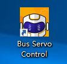

(2) Once the robot is powered on, the software will automatically attempt to connect. If successful, the upper right corner of the main interface will display "**Wire Connect**", and the indicator in the glowy ultrasonic sensor will light up green.

Upon connection, the system will automatically recognize the device and install the necessary driver.

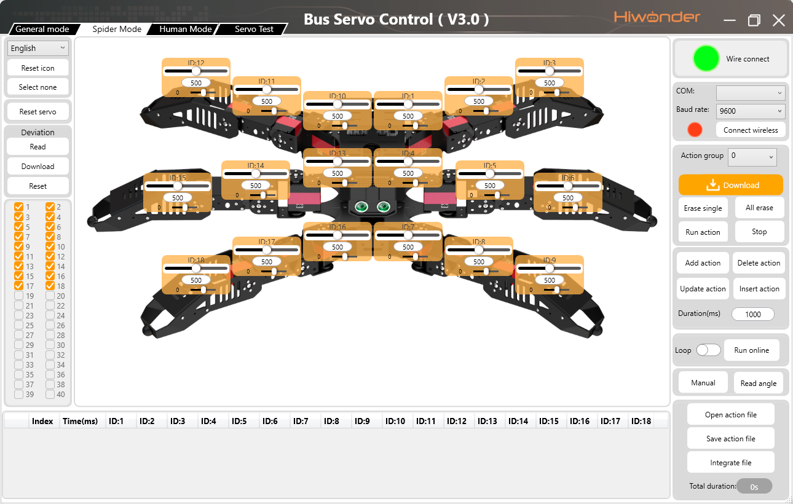

(3) Click **"Open action file"**.

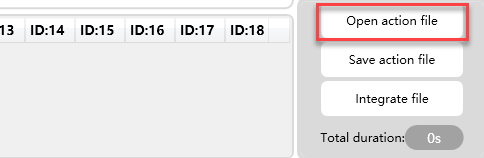

(4) Navigate to the path: [Appendix → Action Group Files](Appendix.md), and select the file named **"No.12 Greeting"**, then click **"Open"**.

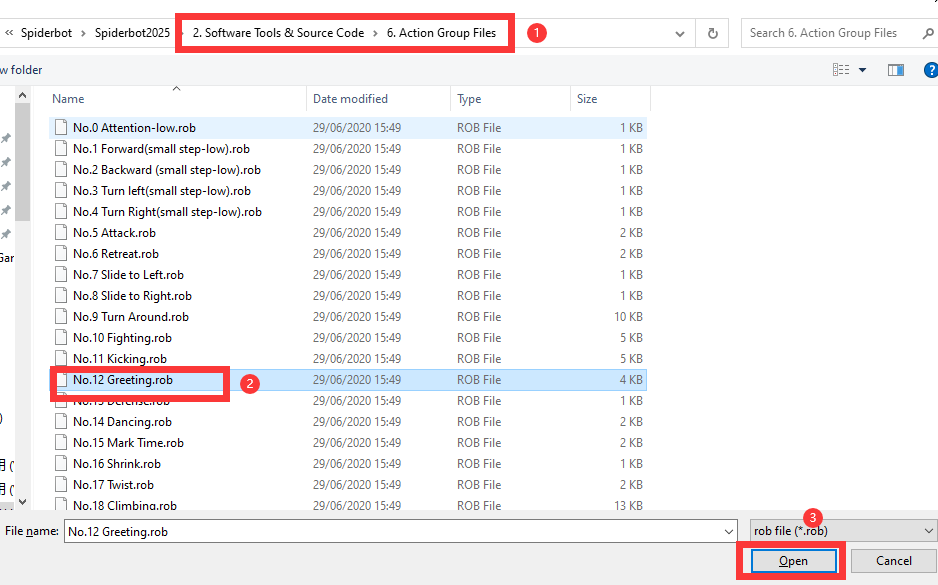

(5) You will now see the loaded file listed in the Action Details List.

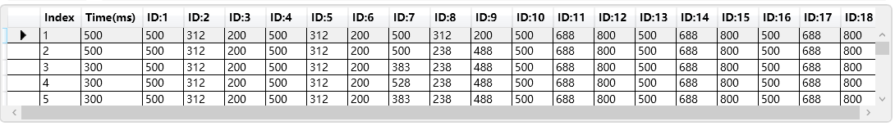

### 3.2.2 Run the Action Group Online

Click **"Run online"** to execute the selected action group.

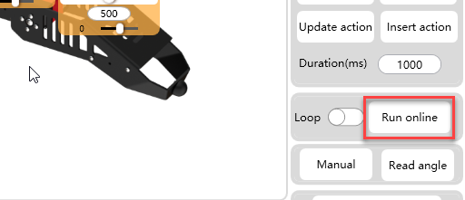

### 3.2.3 Download the Action Group

If you want the robot to run this action offline or call it from a program later, you must download the action group to the robot's controller.

(1) Click the dropdown menu next to the Action Group button to select the Action group number. Note: Some action groups between 0 and 110 are preloaded. To avoid overwriting existing data, select a number greater than 110.  

In this example, choose 130 and click Download.

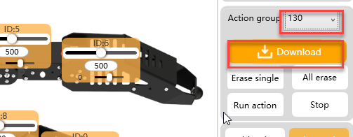

(2) Once the download is complete, a confirmation window will pop up. Click **"OK"** to close it.

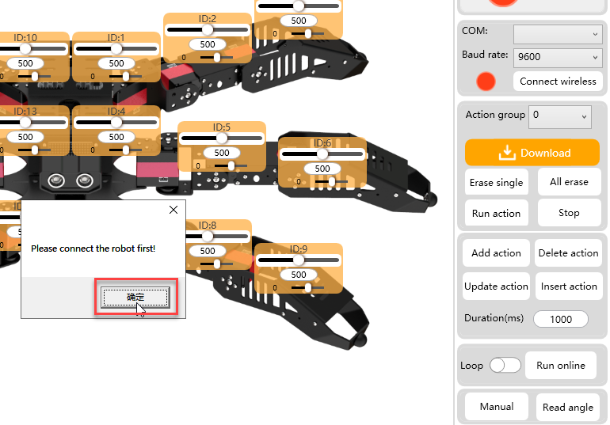

(3) To execute the downloaded action group, select its number and click "**Run action**".

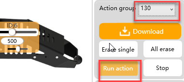

(4) You can call it by entering its assigned group number in the program.

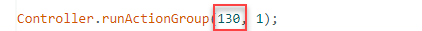

## 3.3 Action Group Programming

In this section, you will learn to create an action group consisting of 7 actions that enable the robot to perform a greeting gesture.

### 3.3.1 Action Design

(1) Power on the robot and connect it to your computer as instructed in the previous sections. Double-click to launch the PC software, then click **"Spider Mode"** at the top of the interface.

(2) Click **"Open action file"** in the Action Group Settings area. Open Action Group 0 located under the path: [Appendix → Action Group Files](Appendix.md).

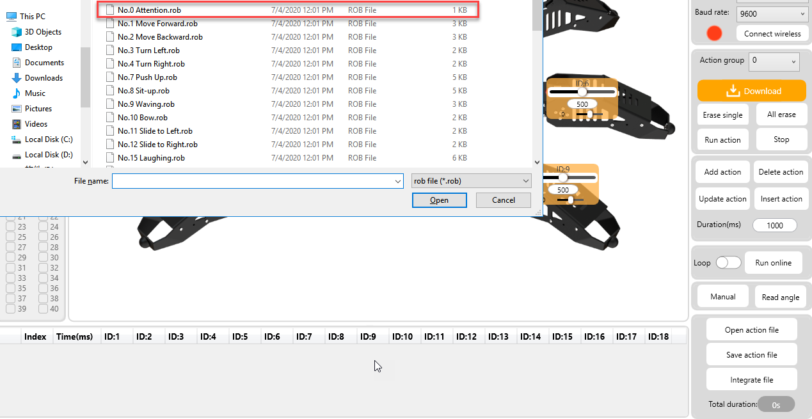

(3) With the first action loaded, clicking "**Run online**" will apply the servo values to the robot.

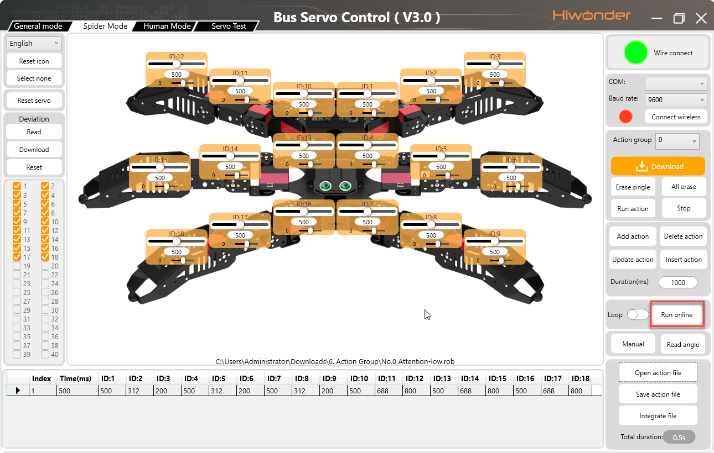

(4) Next, let's design the second action by raising the robot's front right leg. According to the servo ID layout, adjust Servo ID 17 by sliding its slider to a value of 815, then click "**Add action**".

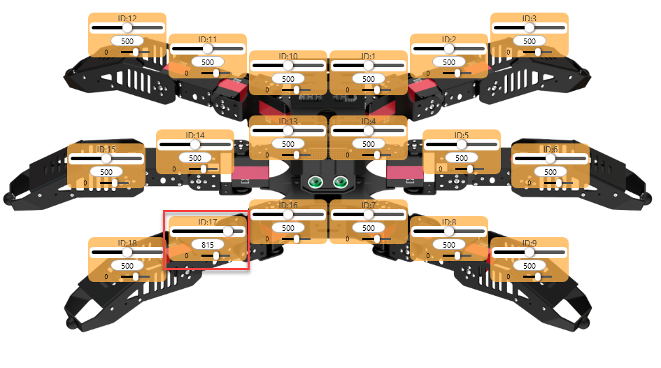

To adjust the value, hold down the left mouse button and drag the slider. For fine-tuning, quickly click on the left or right side of the slider.

(5) To make the robot rotate its front leg, slightly adjust Servo ID 16 to 640, then click "**Add action**" to insert it as the third action.

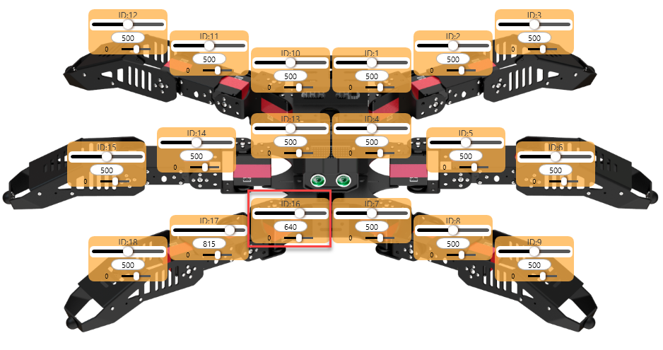

(6) Then, raise the front leg further by setting Servo ID 18 to 550, and add this as the fourth action.

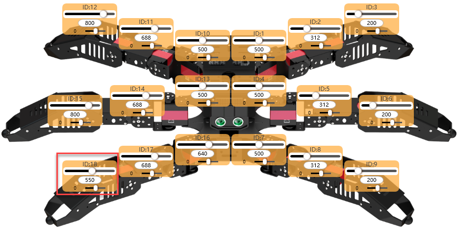

(7) To lower the leg, slide Servo ID 18 to 740, and add this as the fifth action.

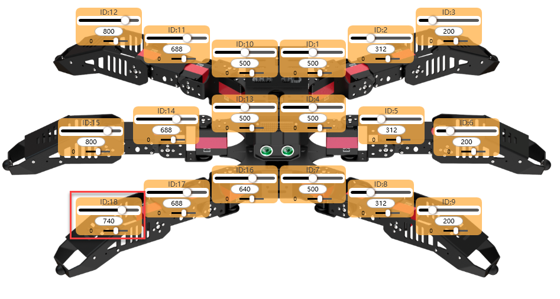

(8) Next, raise the leg again by adjusting Servo ID 18 to 590, and add this as the sixth action.

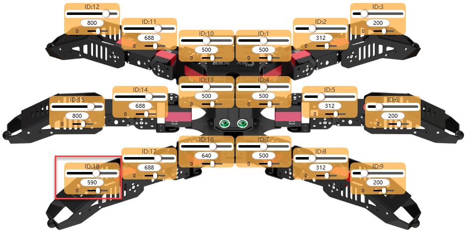

(9) Finally, set the robot to return to the initial action of Stand at Attention after waving the leg. To copy Action 1, you need to right-click on Action 1, choose Copy, and select Action 6, then right-click to choose Paste Down.

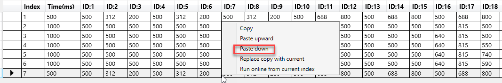

(10) The action group is now complete. The Action Details List records all the servo parameters required for this motion sequence.

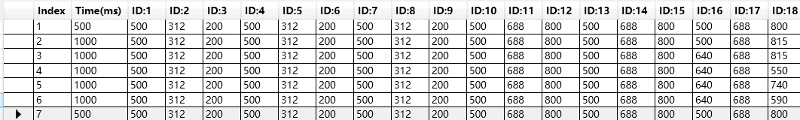

### 3.3.2 Download the Action Group

(1) After completing the actions, save them locally for future testing or modification. Click **"Save action file"**, enter the desired file name and number in the popup window, 120hello in this case, and click **"Save"**.

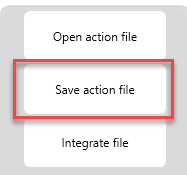

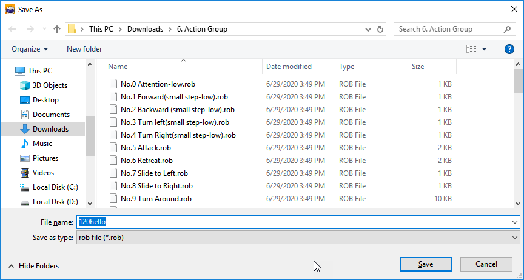

(2) Next, download the saved actions to the corresponding action groups. On the right side of the interface, select action group number 120, then click **"Download"**.

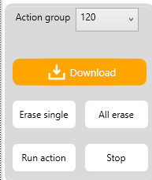

Once the download is complete, the robot will emit a beep sound, and a dialog box will appear confirming "**Download Complete**". Click "**OK**" to close the dialog.

## 3.4 Custom Control via APP

### 3.4.1 Objective

In this section, you will learn to use the custom action feature in the Wonderbot mobile app to display the greeting action group created in 3.3.1 Action Group Programming.

### 3.4.2 Implementation

* **Preparations**

(1) Ensure the robot is fully charged. When powered on, it should not trigger any low battery alerts.

(2) Make sure Bluetooth and location services are enabled on your phone.

(3) Confirm that the created Action Group 120 has been successfully downloaded to the robot. A confirmation message will appear in the PC software upon successful download.

* **Operation Steps**

(1) Turn on the robot and launch the app Wonderbot on your phone.

(2) Connect the device following the steps described in [2. Remote Control->2.2 APP Control](2.Remote_Control.md#app-control).

(3) Tap **"Custom"** in the interface and then tap **"Add"** in the popup window.

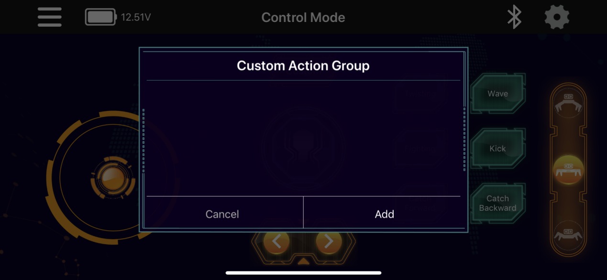

(4) In the form that appears, enter an action group name and action group number.

The name can be anything you like, but the action group number must be entered correctly or the action will not work.

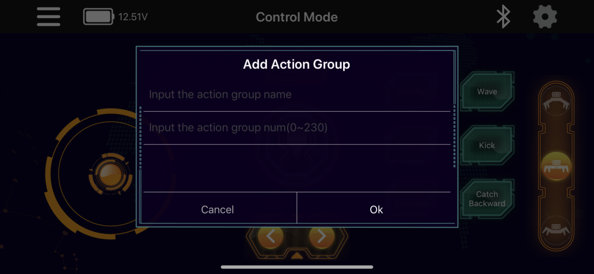

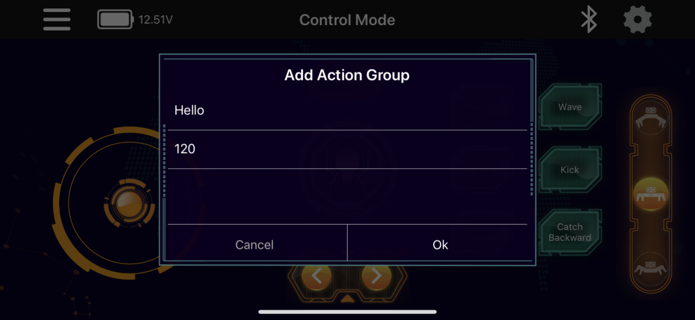

(5) Once added, tap the custom action button to execute the action once.

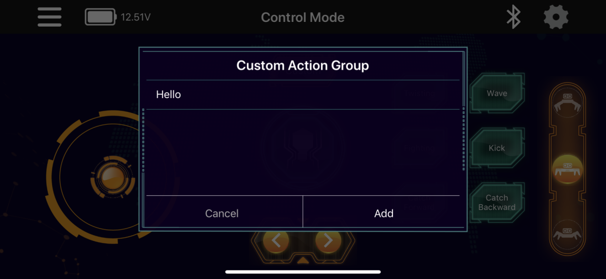

(6) To delete a custom action, swipe or long-press the action button, then tap "**Delete**".

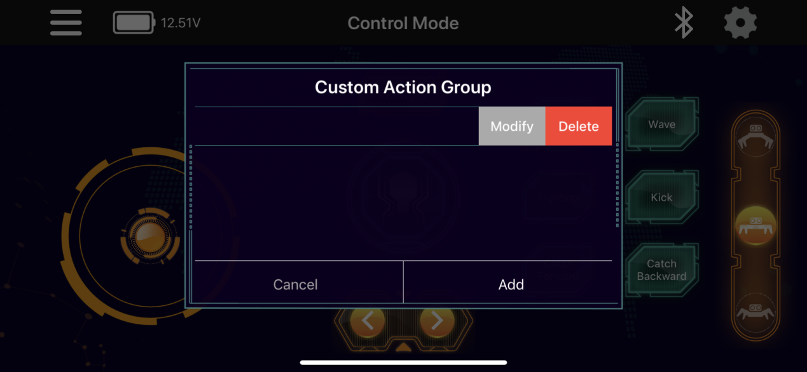

## 3.5 Action File Integration

### 3.5.1 Objective

In this section, you will learn how to use the action file integration feature to combine multiple action groups into one.

### 3.5.2 Implementation

(1) Launch the PC software and connect to the serial port. Click **"Integrate file"** in the Action Group Settings area. Open Action Group 1 located under the path: [Appendix → Action Group Files](Appendix.md).

(2) The parameters of Action Group 1 are displayed in the Action Details List.

(3) Click **"Integrate file"** again, and this time select Action Group 2 to append it to the current list.

(4) You can click **"Run online"** to test the newly integrated action group in real time.

(5) To save the integrated action group for future debugging, click **"Save action file"**. The file is named **"NO.121 Forward and Backward"** in this example.

(6) If the total number of actions in the Action Details List exceeds 510, the software will display a warning message. In this case, the action group cannot be downloaded to the controller and can only be run online for testing.

## 3.6 Offline Operation

### 3.6.1 Objective

This section demonstrates how to enable the robot to operate independently from the PC software, executing preset actions triggered by a button press.

### 3.6.2 Implementation

(1) Open any action group file from the directory [Appendix → Action Group Files](Appendix.md), such as Action Group 10 – Fighting.

(2) On the right side of the interface, select action group number 100, then click **"Download"**.

:::{Note}

Action Group 100 is designated as the default offline start group. Other group numbers cannot be used to trigger offline execution. For example, downloading to group number 98 will not work.

:::

(3) After the download completes, a confirmation dialog will appear in the control software. Click **"OK"** to close the dialog.

(4) Place the robot on a flat surface and turn on the power switch. Press the "**Run**" button on the controller briefly to execute Action Group 100 in offline mode.

Press and hold the **"Run"** button for 3 seconds to enable continuous loop playback of the action group.