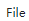
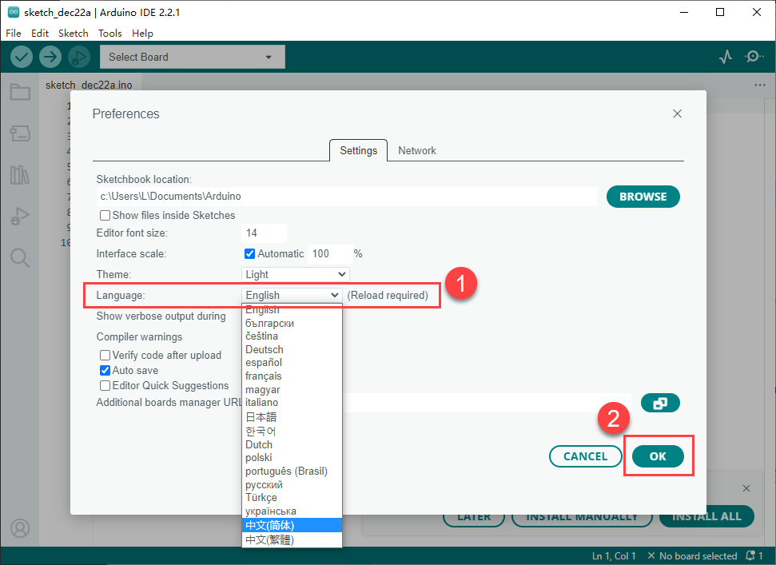
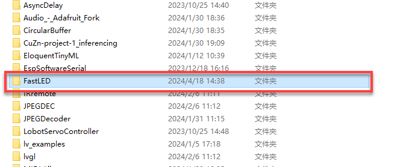

# 4. Introduction and Installation of Arduino IDE

## 4.1 Installation and Interface Overview of the Arduino IDE

:::{Note}

Installation instructions for Mac can be found in the corresponding section of this guide.

:::

### 4.1.1 Installation

The Arduino IDE is a powerful software platform specifically designed for use with Arduino microcontroller. The installation process is consistent across different versions. The following instructions use the Windows version of Arduino IDE 2.2.1 as an example.

(1) Locate the Arduino IDE installation package provided in the same directory as this document. Double-click the installer to begin. To download the latest version of the software, visit the official Arduino website: [**<u>https://www.arduino.cc/en/software</u>**](https://www.arduino.cc/en/software)

(2) Click **"I Agree"** to accept the license agreement to proceed with the installation.

(3) Use the default selected options and click **"Next"** to continue.

(4) Choose the desired installation path by clicking "**Browse**", then click "**Install**" to begin installation.

(5) Wait for the installation process to complete.

:::{Note}

If prompted to install USB drivers during the installation, select "**Always trust software from Arduino LLC**" and click "**Install**."

:::

(6) Once installation is complete, click "**Finish**" to exit the installer.

### 4.1.2 Interface Overview

(1) The main interface of the Arduino IDE is divided into five primary sections:

(2) Menu Bar provides access to key settings and configuration options for the Arduino IDE.

| **Icon**                                                     | **Function**                                                 |
| :----------------------------------------------------------- | :----------------------------------------------------------- |
|  | Create or open projects, and configure interface preferences |
|  | Comment, indent, find/replace text                           |
|  | Configure and compile projects, manage libraries             |
|  | Select controllers and ports, access controller information  |
|  | Access tutorials, troubleshooting resources                  |

(3) Toolbar contains essential tools for project development, including program compilation, uploading, and serial monitoring.

| **Icon**                                                     | **Function**                                                 |
| :----------------------------------------------------------- | :----------------------------------------------------------- |
|  | Verify: Check for errors and compile the code                |
|  | Upload: Upload the program to the Arduino controller         |
|  | Debug: Real-time debugging for supported controllers         |
|  | Select Controller: Select the target controller for the project |
|  | Serial Plotter: Visualize serial data as a graph             |
|  | Serial Monitor: Display data from the serial port            |

(3) Editor Area: The primary area for writing and editing code.

(4) Status Bar: Displays relevant editor and project information, such as cursor position, controller selection, and other status indicators.

(5) Sidebar: A key component of the Arduino IDE, providing tools for file management, code debugging, and library installation.

| **Icon**                                                     | **Function**                                        |
| :----------------------------------------------------------- | :-------------------------------------------------- |
|  | Explorer: shows the current project's files         |
|  | Board Manager: add or manage packages of controller |
|  | Library Manager: install or remove code libraries   |
|  | Debug: perform real-time project debugging          |
|  | Search: search or replace code and variables        |

## 4.2 Using the Arduino IDE

### 4.2.1 Arduino IDE Interface Configuration

(1) To switch the interface language to English, navigate to **File \> Preferences**, then locate the Language setting in the pop-up window. Select **"English"** from the list and click **"OK"** to apply the changes.

(2) Additional preferences such as project file location, editor font size, and color theme can also be configured from this menu.

### 4.2.2 Upload Program to the Arduino

(1) This section demonstrates how to upload a simple program that prints the text **"hiwonder"**. Locate and open the sample sketch file Demo.ino found in the [_Demo ](../_static/source_code/Demo.zip)folder under the same directory as this document.

(2) Connect the Arduino controller to the computer using a USB Type-B cable.

(3) From the **"Select Board"** menu, choose the appropriate controller. For example, when using an Arduino Uno, select it accordingly. The COM port may vary, but you can refer to the **"Device Manager"** on the computer to identify the correct COM number, COM6 is taken as the port in this section.

(4) Click the  button to compile the sketch and check for syntax errors or other issues.

(5) Once compiled successfully, click  button to transfer the program to the Arduino controller.

(6) After uploading, open the Serial Monitor . The text **"hiwonder"** should appear, confirming that the program is running correctly.

### 4.2.3 Importing Libraries

When external libraries are required by a sketch, two import methods are available: Online Import and Local Import.

* **Online Import**

This method is suitable for importing standard libraries provided by the Arduino platform, such as Servo for controlling servo motors, PID for implementing PID algorithms, FastLED for driving RGB LEDs.

For instance, to install the FastLED library, follow the steps below:

(1) Click the Library Manager icon  in the left sidebar of the Ardu ino IDE.

(2) In the search bar, type **"FastLED"**. The library will appear in the search results, and click **"Install"**.

(3) A confirmation message will appear upon successful installation.

* **Local Import**

This method is used for importing downloaded or custom library files. Using FastLED as an example:

(1) Go to **Sketch \> Include Library \> Add.ZIP** Library in the Arduino IDE.

(2) In the dialog box, locate the FastLED.zip file, which can be found in:  [_Demo](../_static/source_code/Demo.zip), Select the file and click **"Open"**.

(3) A confirmation message will indicate successful installation.

:::{Note}

If an error occurs during local import, follow the steps below to resolve it by manually placing the library in the appropriate directory:

:::

Using the FastLED library as an example, this issue can be resolved by extracting the library files and placing the extracted folder directly into the libraries directory within the project path. Steps as follows:

① Extract the contents of the [FastLED.zip](../_static/source_code/Demo.zip) archive.

② Open File \> Preferences in the Arduino IDE.

③ Copy the Sketchbook location path shown in the preferences window.

④ Paste the path into the file explorer and press Enter to open the directory.

⑤ Move the extracted FastLED folder into the libraries folder within this path.

⑥ Restart the Arduino IDE. The library should now be available and recognized.