# 5. Intelligent Games Learning

## 5.1 Overview of Libraries for Secondary Development

During the development process, several libraries are utilized to simplify function calls within the program. These include both official Arduino libraries such as Servo and SoftwareSerial, as well as custom libraries including LobotServoController.

This section provides an overview of the custom libraries and core functions used in secondary development applications. The LED_Matrix library, which has been fully encapsulated, will not be covered in this section.

<table  class="docutils-nobg" border="1">
<colgroup>
<col  />
<col  />
<col  />
<col  />
</colgroup>
<tbody>
<tr>
<td colspan="4" ><strong>HWSensor::ultrasoundGetDistance()</strong></td>
</tr>
<tr>
<td >Description</td>
<td colspan="3" >Directly retrieves the measured distance from the ultrasonic module</td>
</tr>
<tr>
<td >Parameters</td>
<td >None</td>
<td >Return Value</td>
<td >A uint16_t value representing the distance</td>
</tr>
<tr>
<td >Usage Explanation</td>
<td colspan="3" >
<p>HWSensor hws; Creates glowy ultrasonic object</p>
<p>hws.ultrasoundGetDistance(); Returns the measured distance affected by interference</p>
</td>
</tr>
</tbody>
</table>

### 5.1.2 LobotServoController Library

The LobotServoController library is used to control bus servos. It enables execution of individual servo movements and predefined motion sequences for robots.

The following section introduces several frequently used functions from this library.

* **Member Function: LobotServoController::moveServo**

{lineno-start=51}

```
void LobotServoController::moveServo(uint8_t servoID, uint16_t Position, uint16_t Time)
{
	uint8_t buf[11];
	if (servoID > 31 || !(Time > 0)) { //The servo ID cannot be greater than 31, it can be modified according to the corresponding controller
		return;
	}
	buf[0] = FRAME_HEADER;                   //Fill frame header
	buf[1] = FRAME_HEADER;
	buf[2] = 8;                              //Data length = sevo number*3+5，此处=1*3+5
	buf[3] = CMD_SERVO_MOVE;                 //Fill the servo movement command
	buf[4] = 1;                              //Servo number
	buf[5] = GET_LOW_BYTE(Time);             //Low eight bits of fill time
	buf[6] = GET_HIGH_BYTE(Time);            //High eight bits of fill time
	buf[7] = servoID;                        //Servo ID
	buf[8] = GET_LOW_BYTE(Position);         //Fill the lower eight bits of the target position
	buf[9] = GET_HIGH_BYTE(Position);        //Fill the higher eight bits of the target position

	SerialX->write(buf, 10);
}
```

This member function of the LobotServoController class is used to control the rotation of a single bus servo. It accepts three parameters, including servoID, Position, and Time, which represent the ID of the target servo, the position to rotate to, and the duration of the movement, respectively. Description of the function refers to the table below.

<table class="docutils-nobg"  border="1">
<colgroup>
<col  />
<col  />
<col  />
<col  />
</colgroup>
<tbody>
<tr>
<td colspan="4" ><strong>LobotServoController::moveServo</strong></td>
</tr>
<tr>
<td >Description</td>
<td colspan="3" >Controls the rotation of a single bus servo</td>
</tr>
<tr>
<td >Parameters</td>
<td >servoID、Position、Time</td>
<td >Return Value</td>
<td >None</td>
</tr>
<tr>
<td >Usage Explanation</td>
<td colspan="3" >
<p>LobotServoController lsc(MySerial); creates bus servo controller object</p>
<p>lsc.moveServo(16,670,500);</p>
</td>
</tr>
</tbody>
</table>

The function uses write to send data to the servo controller via the serial interface. The command follows the protocol format: header + data length + function code + data.

The servo ID, target position, and duration are packaged according to the protocol and sent to the controller. Upon receiving the command, the controller moves the servo to the specified position.

* **Member Function: LobotServoController::runActionGroup**

The runActionGroup function, a member of the LobotServoController class, is used to execute a predefined action group through the servo controller. It takes two parameters, numOfAction and Times, which specify the action group number to be executed and the number of times it should run. Within the function, both parameters are sent to the servo controller via the serial port, formatted according to the communication protocol. Upon receiving the command, the controller locates the specified action group and initiates its execution accordingly.

{lineno-start=144}

```
void LobotServoController::runActionGroup(uint8_t numOfAction, uint16_t Times)
{
	uint8_t buf[7];
	buf[0] = FRAME_HEADER;   //fill frame header
	buf[1] = FRAME_HEADER;
	buf[2] = 5;      //Data length, the number of data bytes in the data frame except the frame header, this command is fixed at 5
	buf[3] = CMD_ACTION_GROUP_RUN; //Fill in the running action group command
	buf[4] = numOfAction;      //Fill in the running action group number
	buf[5] = GET_LOW_BYTE(Times); //Get the low eight bits of the number of runs
	buf[6] = GET_HIGH_BYTE(Times); //Get the high eight bits of the number of runs
	isRunning_ = true;
	SerialX->write(buf, 7);      //Send data frame
}
```

<table  class="docutils-nobg" border="1">
<colgroup>
<col  />
<col  />
<col  />
<col  />
</colgroup>
<tbody>
<tr>
<td colspan="4" ><strong>LobotServoController::runActionGroup()</strong></td>
</tr>
<tr>
<td >Description</td>
<td colspan="3" >Executes action group of controller</td>
</tr>
<tr>
<td >Parameters</td>
<td >numOfAction、Times</td>
<td >Return Value</td>
<td >None</td>
</tr>
<tr>
<td >Usage Explanation</td>
<td colspan="3" ><p>LobotServoController lsc(MySerial); Creates bus servo controller object</p>
<p>lsc.runActionGroup(0,1);</p></td>
</tr>
</tbody>
</table>

##  5.2 Dot Matrix Display

### 5.2.1 Project Introduction

This lesson demonstrates how to use a dot matrix module to scroll and display a string of characters.

### 5.2.2 Project Process

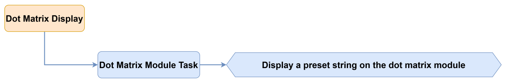

### 5.2.3 Module Instruction

The LED dot matrix module is a display unit that features high brightness, no flickering during display, and easy wiring, and it can show numbers, text, and patterns. This module consists of two red 8x8 LED matrices and is controlled by the TM640B driver chip, which enables control of the dot matrix display.


### 5.2.4 Program Download

(1) Open the program file located in the same directory as this lesson: [Dot Matrix Display Program\LED_Matrix\LED_Matrix.ino](../_static/source_code/intelligent_games_learning.zip)

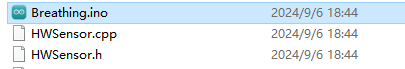

(2) Connect the Arduino UNO to the computer via USB cable.

(3) In the Arduino IDE, click the **"Select Board"** option. The software will automatically detect the connected Arduino serial port.


(4) Then click the upload button  to upload the program to the Arduino. Wait for the upload to complete.


### 5.2.5 Project Outcome

Once uploaded, the LED matrix will scroll and display the text **"Hi, I am Spiderbot"**.

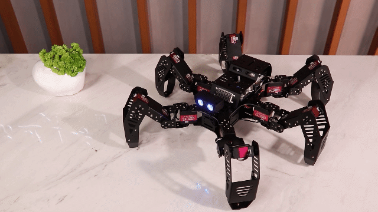

### 5.2.6 Program Brief Analysis

[Source Code](../_static/source_code/intelligent_games_learning.zip)

(1) Several libraries required for this application should be imported, including servo control, sensor, and software serial communication libraries.

{lineno-start=6}

```
#include "Servo.h"
#include "WMMatrixLed.h"
#include "SoftwareSerial.h" 
#include "LobotServoController.h"
```

(2) The communication pins between the Arduino and the servo controller are first defined. Then, instances of the sensor class, software serial class, and other secondary development communication classes are created.

{lineno-start=11}

```
#define rxPin 9  //Serial communication interface between arduino and servo controller
#define txPin 8  

#define DIN  A0  //Dot matrix interface
#define CLK  A1

Servo sonarServo;  //Examples of ultrasonic servo control
SoftwareSerial MySerial(rxPin, txPin);  //Software serial port instantiation
WMMatrixLed matrixLed(CLK, DIN);  //Instantiated dot matrix
LobotServoController Controller(MySerial); //Instantiated secondary development
```

(3) In the `setup()` function, hardware initialization is performed. The serial port is set to a baud rate of 115200, while the software serial port is set to 9600. A loop within the setup function scrolls the text **"Hi, I am Spiderbot"** across the matrix.

Initially, the text is drawn on the far-right side of the display. Its horizontal position is then continuously decreased to create a leftward scrolling effect. Once the text reaches the left edge of the screen, the program pauses briefly before restarting the scroll. After this scroll loop completes, the setup() function ends, and the loop() function begins execution.

{lineno-start=24}

```
void setup()
{ 
  MySerial.begin(9600);  //Software serial port for communication with servo, baud rate 9600
  Serial.begin(9600);    //Hardware serial port used for printing and debugging, the baud rate is 9600
  matrixLed.setColorIndex(1);  //
  matrixLed.setBrightness(3); //Set dot matrix brightness
  matrixLed.clearScreen();  //Clear the screen
  sonarServo.attach(12); //Set the servo control io port
  sonarServo.write(90);  //Initial position 90 degrees
  delay(300); //Delay until servo turn to the designated position
  sonarServo.detach();  //Detach servo when finish
  Controller.runActionGroup(0, 1); //Run No.0 action group

  for (int i = 0; i > -str_len*6; i -- ){ //Scrolling display, one character occupies 6 dots, scrolling to the left is all negative values
    matrixLed.drawStr(i,7, str_data); //Parameter 1 represents the abscissa, parameter 2 represents the ordinate, and parameter 3 represents the character to be displayed. The origin of the coordinate is in the lower left corner, the abscissa is positive to the right, and the ordinate is positive to the bottom
    if (i == 0) {//Pause at the beginning
      delay(500);
    }
    else {
      delay(40);//Scroll speed
    }
  }
}
```

(4) Inside the loop() function, another scroll loop is executed continuously. This loop starts from the center of the screen, horizontal coordinate 16, and scrolls text toward the left. A delay is added between scroll steps. This loop continues to execute repeatedly until the program stops. It starts displaying from the beginning of the string.

Since the string length is fixed, once the text scrolls to the left edge of the screen, it restarts from the center and scrolls the beginning of the string again. It's important to note that the loop condition is i \> -str_len \* 6, where str_len \* 6 represents the pixel width of the string, assuming each character is 6 pixels wide.

If the string length exceeds this value, only the beginning portion will be visible. If the string is shorter, the remaining characters will be displayed on the next loop iteration.

{lineno-start=48}

```
void loop() {
  //Rolling display
  for (int i = 16; i > -str_len*6; i-- ){
    matrixLed.drawStr(i,7, str_data);
    delay(40);//Scroll speed
  }
}
```

### 5.2.7 Feature Extensions

* **Changing the Displayed Text**

(1) To change the displayed text, simply modify the content inside the double quotation marks in the program, as shown in the figure:

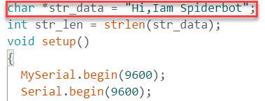

(2) Only English letters and digits are supported. Chinese punctuation marks should not be used. For example, the text can be changed to "**Hi,123**"

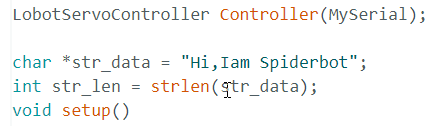

* **Adjusting Scroll Speed**

(1) To adjust the scrolling speed, modify the delay value in milliseconds inside the loop() function, as shown in the figure.

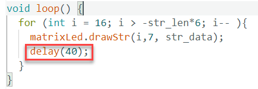

(2) For additional parameter settings and explanations, refer to the comments within the program code.

## 5.3 Distance Measurement Display

### 5.3.1 Project Introduction

This lesson demonstrates how the glowy ultrasonic sensor module to detect the distance of an object, and then display the measured distance using an LED matrix module.

### 5.3.2 Project Process

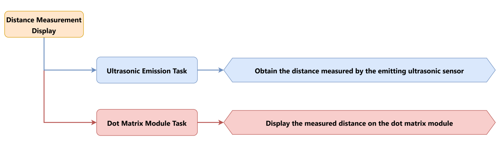

### 5.3.3 Module Instruction

* **Glowy Ultrasonic Module**

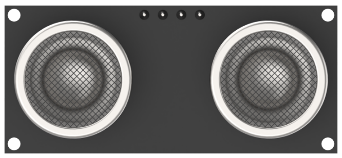

This is a distance-measuring ultrasonic sensor module equipped with an RGB light feature. It adopts an IIC communication interface and can read distance measurements from the ultrasonic sensor via IIC.

During distance measurement, the module automatically sends out 8 pulses of 40 kHz square waves and waits for a signal to return. If a signal is returned, the module outputs a high-level signal, and the duration of the high-level signal corresponds to the time it takes for the ultrasound to travel to the object and back.

* **LED Dot Matrix Module**


The LED dot matrix module is a display unit that features high brightness, no flickering during display, and easy wiring, and it can show numbers, text, and patterns. This module consists of two red 8x8 LED matrices and is controlled by the TM640B driver chip, which enables control of the dot matrix display.

### 5.3.4 Program Download

(1) Open the program file located in the same directory as this lesson:  [Distance Measurement Display Program\\ LED_Matrix_Sonar\\ LED_Matrix_Sonar.ino](../_static/source_code/intelligent_games_learning.zip) 

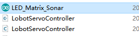

(2) Connect the Arduino UNO to the computer via USB cable.

(3) In the Arduino IDE, click the **"Select Board"** option. The software will automatically detect the connected Arduino serial port.


(4) Then click the upload button  to upload the program to the Arduino. Wait for the upload to complete.


### 5.3.5 Project Outcome

When an object such as a small box is placed in front of the ultrasonic sensor, the LED matrix module will display the distance between the sensor and the object in numerical form.


### 5.3.6 Program Brief Analysis

[Source Code](../_static/source_code/intelligent_games_learning.zip)

(1) Several libraries required for this application should be imported, including servo control, sensor, and software serial communication libraries.

{lineno-start=6}

```
#include <Wire.h>
#include "Servo.h"
#include "WMMatrixLed.h"
#include "SoftwareSerial.h"
#include "LobotServoController.h"
```

(2) The communication pins between the Arduino and the servo controller are first defined. Then, instances of the sensor class, software serial class, and other secondary development communication classes are created.

{lineno-start=12}

```
#define rxPin 9  //Serial communication interface between arduino and servo controller
#define txPin 8  

#define DIN  A0  //Dot matrix interface
#define CLK  A1

#define I2C_ADDR    0x77

//Rigister
#define DISDENCE_L    0//Low 8 bytes of distance, unit mm
#define DISDENCE_H    1

#define RGB_BRIGHTNESS  50//0-255
#define RGB_WORK_MODE 2//RGB mode, 0: user-defined mode 1: breathing light mode default 0

#define RGB1_R      3//R value of No.1 light，0~255，Default is 0
#define RGB1_G      4//Default is 0
#define RGB1_B      5//Default is 255

#define RGB2_R      6//R value of No.2 light，0~255，Default is 0
#define RGB2_G      7//Default is 0
#define RGB2_B      8//Default is 255

#define RGB1_R_BREATHING_CYCLE      9 //In the breathing light mode, the breathing cycle of the R of the No. 1light, the unit is 100ms and the default is 0.
                                      //If the period is set to 3000ms, the value is 30
#define RGB1_G_BREATHING_CYCLE      10
#define RGB1_B_BREATHING_CYCLE      11

#define RGB2_R_BREATHING_CYCLE      12//RGB 2
#define RGB2_G_BREATHING_CYCLE      13
#define RGB2_B_BREATHING_CYCLE      14

#define RGB_WORK_SIMPLE_MODE    0
#define RGB_WORK_BREATHING_MODE   1

Servo sonarServo;  //Examples of ultrasonic servo control
SoftwareSerial MySerial(rxPin, txPin);  //Software serial port instantiation
WMMatrixLed matrixLed(CLK, DIN);  //Instantiated dot matrix
LobotServoController Controller(MySerial); //Instantiated secondary development

```

(3) In the setup() function, I2C communication, software serial, and hardware serial are first initialized. The matrix display brightness is configured, and the screen is cleared. The servo controller is used to position the ultrasonic sensor. RGB lighting mode and brightness are set via I2C commands. A simple pattern is also rendered on the LED matrix.

{lineno-start=113}

```
void setup()
{
  uint8_t RGB[6];
  uint8_t breathing[6];
  uint8_t value;
  
  Wire.begin();
  MySerial.begin(9600);  //Software serial port for communication with servo, baud rate 9600
  Serial.begin(9600);    //Hardware serial port used for printing and debugging, the baud rate is 9600

  matrixLed.setBrightness(3);
  matrixLed.clearScreen();
  sonarServo.attach(12); //Set the servo control io port
  sonarServo.write(90);  //Initial position to 90 degrees 
  delay(300);
  sonarServo.detach();  //Detach servo
  Controller.runActionGroup(0, 0); //Run No.0 action group
  value = RGB_WORK_SIMPLE_MODE;
  WireWriteDataArray(RGB_WORK_MODE,&value,1);
  RGB[0] = 0;RGB[1] = 0;RGB[2] = RGB_BRIGHTNESS;//RGB1
  RGB[3] = 0;RGB[4] = 0;RGB[5] = RGB_BRIGHTNESS;//RGB2
  
  WireWriteDataArray(RGB1_R,RGB,6);
  uint8_t drawBuffer[16] = {
    0x00, 0x00, 0x00, 0x00, 0x00, 0x00, 0x00, 0x00
  , 0x00, 0x00, 0x00, 0x00, 0x00, 0x00, 0x00, 0x00};
  for (int i = 0; i < 16; i++) {
    matrixLed.drawBitmap(0,0,16,drawBuffer);   
    delay(20);
  }  
  matrixLed.clearScreen();
}
```

(4) When the `loop()` function begins, the distance is retrieved using the `getDistance()` function. If the measured value is invalid or out of range, it is reset to zero. The distance is then converted into centimeters and stored in a variable.

Based on the measured distance, the position of the displayed number on the matrix is adjusted to keep it centered. This is achieved by calling the matrixLed.showNum() function.

{lineno-start=157}

```
void loop() {
  int distance = getDistance();
  
  //The value returned beyond the detection range is inaccurate, and is uniformly set to 0
  if (distance == 65522)
    distance = 0;

  distance = int(distance/10); //cm
  
  //Adjust the display position according to different digits so that the number is always displayed in the center
  if (distance < 10 && distance >= 0) {
    matrixLed.showNum(7, float(distance));
  }
  else if (distance < 100) {
    matrixLed.showNum(5, float(distance));
  }
  else if (distance < 1000) {
    matrixLed.showNum(3, float(distance));
  }
  else if (distance < 10000) {
    matrixLed.showNum(1, float(distance));
  }
}
```

(5) The `getDistance()` function obtains the distance value. Inside this function, three measurements are taken to obtain three individual distance readings. The `WireReadDataArray()` function is used to retrieve these values from the sensor over I2C.

To improve accuracy, the average of the three readings is calculated, minimizing errors from individual measurements. The resulting average value is returned for use in other parts of the program.

{lineno-start=147}

```
int getDistance() {       //Get distance
  u16 distance1, distance2, distance3;
  int distance = 0;
  WireReadDataArray(0,(uint8_t *)&distance1,2);
  WireReadDataArray(0,(uint8_t *)&distance2,2);
  WireReadDataArray(0,(uint8_t *)&distance3,2);
  distance = (distance1 + distance2 + distance3)/3;
  return distance;                           //Return to the detected distance
}
```

## 5.4 Distance-Based Alert

### 5.4.1 Project Introduction

This lesson demonstrates how to use the glowy ultrasonic sensor module to detect object distance and control the LED matrix display accordingly.

### 5.4.2 Project Process

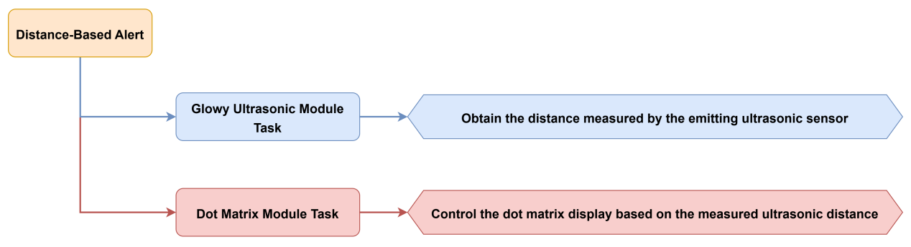

### 5.4.3 Module Instruction

* **Glowy Ultrasonic Module**


This is a distance-measuring ultrasonic sensor module equipped with an RGB light feature. It adopts an IIC communication interface and can read distance measurements from the ultrasonic sensor via IIC.

During distance measurement, the module automatically sends out 8 pulses of 40 kHz square waves and waits for a signal to return. If a signal is returned, the module outputs a high-level signal, and the duration of the high-level signal corresponds to the time it takes for the ultrasound to travel to the object and back.

* **LED Dot Matrix Module**

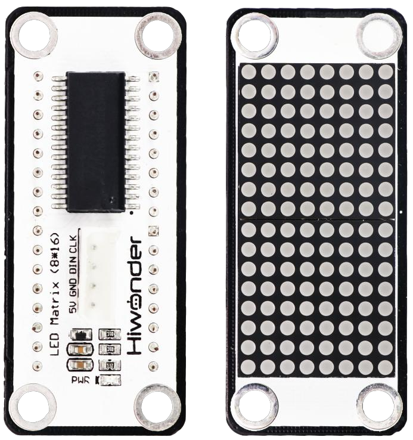

The LED dot matrix module is a display unit that features high brightness, no flickering during display, and easy wiring, and it can show numbers, text, and patterns. This module consists of two red 8x8 LED matrices and is controlled by the TM640B driver chip, which enables control of the dot matrix display.

### 5.4.4 Program Download

[Source Code](../_static/source_code/intelligent_games_learning.zip)

(1) Open the program file located in the same directory as this lesson:  [Distance-Based Alert Program\Breathing\Breathing.ino](../_static/source_code/intelligent_games_learning.zip)

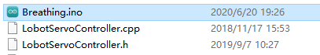

(2) Connect the Arduino UNO to the computer via USB cable.

(3) In the Arduino IDE, click the **"Select Board"** option. The software will automatically detect the connected Arduino serial port.


(4) Then click the upload button  to upload the program to the Arduino. Wait for the upload to complete.


### 5.4.5 Project Outcome

When an object such as a small box is placed in front of the ultrasonic sensor, the LED matrix lights up as a visual alert, and the RGB light on the sensor begins flashing rapidly.


### 5.4.6 Program Brief Analysis

[Source Code](../_static/source_code/intelligent_games_learning.zip)

(1) Several libraries required for this application should be imported, including servo control, sensor, and software serial communication libraries.

{lineno-start=8}

```
#include <Wire.h>
#include "Servo.h"
#include "WMMatrixLed.h"
#include "SoftwareSerial.h"
#include "LobotServoController.h"
```

(2) The communication pins between the Arduino and the servo controller are first defined. Then, instances of the sensor class, software serial class, and other secondary development communication classes are created.

{lineno-start=14}

```
#define rxPin 9  //Serial communication interface between arduino and servo controller
#define txPin 8  

#define DIN  A0  //Dot matrix interface
#define CLK  A1

#define I2C_ADDR    0x77

//Rigister
#define DISDENCE_L    0//Lower 8 bits of distance, unit mm
#define DISDENCE_H    1

#define RGB_WORK_MODE 2

#define RGB1_R      3//R value of No.1 light，0~255，Default is 0
#define RGB1_G      4//Default is 0
#define RGB1_B      5//Default is 255

#define RGB2_R      6//R value of No.2 light，0~255，Default is 0
#define RGB2_G      7//Default 0
#define RGB2_B      8//Default 255

#define RGB1_R_BREATHING_CYCLE      9 //In the breathing light mode, the breathing cycle of the R of the No. 1light, the unit is 100ms and the default is 0.
                                      //If the period is set to 3000ms, the value is 30
#define RGB1_G_BREATHING_CYCLE      10
#define RGB1_B_BREATHING_CYCLE      11

#define RGB2_R_BREATHING_CYCLE      12//RGB 2
#define RGB2_G_BREATHING_CYCLE      13
#define RGB2_B_BREATHING_CYCLE      14

#define RGB_WORK_SIMPLE_MODE    0 //RGB mode，0: User-defined mode 1: Breathing light mode Default 0
#define RGB_WORK_BREATHING_MODE   1

Servo sonarServo;  //Examples of ultrasonic servo control
SoftwareSerial MySerial(rxPin, txPin);  //Software serial port instantiation
WMMatrixLed matrixLed(CLK, DIN);  //Instantiated dot matrix
LobotServoController Controller(MySerial); //Instantiated secondary development

```

(3) In the `setup()` function, I2C communication, software serial, and hardware serial are first initialized. The matrix display brightness is configured, and the screen is cleared. The servo controller is used to position the ultrasonic sensor. RGB lighting mode and brightness are set via I2C commands. A simple pattern is also rendered on the LED matrix.

(4) In the `loop()` function, the `WireReadDataArray` function reads the distance value from the I2C device and stores it in the distance variable. If the distance is between 30 mm and 160 mm, the variable timer is set to 5, corresponding to a 0.5-second blinking interval. The MatrixLedBlink function is then called to control the blinking behavior. In this case, the LED matrix flashes at the defined interval. If the distance falls outside this range, the LED matrix turns off using the predefined drawBuffer array, and timer is set to 20, correspongding to a 2-second interval. In this case, the LED matrix remains off.

{lineno-start=169}

```
void loop() 
{
  uint8_t RGB[6];
  uint8_t breathing[6];
  uint8_t value;  
  static uint32_t Time;
  static int timer;
  u16 distance = 0;

  WireReadDataArray(0,(uint8_t *)&distance,2);  //Get distance 

  //Set to blink every 0.5s between 30-180mm
  if (distance > 30 && distance < 160) {
    timer = 5;
    MatrixLedBlink(timer*100);
  }
  else {//In other intervals, the dot matrix is off, and the blinking interval is adjusted to 2s
    uint8_t drawBuffer[16] = {
      0x00, 0x00, 0x00, 0x00, 0x00, 0x00, 0x00, 0x00
    , 0x00, 0x00, 0x00, 0x00, 0x00, 0x00, 0x00, 0x00};
    matrixLed.drawBitmap(0,0,16,drawBuffer);
    timer = 20;
  }

  //Allowed to enter again only after the waiting is over. There is no "delay" here. "Delay" is a blocking delay and cannot always detect the distance.
  if (Time > millis())
    return;
  value = RGB_WORK_BREATHING_MODE;
  WireWriteDataArray(RGB_WORK_MODE,&value,1);
  breathing[0] = 0;breathing[1] = 0;breathing[2] = timer;//RGB1，The parameter represents the cycle of the breathing light, for example 20 is 2s, the three parameters are R, G, B respectively
  breathing[3] = 0;breathing[4] = 0;breathing[5] = timer;//RGB2
  WireWriteDataArray(RGB1_R_BREATHING_CYCLE,breathing,6); 
  Time = millis() + timer*100;
}
```

(5) This function is used to control the blinking behavior of the LED matrix module. By changing the value of the static variable ledStatus, the LED display toggles between on and off states. The blinking frequency is controlled by setting a time interval.

Two arrays are used to represent the lit and unlit states of the matrix, and the `matrixLed.drawBitmap()` function is called to apply the corresponding display pattern.

{lineno-start=114}

```
void MatrixLedBlink(uint8_t t) {
  static uint32_t Time = 0;
  static bool ledStatus = false;
  if (Time > millis()) {
    return;
  }

  if (!ledStatus) {//turn on light
    //The dot matrix is 16x8. Each parameter in the list below represents a column, from left to right.
    //Each column is represented by a hexadecimal number. The first one is represented by binary when it is lit from bottom to top, the second is 10, and the third is 100. At the same time, the first is lit, and the second is 11. And so on
    //Then convert the binary number to hexadecimal.
    uint8_t drawBuffer[16] = {
      0x00, 0x00, 0x00, 0x00, 0x00, 0x00, 0x00, 0x00
    , 0x00, 0x00, 0x00, 0x00, 0x00, 0x00, 0x00, 0x00};
    matrixLed.drawBitmap(0,0,16,drawBuffer); 
  }
  else {//turn off light
    uint8_t drawBuffer_[16] = {
      0xff, 0xff, 0xff, 0xff, 0xff, 0xff, 0xff, 0xff
    , 0xff, 0xff, 0xff, 0xff, 0xff, 0xff, 0xff, 0xff};  
    matrixLed.drawBitmap(0,0,16,drawBuffer_);
  }
  ledStatus = !ledStatus;
  Time = millis() + t;
}
```

### 5.4.7 Feature Extensions

* **Adjusting Detection Range**

(1) To modify the distance detection conditions, update the values in the relevant section of the code.

{lineno-start=172}

```
  uint8_t breathing[6];
  uint8_t value;  
  static uint32_t Time;
  static int timer;
  u16 distance = 0;

  WireReadDataArray(0,(uint8_t *)&distance,2);  //Get distance 

  //Set to blink every 0.5s between 30-180mm
  if (distance > 30 && distance < 160) {
    timer = 5;
    MatrixLedBlink(timer*100);
  }
  else {//In other intervals, the dot matrix is off, and the blinking interval is adjusted to 2s
    uint8_t drawBuffer[16] = {
      0x00, 0x00, 0x00, 0x00, 0x00, 0x00, 0x00, 0x00
    , 0x00, 0x00, 0x00, 0x00, 0x00, 0x00, 0x00, 0x00};
    matrixLed.drawBitmap(0,0,16,drawBuffer);
    timer = 20;
  }

  //Allowed to enter again only after the waiting is over. There is no "delay" here. "Delay" is a blocking delay and cannot always detect the distance.
  if (Time > millis())
    return;
  value = RGB_WORK_BREATHING_MODE;
  WireWriteDataArray(RGB_WORK_MODE,&value,1);
  breathing[0] = 0;breathing[1] = 0;breathing[2] = timer;//RGB1，The parameter represents the cycle of the breathing light, for example 20 is 2s, the three parameters are R, G, B respectively
  breathing[3] = 0;breathing[4] = 0;breathing[5] = timer;//RGB2
  WireWriteDataArray(RGB1_R_BREATHING_CYCLE,breathing,6); 
  Time = millis() + timer*100;
```

(2) The default condition detects objects between 30 mm and 160 mm. These threshold values can be changed directly based on the specific application.

* **Adjusting Blinking Speed**

(1) To change the RGB light's blinking speed, adjust the timer values in the appropriate sections of the code.

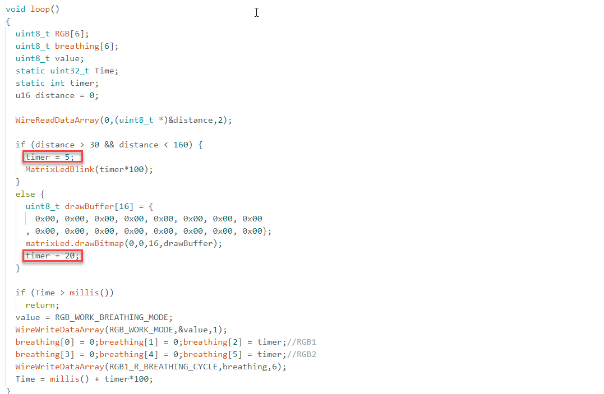

(2) Default settings:

timer = 5: When the object is within 30–160 mm, the RGB light blinks every 0.5 seconds.

timer = 20: When the object is beyond 160 mm, the RGB light blinks every 2 seconds.

(3) For example, to increase blinking speed:  

Set timer = 3 for a 0.3-second interval within 30–160 mm.  

Set timer = 10 for a 1-second interval beyond 160 mm.

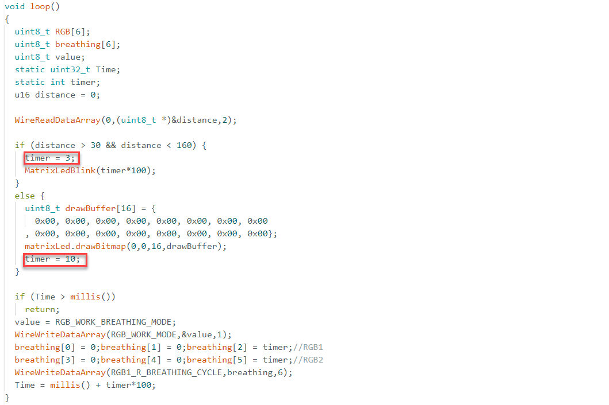

## 5.5 Autonomous Following

### 5.5.1 Project Introduction

This lesson focuses on detecting the distance of nearby object using a glowy ultrasonic module, displaying the data via an LED matrix, and controlling the robot's movement accordingly.

### 5.5.2 Project Process

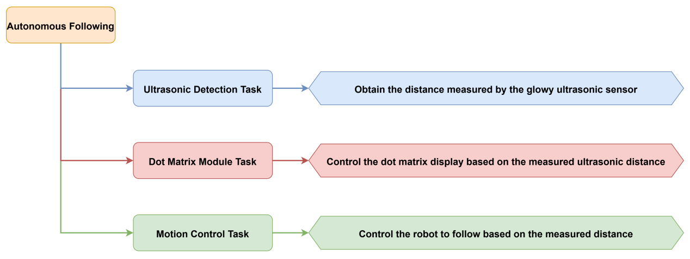

### 5.5.3  Module Instruction


This is a distance-measuring ultrasonic sensor module equipped with an RGB light feature. It adopts an IIC communication interface and can read distance measurements from the ultrasonic sensor via IIC.

During distance measurement, the module automatically sends out 8 pulses of 40 kHz square waves and waits for a signal to return. If a signal is returned, the module outputs a high-level signal, and the duration of the high-level signal corresponds to the time it takes for the ultrasound to travel to the object and back.

### 5.5.4 Program Download

[Source Code](../_static/source_code/intelligent_games_learning.zip)

(1) Open the file named [Autonomous Following Program\Follow\Follow.ino](../_static/source_code/intelligent_games_learning.zip) located in the corresponding lesson folder.

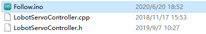

(2) Connect the Arduino UNO to the computer via USB cable.

(3) In the Arduino IDE, click the **"Select Board"** option. The software will automatically detect the connected Arduino serial port.


(4) Then click the upload button  to upload the program to the Arduino. Wait for the upload to complete.


### 5.5.5 Project Outcome

Place a cardboard box in front of the ultrasonic sensor. The sensor will measure the distance to the object. If the object approaches, an upward arrow appears on the LED matrix, the ultrasonic module glows red, and the robot moves backward. If the object moves away, a downward arrow is displayed, the module glows green, and the robot moves forward.


### 5.5.6 Program Brief Analysis

[Source Code](../_static/source_code/intelligent_games_learning.zip)

(1) Several libraries required for this application should be imported, including servo control, sensor, and software serial communication libraries.

{lineno-start=6}

```
#include <Wire.h>
#include "Servo.h"
#include "WMMatrixLed.h"
#include "SoftwareSerial.h"
#include "LobotServoController.h"
```

(2) The communication pins between the Arduino and the servo controller are first defined. Then, instances of the sensor class, software serial class, and other secondary development communication classes are created.

{lineno-start=15}

```
#define DIN  A0  //Dot matrix interface
#define CLK  A1

#define I2C_ADDR    0x77

//Rigister
#define DISDENCE_L    0//Low 8 bytes of distance, unit mm
#define DISDENCE_H    1

#define RGB_BRIGHTNESS  50//0-255

#define RGB_WORK_MODE 2//RGB mode, 0: user-defined mode 1: breathing light mode default 0

#define RGB1_R      3//R value of No.1 light，0~255，Default is 0
#define RGB1_G      4//Default is 0
#define RGB1_B      5//Default is 255

#define RGB2_R      6//R value of No.2 light，0~255，Default is 0
#define RGB2_G      7//Default is 0
#define RGB2_B      8//Default is 255

#define RGB1_R_BREATHING_CYCLE      9 //In the breathing light mode, the breathing cycle of the R of the No. 1light, the unit is 100ms and the default is 0.
                                      //If the period is set to 3000ms, the value is 30
#define RGB1_G_BREATHING_CYCLE      10
#define RGB1_B_BREATHING_CYCLE      11

#define RGB2_R_BREATHING_CYCLE      12//RGB 2
#define RGB2_G_BREATHING_CYCLE      13
#define RGB2_B_BREATHING_CYCLE      14

#define RGB_WORK_SIMPLE_MODE    0
#define RGB_WORK_BREATHING_MODE   1
```

(3) In the setup() function, I2C communication, software serial, and hardware serial are first initialized. The matrix display brightness is configured, and the screen is cleared. The servo controller is used to position the ultrasonic sensor. RGB lighting mode and brightness are set via I2C commands. A simple pattern is also rendered on the LED matrix.

{lineno-start=196}

```
void setup() {
  Wire.begin();
  Serial.begin(9600);   //Initialize serial port 0, baud rate 9600
  MySerial.begin(9600); //Initialize software serial port  
  matrixLed.setBrightness(3);
  matrixLed.clearScreen();  
  sonarServo.attach(12); //Set the servo control io port
  sonarServo.write(90);  
  delay(300);
  sonarServo.detach();  //Detach servo  
  Controller.runActionGroup(0, 1); //Run No.0 action group to command the robot to stand up 
  uint8_t drawBuffer[16] = {
    0x00, 0x00, 0x00, 0x00, 0x00, 0x00, 0x00, 0x00
  , 0x00, 0x00, 0x00, 0x00, 0x00, 0x00, 0x00, 0x00};
  for (int i = 0; i < 16; i++) {
    drawBuffer[i] = 0xff;
    matrixLed.drawBitmap(0,0,16,drawBuffer);   
    delay(20);
  }  
   
  matrixLed.clearScreen();
}
```

(4) In the `loop()` function, `Controller.receiveHandle()` processes incoming serial data, ensuring real-time response to inputs or sensor data. The `getDistance()` function retrieves the measured distance to an object.

The function `Distancewalking()` processes logic based on the measured distance, triggering actions like hardware movement, data handling or responding to other tasks. The specific logic operations depend on the internal implementation of the `Distancewalking()` function.

{lineno-start=219}

```
void loop() 
{
  Controller.receiveHandle(); //Receive and process functions, fetch data from the serial port receive buffer
  getDistance();              //Measure distance 

//  Serial.print("distance = ");Serial.println(distance);
  Distancewalking();          //Logic realization
}
```

(5) Within `Distancewalking()`, local variables are defined, including RGB value arrays and display patterns. The function `Controller.isRunning()` checks whether a motion group is currently executing. If no action group is running, and the measured distance is between 30mm and 180mm, a specific pattern is displayed on the matrix, RGB mode is set to simple, and RGB lights are dimmed or turned off. If the distance is between 300mm and 400mm, another pattern is displayed and different RGB light settings are applied.

{lineno-start=151}

```
void Distancewalking()
{ 
  uint8_t RGB[6];
  uint8_t breathing[6];
  uint8_t value;
  
  if (!Controller.isRunning()) {
    if (Distance > 30 && Distance < 180) {
      uint8_t drawBuffer[16] = {
      0x0,0x0,0x0,0x0,0x10,0x30,0x7f,0xff
      ,0x7f,0x30,0x10,0x0,0x0,0x0,0x0,0x0};
      matrixLed.drawBitmap(0,0,16,drawBuffer);
      value = RGB_WORK_SIMPLE_MODE;
      WireWriteDataArray(RGB_WORK_MODE,&value,1);
      RGB[0] = RGB_BRIGHTNESS;RGB[1] = 0;RGB[2] = 0;//RGB1
      RGB[3] = RGB_BRIGHTNESS;RGB[4] = 0;RGB[5] = 0;//RGB2
      WireWriteDataArray(RGB1_R,RGB,6);
      Controller.runActionGroup(2, 1);
    }
    else if (Distance > 300 && Distance < 400) {
      uint8_t drawBuffer[16] = {
      0x0,0x0,0x0,0x0,0x8,0xc,0xfe,0xff
      ,0xfe,0xc,0x8,0x0,0x0,0x0,0x0,0x0};
      matrixLed.drawBitmap(0,0,16,drawBuffer); 
      value = RGB_WORK_SIMPLE_MODE;
      WireWriteDataArray(RGB_WORK_MODE,&value,1);
      RGB[0] = 0;RGB[1] = RGB_BRIGHTNESS;RGB[2] = 0;//RGB1
      RGB[3] = 0;RGB[4] = RGB_BRIGHTNESS;RGB[5] = 0;//RGB2
      WireWriteDataArray(RGB1_R,RGB,6);
      Controller.runActionGroup(1, 1);
    } 
    else {
      uint8_t drawBuffer[16] = {
      0x0,0x0,0x0,0x70,0xf8,0xfc,0xfe,0x7f
      ,0x7f,0xfe,0xfc,0xf8,0x70,0x0,0x0,0x0};
      matrixLed.drawBitmap(0,0,16,drawBuffer); 
      value = RGB_WORK_SIMPLE_MODE;
      WireWriteDataArray(RGB_WORK_MODE,&value,1);
      RGB[0] = 255;RGB[1] = 192;RGB[2] = 203;//RGB1
      RGB[3] = 255;RGB[4] = 192;RGB[5] = 203;//RGB2
      WireWriteDataArray(RGB1_R,RGB,6);
    } 
  }
}
```

### 5.5.7 Feature Extensions

* **Adjusting Distance Thresholds**

(1) To change the range at which the robot responds, modify the corresponding section of the code marked in red.

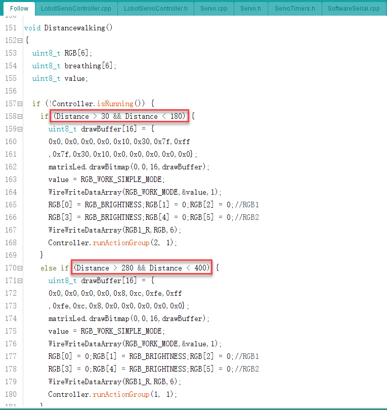

(2) When an object is detected at 30–180mm, the robot moves backward by default. When the distance is 280–400mm, the robot moves forward. These values can be adjusted directly as needed.

* **Modifying Ultrasonic RGB Colors**

(1) To change the color display of the ultrasonic module, adjust the RGB array settings in the highlighted code section.

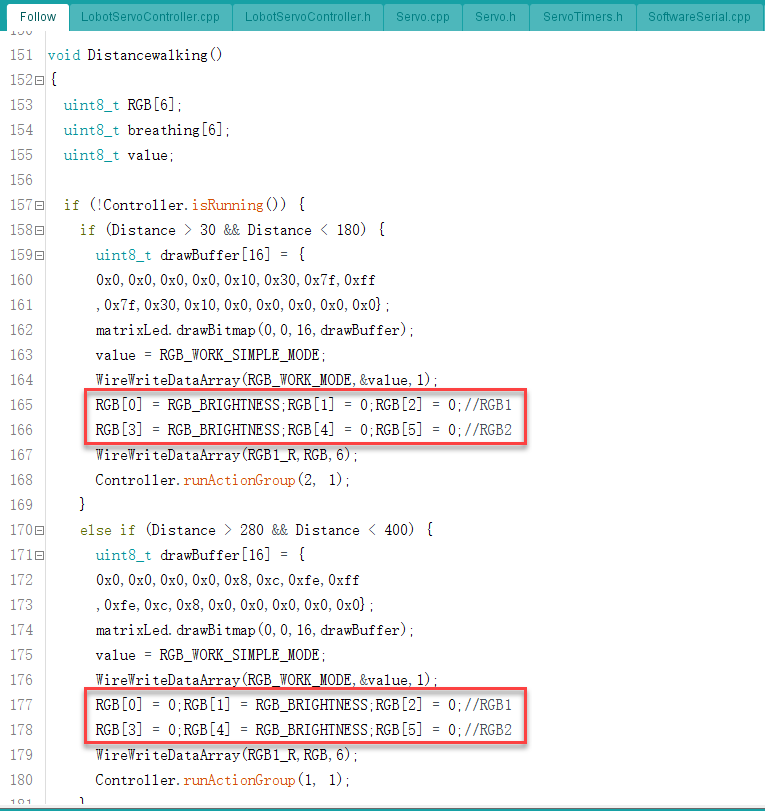

(2) There are two RGB LED onboard, and each consists of three color components, totaling six LED elements indexed from 0 to 5.

(3) When moving backward, LEDs 0 and 3 (left and right) are set to red by default. When moving forward, LEDs 1 and 4 are set to green.

(4) To activate any individual LED, set its corresponding array element to RGB_BRIGHTINESS.

## 5.6 Maze Navigation

### 5.6.1 Project Introduction

This lesson focuses on using a glowy ultrasonic module to detect distances and guide the robot to avoid obstacles during maze navigation.

### 5.6.2 Project Process

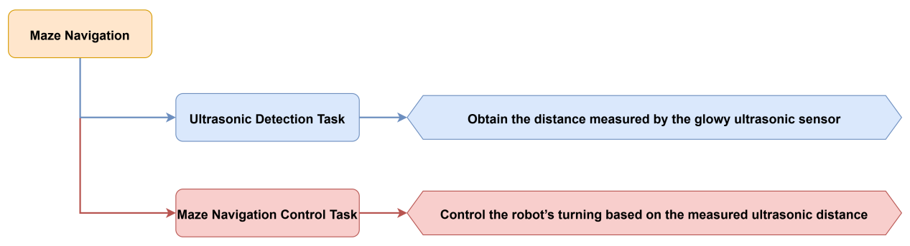

### 5.6.3 Module Instruction


This is a distance-measuring ultrasonic sensor module equipped with an RGB light feature. It adopts an IIC communication interface and can read distance measurements from the ultrasonic sensor via IIC.

During distance measurement, the module automatically sends out 8 pulses of 40 kHz square waves and waits for a signal to return. If a signal is returned, the module outputs a high-level signal, and the duration of the high-level signal corresponds to the time it takes for the ultrasound to travel to the object and back.

### 5.6.4 Program Download 

[Source Code](../_static/source_code/intelligent_games_learning.zip)

(1) Open the program file located in the same directory as this lesson:  [Maze Navigation Program\Sonar\Sonar.ino](../_static/source_code/intelligent_games_learning.zip)

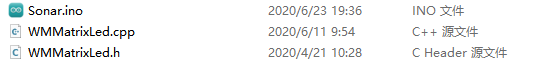

(2) Connect the Arduino UNO to the computer via USB cable.

(3) In the Arduino IDE, click the **"Select Board"** option. The software will automatically detect the connected Arduino serial port.


(4) Then click the upload button  to upload the program to the Arduino. Wait for the upload to complete.


### 5.6.5 Project Outcome

When the ultrasonic sensor detects an obstacle in front, the robot's head rotates from side to side to scan for openings. If there is no obstacle on the left, the robot turns left; if the right side is clear, it turns right.


### 5.6.6 Program Brief Analysis

[Source Code](../_static/source_code/intelligent_games_learning.zip)

(1) Several libraries required for this application should be imported, including servo control, sensor, and software serial communication libraries.

{lineno-start=6}

```
#include <Wire.h>
#include "Servo.h"
#include "WMMatrixLed.h"
#include "SoftwareSerial.h"
#include "LobotServoController.h"
```

(2) The communication pins between the Arduino and the servo controller are first defined. Then, instances of the sensor class, software serial class, and other secondary development communication classes are created.

{lineno-start=15}

```
#define DIN  A0  //Dot matrix interface
#define CLK  A1

#define GO_FORWARD  26     /*action group of forward*/
#define GO_BACK     27     /*action group of backward*/
#define TURN_LEFT   32     /*action group of turning left*/
#define TURN_RIGHT  33     /*action group of turning right*/

#define MIN_DISTANCE_TURN 300 /*Distance avoiding obstacle.The robot avoid obstacle when the obstacle avoidance is less than the set distance*/
#define BIAS  0       /*Servo deviation.Adjust the data according to the actual situation to make the ultrasound face straight forward*/

#define I2C_ADDR    0x77

//Rigister
#define DISDENCE_L    0//Low 8 bytes of distance, unit mm
#define DISDENCE_H    1

#define RGB_BRIGHTNESS  50//0-255

#define RGB_WORK_MODE 2//RGB mode, 0: user-defined mode 1: breathing light mode default 0

#define RGB1_R      3//R value of No.1 light，0~255，Default is 0
#define RGB1_G      4//Default is 0
#define RGB1_B      5//Default is 255

#define RGB2_R      6//R value of No.2 light，0~255，Default is 0
#define RGB2_G      7//Default is 0
#define RGB2_B      8//Default is 255

#define RGB1_R_BREATHING_CYCLE      9 //In the breathing light mode, the breathing cycle of the R of the No. 1light, the unit is 100ms and the default is 0.
                                      //If the period is set to 3000ms, the value is 30
#define RGB1_G_BREATHING_CYCLE      10
#define RGB1_B_BREATHING_CYCLE      11

#define RGB2_R_BREATHING_CYCLE      12//RGB 2
#define RGB2_G_BREATHING_CYCLE      13
#define RGB2_B_BREATHING_CYCLE      14

#define RGB_WORK_SIMPLE_MODE    0
#define RGB_WORK_BREATHING_MODE   1

Servo sonarServo;  //Examples of ultrasonic servo control
SoftwareSerial MySerial(rxPin, txPin);  //Software serial port instantiation
WMMatrixLed matrixLed(CLK, DIN);  //Instantiated dot matrix
LobotServoController Controller(MySerial); //Instantiated secondary development

```

(3) In the setup() function, I2C communication, software serial, and hardware serial are first initialized. The matrix display brightness is configured, and the screen is cleared. The servo controller is used to position the ultrasonic sensor. RGB lighting mode and brightness are set via I2C commands. A simple pattern is also rendered on the LED matrix.

{lineno-start=262}

```
void setup() 
{
  Wire.begin();
  Serial.begin(9600);      //Initialize serial port 0, baud rate 9600
  MySerial.begin(9600);     //Initialize serial port , baud rate 9600
  sonarServo.attach(12);         //Set the servo control io port
  sonarServo.write(90); 
  matrixLed.setColorIndex(1);
  matrixLed.setBrightness(3);
  matrixLed.clearScreen();   
  Controller.runActionGroup(25, 1); 
  uint8_t drawBuffer[16] = {
    0x00, 0x00, 0x00, 0x00, 0x00, 0x00, 0x00, 0x00
  , 0x00, 0x00, 0x00, 0x00, 0x00, 0x00, 0x00, 0x00};
  for (int i = 0; i < 16; i++) {
    drawBuffer[i] = 0xff;
    matrixLed.drawBitmap(0,0,16,drawBuffer);   
    delay(20);
  } 
```

(4) In the loop() function, the Controller.receiveHandle() function is first called to handle incoming serial data. Then, the sonar() function is executed to perform obstacle avoidance. This function uses the ultrasonic sensor to detect obstacles in the environment and determines how the robot should respond, such as changing direction or speed.

{lineno-start=285}

```
void loop() 
{
  Controller.receiveHandle(); //Receive and process function, fetch data from the serial port receive buffer
  sonar();                    //Avoid obstacle
//  Serial.println(getDistance());
//  getAllDistance();
//  Serial.print(gLDistance);Serial.print(' ');
//  Serial.print(gDistance);Serial.print(' ');
//  Serial.println(gRDistance); 
}
```

(5) The function continuously monitors distance values in front of and beside the robot. Based on the proximity and location of obstacles, it determines whether to turn left, turn right, or reverse to navigate safely through the maze.

{lineno-start=172}

```
  switch (step_)  //switch according to step_
  {
    case 0:  //step 0
      gDistance = getDistance();   ///Measure the distance and save it to gLDistance
      if (!Controller.isRunning()) {
        if (gDistance > MIN_DISTANCE_TURN || gDistance == 0) {  //If the measured distance is greater than the specified obstacle avoidance distance, go forward   
            uint8_t drawBuffer[16] = {
            0x0,0x0,0x0,0x0,0x8,0xc,0xfe,0xff
            ,0xfe,0xc,0x8,0x0,0x0,0x0,0x0,0x0};
            matrixLed.drawBitmap(0,0,16,drawBuffer); 
            Controller.runActionGroup(GO_FORWARD, 0);  //Keep going forward
            step_ = 1;  //turn to step 1
        } 
        else {  //If the measured distance is smaller than the specified obstacle avoidance distance
          Controller.stopActionGroup();
          step_ = 2;  //turn to step 2
          timer = millis() + 500;
        }
      }
      break;  //end switch statement
    case 1:   //stepp 1
      gDistance = getDistance();   //Measure distance
      if (gDistance < MIN_DISTANCE_TURN && gDistance > 0) {
        //If the measured distance is less than the specified obstacle avoidance distance, stop all action groups and move to step 2.
        Controller.stopActionGroup();
        step_ = 2;
        timer = millis() + 500;
      }
      break; //end switch statement
    case 2:
      if (!Controller.isRunning()) {
        getAllDistance();  //Get the distance in three directions
        step_ = 3;  //turn to step 3
      } 
      else {
        timer = millis() + 500; 
```

### 5.7 Feature Extensions

* **Adjusting Distance Thresholds**

(1) To modify the detection range for obstacle avoidance, update the relevant section of the code as indicated by red boxes in the example diagram.

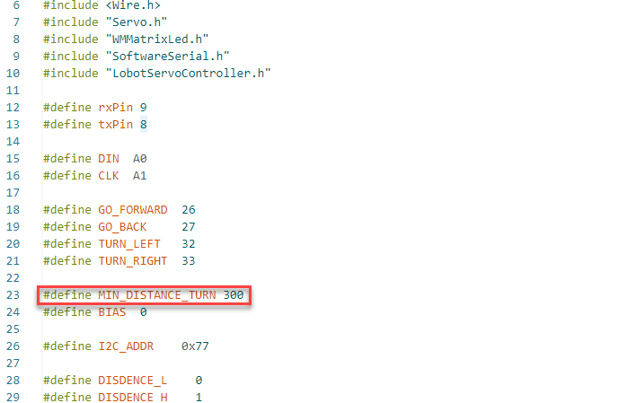

(2) When the ultrasonic sensor detects an object ahead, the measured distance is compared with a predefined threshold value, MIN_DISTANCE_TURN. Based on this comparison, the program determines the appropriate action to take.

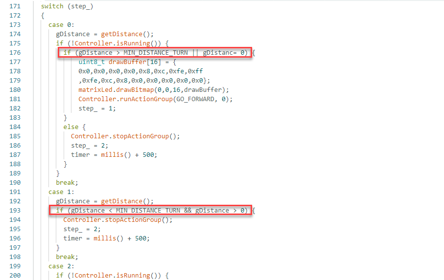

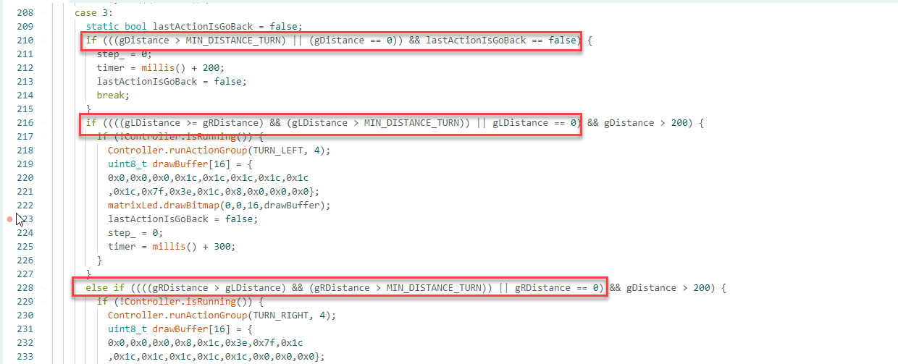

## 5.7 Cross Fire Navigation

### 5.7.1 Project Introduction

This lesson demonstrates how to use an glowy ultrasonic sensor module to measure distance and control the robot's posture while navigating through obstacles.

### 5.7.2 Project Process


### 5.7.3 Module Instruction


This is a distance-measuring ultrasonic sensor module equipped with an RGB light feature. It adopts an IIC communication interface and can read distance measurements from the ultrasonic sensor via IIC.

During distance measurement, the module automatically sends out 8 pulses of 40 kHz square waves and waits for a signal to return. If a signal is returned, the module outputs a high-level signal, and the duration of the high-level signal corresponds to the time it takes for the ultrasound to travel to the object and back.

### 5.7.4 Program Download

(1) Open the program file located in the same directory as this lesson:  [Cross Fire Navigation Program\Cross\Cross.ino](../_static/source_code/intelligent_games_learning.zip)

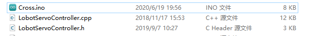

(2) Connect the Arduino UNO to the computer via USB cable.

(3) In the Arduino IDE, click the **"Select Board"** option. The software will automatically detect the connected Arduino serial port.


(4) Then click the upload button  to upload the program to the Arduino. Wait for the upload to complete.


### 5.7.5 Project Outcome

A small tunnel can be created using cardboard boxes. Once the robot is placed inside and powered on, the ultrasonic sensor begins detecting the distance to obstacles in front. When no nearby object is detected, the robot proceeds in a high stance.

If an object is detected within a predefined range, the robot switches to a low stance and attempts to pass under the obstacle. Once the path is clear again, it resumes high-stance movement.


### 5.7.6 Program Brief Analysis

[Source Code](../_static/source_code/intelligent_games_learning.zip)

(1) Several libraries required for this application should be imported, including servo control, sensor, and software serial communication libraries.

{lineno-start=6}

```
#include <Wire.h>
#include "Servo.h"
#include "WMMatrixLed.h"
#include "SoftwareSerial.h"
#include "LobotServoController.h"
```

(2) The communication pins between the Arduino and the servo controller are first defined. Then, instances of the sensor class, software serial class, and other secondary development communication classes are created.

{lineno-start=19}

```
#define H_STAND       34    //High stance
#define L_STAND       0     //Low stance, stand up

#define H_GO_FORWARD  35    //High stance
#define L_GO_FORWARD  1     //Low stance, move forward

#define I2C_ADDR    0x77

#define MIN_DISTANCE 250//250mm

#define RGB_BRIGHTNESS  50//0-255

//Rigister
#define DISDENCE_L    0//Low 8 bytes of distance, unit mm
#define DISDENCE_H    1

#define RGB_BRIGHTNESS  50//0-255

#define RGB_WORK_MODE 2//RGB mode, 0: user-defined mode 1: breathing light mode default 0

#define RGB1_R      3//R value of No.1 light，0~255，Default is 0
#define RGB1_G      4//Default is 0
#define RGB1_B      5//Default is 255

#define RGB2_R      6//R value of No.2 light，0~255，Default is 0
#define RGB2_G      7//Default is 0
#define RGB2_B      8//Default is 255

#define RGB1_R_BREATHING_CYCLE      9 //In the breathing light mode, the breathing cycle of the R of the No. 1light, the unit is 100ms and the default is 0.
                                      //If the period is set to 3000ms, the value is 30
#define RGB1_G_BREATHING_CYCLE      10
#define RGB1_B_BREATHING_CYCLE      11

#define RGB2_R_BREATHING_CYCLE      12//RGB 2
#define RGB2_G_BREATHING_CYCLE      13
#define RGB2_B_BREATHING_CYCLE      14

#define RGB_WORK_SIMPLE_MODE    0
#define RGB_WORK_BREATHING_MODE   1

Servo sonarServo;  //Examples of ultrasonic servo control
SoftwareSerial MySerial(rxPin, txPin);  //Software serial port instantiation
WMMatrixLed matrixLed(CLK, DIN);  //Instantiated dot matrix
LobotServoController Controller(MySerial); //Instantiated secondary development

```

(3) In the `setup()` function, all hardware and communication interfaces are initialized. This includes I2C, software and hardware serial ports, peripheral devices, and the LED matrix. The function ensures that all components are in their expected initial states before entering the main loop.

{lineno-start=239}

```
void setup() 
{
  Wire.begin();
  Serial.begin(9600);   //Initialize serial port 0, baud rate 9600
  MySerial.begin(9600); //Initialize software serial port  

  matrixLed.setBrightness(3);
  matrixLed.clearScreen();  
  sonarServo.attach(12); //Set the servo control io port
  sonarServo.write(90);  
  delay(300);
  sonarServo.detach();  //Detach servo  
  Controller.runActionGroup(H_STAND, 1);  //Run No.0 action group to command the robot to stand up 
  uint8_t drawBuffer[16] = {
    0x00, 0x00, 0x00, 0x00, 0x00, 0x00, 0x00, 0x00
  , 0x00, 0x00, 0x00, 0x00, 0x00, 0x00, 0x00, 0x00};
  for (int i = 0; i < 16; i++) {
    drawBuffer[i] = 0xff;
    matrixLed.drawBitmap(0,0,16,drawBuffer);   
    delay(20);
  }  
  
  matrixLed.clearScreen();
}
```

(4) Within the `loop()` function, the `Controller.receiveHandle()` function first processes incoming serial data. The `getDistance()` function is then called to obtain distance measurements. Display data is stored in the `drawBuffer` array, which is updated in a loop based on the pos variable.

{lineno-start=264}

```
void loop() 
{
  Controller.receiveHandle(); //Receive and process functions, fetch data from the serial port receive buffer
  getDistance();              //Measure distance

  uint8_t drawBuffer[16] = {
  0x0,0x0,0x0,0x0,0x8,0xc,0xfe,0xff
  ,0xfe,0xc,0x8,0x0,0x0,0x0,0x0,0x0};
  
  for(int i = 0; i < 16; ++i){
    int ptmp = abs(pos);
    if(pos > 0)
      drawBuffer[i] <<= ptmp;
    else
      drawBuffer[i] >>= ptmp;
  }
  delay(20);
  matrixLed.drawBitmap(0,0,16, drawBuffer);
  sonar();                    //Realize the logic
}
```

(5) The `getDistance()` function combines ultrasonic distance measurement with movement control. The overall functionality involves using ultrasonic distance measurements to determine proximity and executing different actions based on the measured values.

The function reads distance values, stores them in the echoTime array, and calculates an average to reduce error. This average distance is then used for subsequent motion control logic.

{lineno-start=127}

```
int getDistance()
{
  static uint32_t timer;
  static bool firstTime = true;
  static uint32_t echoTime[3];
  static uint8_t index = 0;
  static uint8_t count = 0;

  WireReadDataArray(0,(uint8_t *)&distance,2);    
  if (firstTime == true) {
    echoTime[0] = echoTime[1] = echoTime[2] = distance;  
    firstTime = false;
  }
  else {
    if (distance != 0 && distance != 65522) {
      count = 0;
      echoTime[index] = distance; 
    }
    else {
      count ++;
      index = 0;
      if (count > 4) {
        count = 0;
        Distance = 0;            
      }
    }
  }
  index++;
  if (index > 2) {
    index = 0;
    count = 0;
    Distance = (echoTime[0] + echoTime[1] + echoTime[2]) / 3.0;
  }  
}
```

(6) The `sonar()` function contains a state machine that controls the robot's movement. A static variable, step, determines the current behavior based on the measured distance.

Key logic breakdown:  

If the distance is greater than the predefined minimum threshold MIN_DISTANCE, or equals zero, which indicates extreme proximity or no obstacle, the robot moves forward in high stance and changes the RGB LED color as a visual cue in the initial state (Step 0).

{lineno-start=163}

```
void sonar()  //Logic
{
  static uint8_t  step = 0;   //Static variables for recording steps
  uint8_t RGB[6];
  uint8_t breathing[6];
  uint8_t value;
  
  switch (step)  //Branch according to step
  {
    case 0:   //Step 0
      if (!Controller.isRunning()) 
      {
        if (Distance > MIN_DISTANCE || Distance == 0) //If the measured distance is greater than the specified distance
        {  
          value = RGB_WORK_SIMPLE_MODE;
          WireWriteDataArray(RGB_WORK_MODE,&value,1);
          RGB[0] = 0;RGB[1] = RGB_BRIGHTNESS;RGB[2] = 0;//RGB1
          RGB[3] = 0;RGB[4] = RGB_BRIGHTNESS;RGB[5] = 0;//RGB2
          WireWriteDataArray(RGB1_R,RGB,6);        
          Controller.runActionGroup(H_GO_FORWARD, 0); //Go forward
          step = 1;
        }
      }
      break;
```

(7) When an object is detected within the minimum threshold (Step 1), the robot stops, changes LED color, and transitions to a low posture. During this process, if the robot moves to a predefined position potentially near the boundary, the position variable pos is adjusted to prevent exceeding the specified limits.

{lineno-start=187}

```
    case 1:
      if (pos <= -8) {
        pos = 8;
      }
      pos -= 1; 
      if (Distance < MIN_DISTANCE  && Distance > 0) //If the measured distance is smaller than the specified distance
      {  
        value = RGB_WORK_SIMPLE_MODE;
        WireWriteDataArray(RGB_WORK_MODE,&value,1);
        RGB[0] = RGB_BRIGHTNESS;RGB[1] = 0;RGB[2] = 0;//RGB1
        RGB[3] = RGB_BRIGHTNESS;RGB[4] = 0;RGB[5] = 0;//RGB2
        WireWriteDataArray(RGB1_R,RGB,6);
        Controller.stopActionGroup(); 
        delay(500);
        Controller.runActionGroup(L_STAND, 1); //Squat
        step = 2;  //Turn to step 2
      }
      break; 
```

(8) After entering the crouching posture (Step 2), if the measured distance exceeds the predefined minimum threshold, the robot proceeds forward while maintaining the crouching posture. During the movement, the robot changes the RGB LED color as a visual cue.

(9) Finally, after Step 3, the robot returns to the upright posture upon completing the action and waits for the next distance measurement control cycle. If the robot reaches a predefined edge position, the position variable is also adjusted to prevent exceeding the set limits.

Overall, this function represents a robot motion control logic based on ultrasonic distance measurement, where actions and state transitions are executed according to the measured distance values. It includes movements such as forward motion, stopping, crouching, and stand at attention, with visual feedback provided through changes in RGB light color.

### 5.7.7 Feature Extensions

* **Adjusting Obstacle Detection Thresholds**

(1) To modify the detection range for obstacle avoidance, update the relevant section of the code as indicated by red boxes in the example diagram.

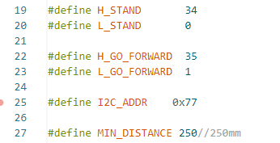

(2) When the ultrasonic sensor detects an object ahead, the measured distance is compared with a predefined threshold value, MIN_DISTANCE. Based on this comparison, the program determines the appropriate action to take.

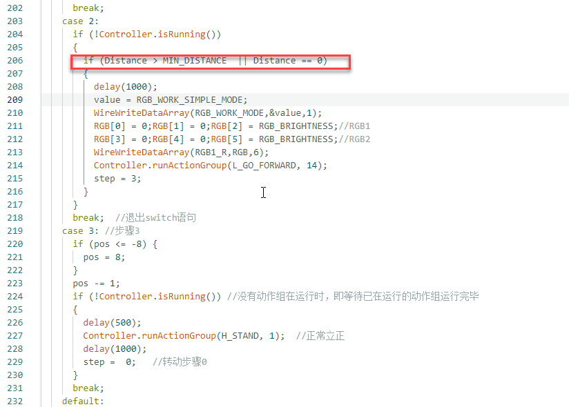

* **Customizing Movement Postures**

(1) To change the robot's posture when encountering obstacles at various distances, modify the motion group values in the relevant section of the program.

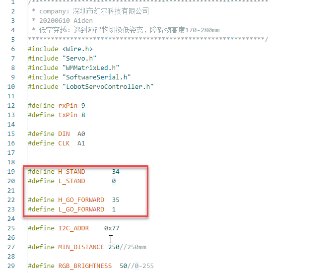

(2) Several posture macros are predefined in the program. Based on measured distance, the robot executes different movement patterns using the assigned motion group number.

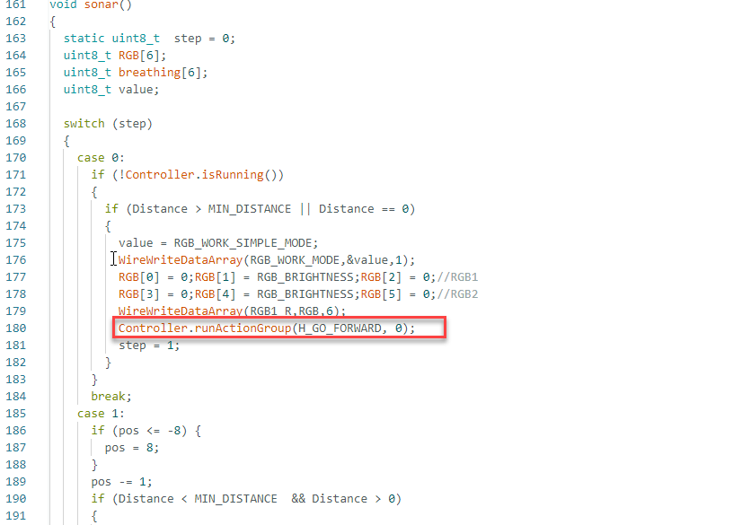

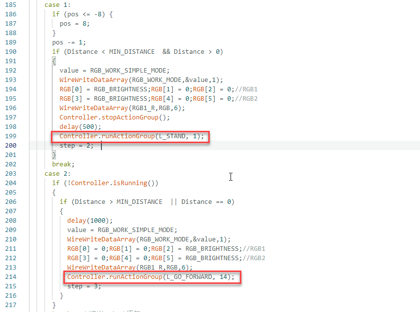

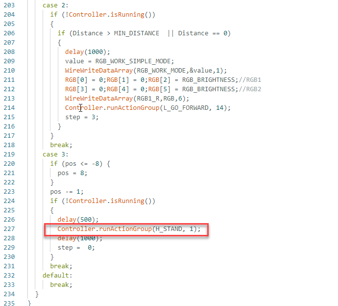

(3) To modify the robot's actions during operation, update the action value within the highlighted section of the code to match one of the predefined posture macros.

(4) By default, when the measured distance exceeds the specified threshold, the robot moves forward in a normal posture using `Controller.runActionGroup(H_GO_FORWARD, 0)`.

(5) For example, this can be changed to `Controller.runActionGroup(L_GO_FORWARD, 0)` to move forward in a crouching posture.

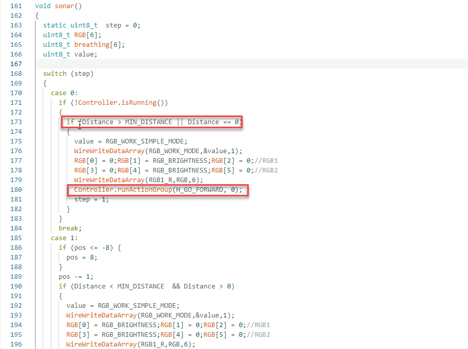

## 5.8 Inverted Walking

### 5.8.1 Project Introduction

This lesson demonstrates how the robot can continue walking even when turned upside down.

### 5.8.2 Project Process

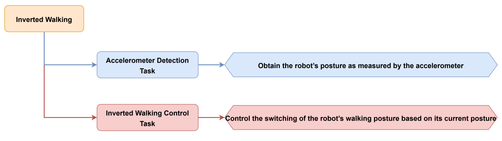

### 5.8.3 Module Instruction


This sensor primarily uses the MPU6050 component. It integrates a 3-axis MEMS gyroscope, a 3-axis MEMS accelerometer, and an expandable Digital Motion Processor (DMP). The sensor uses three 16-bit ADCs for both the gyroscope and accelerometer to convert measured analog signals into digital output.

### 5.8.4 Program Download

[Source Code](../_static/source_code/intelligent_games_learning.zip)

(1) Open the file named [Inverted Walking Program\\ upAndDown\\ upAndDown.ino](../_static/source_code/intelligent_games_learning.zip) located in the corresponding lesson folder.

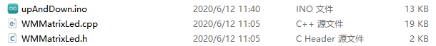

(2) Connect the Arduino UNO to the computer via USB cable.

(3) In the Arduino IDE, click the **"Select Board"** option. The software will automatically detect the connected Arduino serial port.

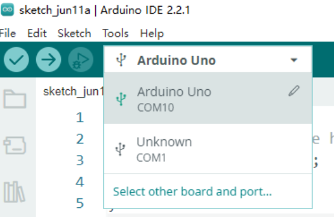

(4) Then click the upload button  to upload the program to the Arduino. Wait for the upload to complete.


### 5.8.5 Project Outcome

During forward movement, if the robot is turned upside down so that its underside faces upward, it will resume walking in a rolling motion after a brief moment. When flipped back to its original orientation, the robot will continue walking as before in its standard posture.


### 5.8.6 Program Brief Analysis

[Source Code](../_static/source_code/intelligent_games_learning.zip)

(1) Several libraries required for this application should be imported, including servo control, sensor, and software serial communication libraries.

{lineno-start=6}

```
#include <Wire.h>
#include "Servo.h"
#include "I2Cdev.h"
#include "MPU6050.h"
#include "WMMatrixLed.h"
#include "SoftwareSerial.h"
#include "LobotServoController.h"
```

(2) The communication pins between the Arduino and the servo controller are first defined. Then, instances of the sensor class, software serial class, and other secondary development communication classes are created.

{lineno-start=22}

```
#define L_STAND       0     //Low stance，stand up
#define L_GO_FORWARD  1     //Low stance, go forward
#define L_GO_BACK     2     //Low stance，backward

#define U_STAND       90     //Flipped stance，stand up
#define U_GO_FORWARD  91     //Flipped stance，go forward
#define U_GO_BACK     92     //Flipped stance，backward

#define weight 0.1

#define I2C_ADDR    0x77

//Rigister
#define DISDENCE_L    0//Low 8 bytes of distance, unit mm
#define DISDENCE_H    1

#define RGB_BRIGHTNESS  50//0-255
#define RGB_WORK_MODE 2//RGB mode, 0: user-defined mode 1: breathing light mode default 0

#define RGB1_R      3//R value of No.1 light，0~255，Default is 0
#define RGB1_G      4//Default is 0
#define RGB1_B      5//Default is 255

#define RGB2_R      6//R value of No.2 light，0~255，Default is 0
#define RGB2_G      7//Default is 0
#define RGB2_B      8//Default is 255

#define RGB1_R_BREATHING_CYCLE      9 //In the breathing light mode, the breathing cycle of the R of the No. 1light, the unit is 100ms and the default is 0.
                                      //If the period is set to 3000ms, the value is 30
#define RGB1_G_BREATHING_CYCLE      10
#define RGB1_B_BREATHING_CYCLE      11

#define RGB2_R_BREATHING_CYCLE      12//RGB 2
#define RGB2_G_BREATHING_CYCLE      13
#define RGB2_B_BREATHING_CYCLE      14

#define RGB_WORK_SIMPLE_MODE    0
#define RGB_WORK_BREATHING_MODE   1
 
unsigned long now, lastTime = 0;
float dt;                                   //Derivative time
 
int16_t ax, ay, az, gx, gy, gz;             //Accelerometer gyroscope raw data
float aax=0, aay=0,aaz=0, agx=0, agy=0, agz=0;    //Angle variable
long axo = 0, ayo = 0, azo = 0;             //Accelerometer offset
long gxo = 0, gyo = 0, gzo = 0;             //Gyro offset
 
float pi = 3.1415926;
float AcceRatio = 16384.0;                  //Accelerometer scale factor
float GyroRatio = 131.0;                    //Gyro scale factor
 
uint8_t n_sample = 8;                       //Accelerometer filtering algorithm sampling number
float aaxs[8] = {0}, aays[8] = {0}, aazs[8] = {0};         //x,y axis sampling queue
long aax_sum, aay_sum,aaz_sum;                      //x,y axis sampling and
 
float a_x[10]={0}, a_y[10]={0},a_z[10]={0} ,g_x[10]={0} ,g_y[10]={0},g_z[10]={0}; //Accelerometer covariance calculation queue
float Px=1, Rx, Kx, Sx, Vx, Qx;             //x-axis Kalman variable
float Py=1, Ry, Ky, Sy, Vy, Qy;             //y-axis Kalman variable
float Pz=1, Rz, Kz, Sz, Vz, Qz;             //z-axis Kalman variable

MPU6050 accelgyro;
Servo sonarServo;  //Examples of ultrasonic servo control
SoftwareSerial MySerial(rxPin, txPin);  //Software serial port instantiation
WMMatrixLed matrixLed(CLK, DIN);  //Instantiated dot matrix
LobotServoController Controller(MySerial); //Instantiated secondary development

```

(3) In the `setup()` function, I2C communication, software serial, and hardware serial are first initialized. The matrix display brightness is configured, and the screen is cleared. The servo controller is used to position the ultrasonic sensor. RGB lighting mode and brightness are set via I2C commands. A simple pattern is also rendered on the LED matrix.

{lineno-start=343}

```
void setup() {
  // put your setup code here, to run once:
  uint8_t RGB[6];
  uint8_t breathing[6];
  uint8_t value;
  
  Wire.begin();
  MySerial.begin(9600);  //Software serial port for communication with the servo, baud rate 9600
  Serial.begin(9600);    //The hardware serial port used for printing and debugging, the baud rate is 9600
  matrixLed.setColorIndex(1);
  matrixLed.setBrightness(3);
  matrixLed.clearScreen();  
  sonarServo.attach(12); //Set the servo control io port
  sonarServo.write(90);  //Initial position to 90 degrees
```

(4) The main function is primarily responsible for receiving data, measuring distance, updating the LED display, and executing additional logic. The ultrasonic distance is measured using the getDistance() function, which retrieves the current distance information. An array named drawBuffer is defined to store data for the LED matrix display. This array is initialized with zeros, which means all LEDs are off.

A loop iterates through each element in the drawBuffer array. Based on the value of the variable pos, the binary value of each element is shifted accordingly. If pos is positive, each element is shifted left by ptmp bits, where ptmp is the absolute value of pos. If pos is negative, each element is shifted right by ptmp bits.

{lineno-start=382}

```
  uint8_t drawBuffer[16] = {
    0x00, 0x00, 0x00, 0x00, 0x00, 0x00, 0x00, 0x00
  , 0x00, 0x00, 0x00, 0x00, 0x00, 0x00, 0x00, 0x00};
  for (int i = 0; i < 16; i++) {
    drawBuffer[i] = 0xff;
    matrixLed.drawBitmap(0,0,16,drawBuffer);   
    delay(20);
  }  
  
  sonarServo.detach();  //Detach servo
  matrixLed.clearScreen();
}
```

(5) In the `loop()` function, the primary tasks include receiving data, measuring distance, updating the LED display, and executing specific logic operations. It integrates data processing, hardware control, and graphical display. These components work together to achieve specific behavior or functionality.

{lineno-start=395}

```
void loop() { //Main loop
  // put your main code here, to run repeatedly:
  Controller.receiveHandle();  //Receiving processing, used to process the data received from the steering gear control board
  update_mpu6050();
  upDown();  //Logic realization
}
```

### 5.8.7 Feature Extensions

* **Adding Inverted Movement**

(1) To modify the robot's behavior after it has been flipped, adjustments can be made in the specified section of the code.

{lineno-start=6}

```
#include <Wire.h>
#include "Servo.h"
#include "I2Cdev.h"
#include "MPU6050.h"
#include "WMMatrixLed.h"
#include "SoftwareSerial.h"
#include "LobotServoController.h"

#define rxPin 9  //Serial communication interface between arduino and servo controller
#define txPin 8  

#define DIN  A0  //Dot matrix interface
#define CLK  A1

//Number of all action groups can be modified.

#define L_STAND       0     //Low stance，stand up
#define L_GO_FORWARD  1     //Low stance, go forward
#define L_GO_BACK     2     //Low stance，backward

#define U_STAND       90     //Flipped stance，stand up
#define U_GO_FORWARD  91     //Flipped stance，go forward
#define U_GO_BACK     92     //Flipped stance，backward

#define weight 0.1
```

(2) Several predefined macros define different motion actions based on the robot's orientation.

{lineno-start=273}

```
void upDown()
{
  static uint32_t timer = 0;//Define static variable timer for timing
  static uint8_t  stept = 0;   //Static variables for recording steps
  if (timer > millis())  //Return if the set time is greater than the current number of milliseconds, otherwise continue
    return;
  switch (stept)  //Switch according to step
  {
    case 0:
      if (agy < 0) {
        Controller.stopActionGroup();
        stept = 1;
      }
      else {
        uint8_t drawBuffer[16] = {
        0x0,0x0,0x0,0x0,0x10,0x30,0x7f,0xff
        ,0x7f,0x30,0x10,0x0,0x0,0x0,0x0,0x0};
        matrixLed.drawBitmap(0,0,16,drawBuffer);
        Controller.runActionGroup(L_GO_FORWARD, 0);//Go forward
      }
      break;

    case 1:
      if (agy < 0) {
        uint8_t drawBuffer[16] = {
        0x0,0x0,0x0,0x0,0x10,0x30,0x7f,0xff
        ,0x7f,0x30,0x10,0x0,0x0,0x0,0x0,0x0};
        for (int i = 0; i < 16; i++) {
          if (drawBuffer[i] != 0x00) {  
            drawBuffer[i] = getInvert(drawBuffer[i]);
          }
        }
        matrixLed.drawBitmap(0,0,16,drawBuffer);
        Controller.runActionGroup(U_STAND, 1);//Stand in the opposite direction
        timer = millis() + 1500;
        stept = 2;
      }
      else
        stept = 0;
      break;

    case 2:
      if (!Controller.isRunning()) {  //If there is no action group running
        stept = 3;
      }
      break;
    case 3:
      if (agy > 0) {
        timer = millis() + 500;
        stept = 4;
      }
      else
//      ;
        Controller.runActionGroup(U_GO_FORWARD, 0);//Go forward in the opposite direction
      break;

    case 4:
      if (agy > 0){
        uint8_t drawBuffer[16] = {
        0x0,0x0,0x0,0x0,0x10,0x30,0x7f,0xff
        ,0x7f,0x30,0x10,0x0,0x0,0x0,0x0,0x0};
        matrixLed.drawBitmap(0,0,16,drawBuffer);
        Controller.runActionGroup(L_STAND, 1);//Stand up
        timer = millis() + 1500;
        stept = 0;
      }
      break;
  }
}
```

(3) When the front side faces upward, the robot moves forward. When the robot is flipped upside down, the program triggers inverted movement.

(4) To modify the robot's actions during operation, update the action value within the highlighted section of the code to match one of the predefined posture macros. For example, by default, when the robot is flipped with its back side facing upward, the action `Controller.runActionGroup(U_GO_FORWARD, 0)` is executed, initiating forward movement in the inverted state.

(5) This line can be modified to `Controller.runActionGroup(U_GO_BACK, 0)` to perform backward movement instead. For example, this can be changed to `Controller.runActionGroup(L_GO_FORWARD, 0)` to move forward in a crouching posture.

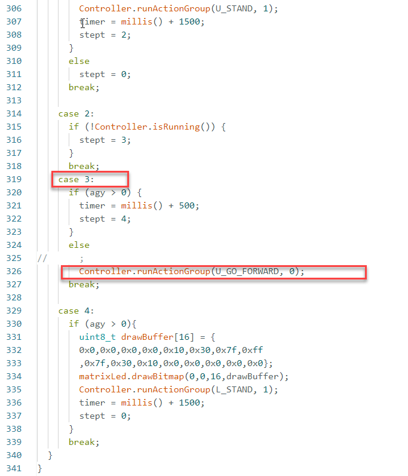

## 5.9 Color Recognition

### 5.9.1 Assembly and Wiring

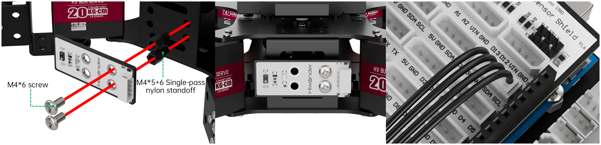

### 5.9.2 Project Introduction

This lesson demonstrates the use of a color sensor to detect three primary colors—red, green, and blue—and to control the robot's behavior and the RGB lighting on the ultrasonic module accordingly.

### 5.9.3 Project Process

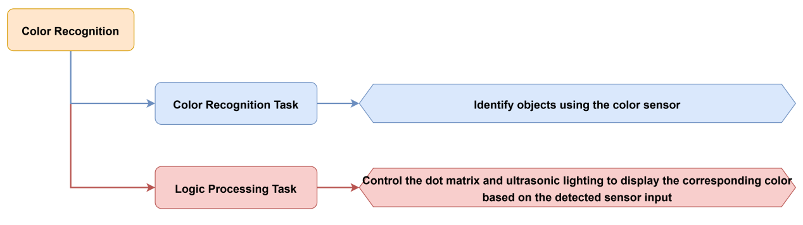

### 5.9.4 Module Instruction

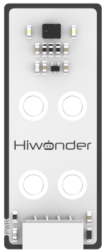

This is a sensor that can detect the color of an object, the ambient light intensity, object proximity, and support non-contact gesture detection. It features integrated RGB color detection which enables identification of various colors, ambient light detection to measure light intensity under different lighting conditions, and a built-in infrared LED to support proximity sensing.

### 5.9.5 Program Download

[Source Code](../_static/source_code/intelligent_games_learning.zip)

(1) Open the file named [Color Recognition Program\color_detect\color_detect.ino](../_static/source_code/intelligent_games_learning.zip) located in the corresponding lesson folder.

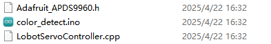

(2) Connect the Arduino UNO to the computer via USB cable.

(3) In the Arduino IDE, click the **"Select Board"** option. The software will automatically detect the connected Arduino serial port.


(4) Then click the upload button  to upload the program to the Arduino. Wait for the upload to complete.


### 5.9.6 Project Outcome

Place the robot on a flat surface and turn on the power. Present the color cards one by one in front of the color sensor.

(1) When blue is detected, the LED matrix scrolls the text **"BLUE,"** the ultrasonic module emits blue light, and the pan-tilt servo rotates in a head-shaking motion.

(2) When green is detected, the LED matrix scrolls **"GREEN,"** the ultrasonic module emits green light, and the pan-tilt servo performs the same head-shaking movement.

(3) When red is detected, the LED matrix scrolls **"RED,"** the ultrasonic module emits red light, and the pan-tilt servo remains stationary.


### 5.9.7 Program Brief Analysis

[Source Code](../_static/source_code/intelligent_games_learning.zip)

(1) Several libraries required for this application should be imported, including servo control, sensor, and software serial communication libraries.

{lineno-start=6}

```
#include <Wire.h>
#include "Servo.h"
#include "WMMatrixLed.h"
#include "SoftwareSerial.h"
#include "Adafruit_APDS9960.h"
#include "LobotServoController.h"
```

(2) The communication pins between the Arduino and the servo controller are first defined. Then, instances of the sensor class, software serial class, and other secondary development communication classes are created. Control objects for servos and LED matrix are initialized to manage peripheral modules.

{lineno-start=31}

```
#define I2C_ADDR    0x77

//register
#define DISDENCE_L    0//distanceis lower 8 bits, unit mm
#define DISDENCE_H    1

#define RGB_BRIGHTNESS  50//0-255
#define RGB_WORK_MODE 2//RGB light modoe，0：User-defined mode   1：Breathing light mode default 0

#define RGB1_R      3//R value of probe 1，0~255，default0
#define RGB1_G      4//default0
#define RGB1_B      5//default255

#define RGB2_R      6//R value of proble，0~255，default0
#define RGB2_G      7//default0
#define RGB2_B      8//default255

#define RGB1_R_BREATHING_CYCLE      9 //when breathing light mode is 1，the breathing period of probe 1,unit 100ms default0,
                                      //if set to period is 3000ms,then the value is 30
#define RGB1_G_BREATHING_CYCLE      10
#define RGB1_B_BREATHING_CYCLE      11

#define RGB2_R_BREATHING_CYCLE      12//No.2 proble
#define RGB2_G_BREATHING_CYCLE      13
#define RGB2_B_BREATHING_CYCLE      14

#define RGB_WORK_SIMPLE_MODE    0
#define RGB_WORK_BREATHING_MODE   1

Adafruit_APDS9960 apds;
Servo sonarServo;  //unltrasion stastion servo control examples
SoftwareSerial MySerial(rxPin, txPin);  //soft serial port examples
WMMatrixLed matrixLed(CLK, DIN);  //dot matrix examples
LobotServoController Controller(MySerial); //instantiated secondary development

```

(3) In the setup() function, I2C communication, software serial, and hardware serial interfaces are initialized. Servo IO pins are bound, and the servo is set to its initial position at 90 degrees. The robot's default posture is configured to Attention. The ultrasonic RGB light is set to breathing mode, and the color detection function of the sensor is enabled.

{lineno-start=246}

```
void setup() {
  // put your setup code here, to run once:
  uint8_t RGB[6];
  uint8_t breathing[6];
  uint8_t value;
  
  Wire.begin();
  MySerial.begin(9600);  //soft serial port for communication with the steering gear, baud rate 9600
  Serial.begin(9600);    //the hardware serial port used for printing and debugging, the baud rate is 9600

  matrixLed.setBrightness(3);
  matrixLed.clearScreen();
  sonarServo.attach(12); //set the servo control io port
  sonarServo.write(90);  //initial position 90 degrees
  delay(300);
  sonarServo.detach();
  Controller.runActionGroup(0, 1);   //running high profile  
  value = RGB_WORK_SIMPLE_MODE;
  WireWriteDataArray(RGB_WORK_MODE,&value,1);
  RGB[0] = 0;RGB[1] = 0;RGB[2] = RGB_BRIGHTNESS;//RGB1
  RGB[3] = 0;RGB[4] = 0;RGB[5] = RGB_BRIGHTNESS;//RGB2
  WireWriteDataArray(RGB1_R,RGB,6);

  if (!apds.begin()) { //initialize the sensor
    Serial.println("failed to initialize device! Please check your wiring.");
  }
  else Serial.println("Device initialized!");
  //enable color sensign mode
  apds.enableColor(true);//make sensor can color detection
  uint8_t drawBuffer[16] = {
    0x00, 0x00, 0x00, 0x00, 0x00, 0x00, 0x00, 0x00
  , 0x00, 0x00, 0x00, 0x00, 0x00, 0x00, 0x00, 0x00};
  for (int i = 0; i < 16; i++) {
    drawBuffer[i] = 0xff;
    matrixLed.drawBitmap(0,0,16,drawBuffer);   
    delay(20);
  }  
  
  matrixLed.clearScreen();
```

(4) The main function mainly handles data received from the servo controller and executes logic related to color recognition.

{lineno-start=287}

```
void loop() {
  // put your main code here, to run repeatedly:
  Controller.receiveHandle();  //process the data received from the steering gear control board
  color_detect();
}
```

(5) Within the color_detect() function, the color_logic() function is called to retrieve the detected color. If red is detected, the RGB light on the ultrasonic module is set to red, and "RED" is displayed on the LED matrix.

{lineno-start=196}

```
void color_detect() {
  uint8_t RGB[6];
  uint8_t breathing[6];
  uint8_t value; 
  uint8_t color;
  uint8_t status_;
  
  color = color_logic();
  if (color == RED && status_ != 1)
  {
    status_ = 1;
    value = RGB_WORK_BREATHING_MODE;
    WireWriteDataArray(RGB_WORK_MODE,&value,1);
    breathing[0] = 5;breathing[1] = 0;breathing[2] = 0;//RGB1，the parameter represents the cycle of the breathing light, for example 20 is 2s, the three parameters are R, G, B respectively
    breathing[3] = 5;breathing[4] = 0;breathing[5] = 0;//RGB2
    breathing[3] = 5;breathing[4] = 0;breathing[5] = 0;//RGB2
    WireWriteDataArray(RGB1_R_BREATHING_CYCLE,breathing,6); 
    showStr("RED", 60);
  }
  else if (color == GREEN && status_ != 2) {
    status_ = 2;
    value = RGB_WORK_SIMPLE_MODE;
    WireWriteDataArray(RGB_WORK_MODE,&value,1);
    RGB[0] = 0;RGB[1] = RGB_BRIGHTNESS;RGB[2] = 0;//RGB1
    RGB[3] = 0;RGB[4] = RGB_BRIGHTNESS;RGB[5] = 0;//RGB2
    WireWriteDataArray(RGB1_R,RGB,6);
    showStr("GREEN", 60);
```

(6) If green is detected, the RGB light is set to green, and "**GREEN**" is displayed. If blue is detected, the robot performs a head-shaking motion, and the RGB light is set to blue.

{lineno-start=215}

```
  else if (color == GREEN && status_ != 2) {
    status_ = 2;
    value = RGB_WORK_SIMPLE_MODE;
    WireWriteDataArray(RGB_WORK_MODE,&value,1);
    RGB[0] = 0;RGB[1] = RGB_BRIGHTNESS;RGB[2] = 0;//RGB1
    RGB[3] = 0;RGB[4] = RGB_BRIGHTNESS;RGB[5] = 0;//RGB2
    WireWriteDataArray(RGB1_R,RGB,6);
    showStr("GREEN", 60);
    shake_Head();
  }
  else if (color == BLUE && status_ != 3) {
    status_ = 3;
    value = RGB_WORK_SIMPLE_MODE;
    WireWriteDataArray(RGB_WORK_MODE,&value,1);
    RGB[0] = 0;RGB[1] = 0;RGB[2] = RGB_BRIGHTNESS;//RGB1
    RGB[3] = 0;RGB[4] = 0;RGB[5] = RGB_BRIGHTNESS;//RGB2
    WireWriteDataArray(RGB1_R,RGB,6);  
    showStr("BLUE", 60);  
    shake_Head();
  }
  else if (status_ != 4){
    status_ = 4;
    matrixLed.clearScreen();
    value = RGB_WORK_SIMPLE_MODE;
    WireWriteDataArray(RGB_WORK_MODE,&value,1);
    RGB[0] = 0;RGB[1] = 0;RGB[2] = 0;//RGB1
    RGB[3] = 0;RGB[4] = 0;RGB[5] = 0;//RGB2
    WireWriteDataArray(RGB1_R,RGB,6);     
  }
}
```

### 5.9.8 Feature Extensions

* **Setting a Different Target Color**

(1) By default, the program uses red as the target color. To modify the distance detection conditions, update the values in the relevant section of the code.

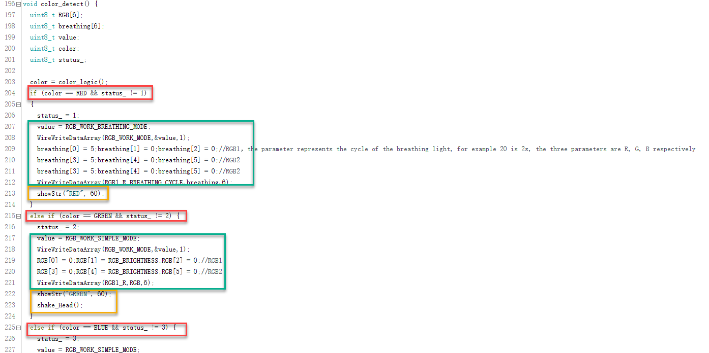

(2) In the section marked in red, the color sensor evaluates the read values to determine whether the detected color is red, green, or blue. In the green-marked section, the corresponding RGB light color on the ultrasonic module is set based on the identified color.

(3) By default, red triggers a breathing light effect, while green and blue use a steady light. The yellow-marked section contains the character output displayed on the LED matrix. It reflects the identified color. If the detected color is not the correct one, the 9g servo beneath the ultrasonic module will be triggered to move back and forth as an error response.

* **Customizing Color Recognition**

(1) The color sensor detects RGB values, which identifies colors based on the combination of red, green, and blue components.

(2) In the default configuration, the sensor reads RGB values and allows the robot to perform specific actions based on the dominant color. In the red-marked section, the raw R, G, and B values are converted into the variables r, g, and b, representing the intensity of red, green, and blue respectively, with each ranging from 0 to 255.

(3) In the green-marked section, the program compares the r, g, and b values to determine which color component is dominant and thus classifies the detected color.

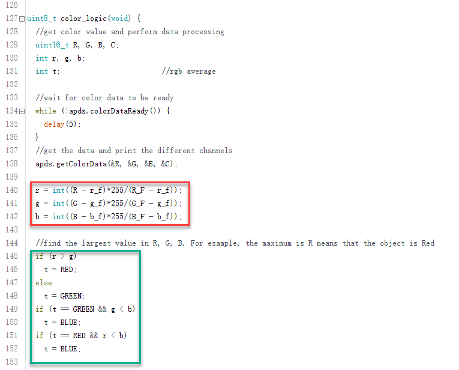

(4) To add support for other colors, the target RGB values must first be determined. This can be done using the "**Paint**" application on a Windows system.

(5) Open an image containing the desired color. Use the Eyedropper Tool to select the color. Taking color "**Orange**" as an example, click "**Edit Colors**" to view the exact Red, Green, and Blue values.

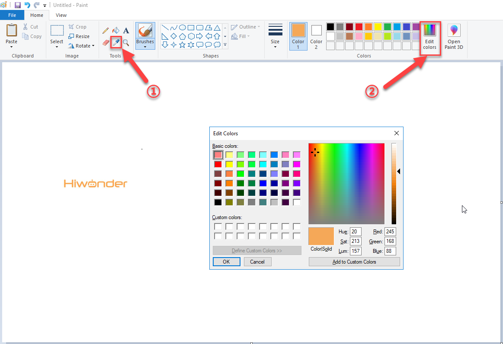

(6) These RGB values can then be used in the program to compare with the color sensor's readings. If the sensor readings closely match the target RGB values, the color can be recognized as a user-defined color.

## 5.10 Sound Control

### 5.10.1 Assembly and Wiring

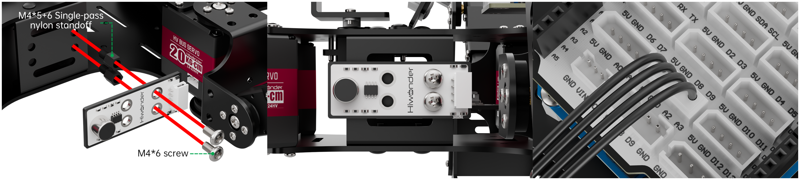

### 5.10.2 Project Introduction

This lesson demonstrates how to control the robot's movement using a sound sensor. The number of detected sounds determines the robot's response.

### 5.10.3 Project Process

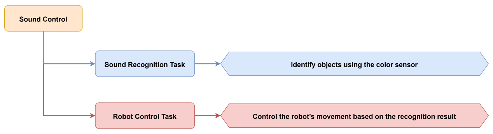

### 5.10.4 Module Instruction

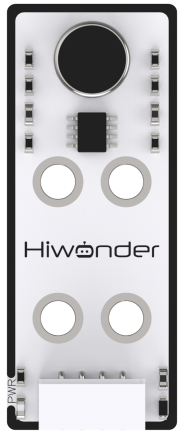

The sensor features a built-in capacitive electret microphone. Sound waves cause the internal diaphragm to vibrate, resulting in capacitance changes and small voltage fluctuations. This voltage is converted to a 0 to 5V signal and compared with a preset adjustable threshold.

Through the module's A/D conversion, values in the range of 0 to 1023 are read by the data acquisition system. The stronger the sound, the higher the output value, indicating a direct correlation between sound intensity and analog output.

### 5.10.5 Program Download

[Source Code](../_static/source_code/intelligent_games_learning.zip)

(1) Open the program file located in the same directory as this lesson:  [Sound Control Program\Sound\Sound.ino](../_static/source_code/intelligent_games_learning.zip)

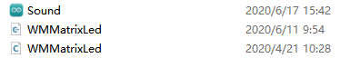

(2) Connect the Arduino UNO to the computer via USB cable.

(3) In the Arduino IDE, click the **"Select Board"** option. The software will automatically detect the connected Arduino serial port.


(4) Then click the upload button  to upload the program to the Arduino. Wait for the upload to complete.


### 5.10.6 Project Outcome

Sound cues, such as claps, can be used to control the robot. One sound triggers a short forward movement, while two sounds trigger a short backward movement.


### 5.10.7 Program Brief Analysis

[Source Code](../_static/source_code/intelligent_games_learning.zip)

(1) Several libraries required for this application should be imported, including servo control, sensor, and software serial communication libraries.

{lineno-start=6}

```
#include <Wire.h>
#include "Servo.h"
#include "WMMatrixLed.h"
#include "SoftwareSerial.h"
#include "LobotServoController.h"
```

(2) The communication pins between the Arduino and the servo controller are first defined. Then, instances of the sensor class, software serial class, and other secondary development communication classes are created.

{lineno-start=12}

```
#define rxPin 9  //arduino and servo controller's serial communication port 
#define txPin 8  

#define DIN  A0  //dot matrix port
#define CLK  A1
#define SOUND_PIN  A2  /*IO port where the sound sensor is located*/

#define L_STAND       0     //low posture, attention

#define I2C_ADDR    0x77
```

(3) In the setup() function, several arrays and variables are defined. First, I2C communication and serial communication are initialized, and the baud rate for communication with the servo controller is set to 9600. Then, the sound input pin is configured as an input. The LED matrix is initialized, with its color and brightness set, and the display cleared.

{lineno-start=185}

```
  Wire.begin();
  MySerial.begin(9600);  //soft serial port for communication with the steering gear, baud rate 9600
  Serial.begin(9600);    //the hardware serial port used for printing and debugging, the baud rate is 9600
  pinMode(SOUND_PIN, INPUT);   
  matrixLed.setColorIndex(1);
  matrixLed.setBrightness(3);
  matrixLed.clearScreen();  
  sonarServo.attach(12); //set the servo control io port
```

(4) The servo is then configured by binding it to a specific I/O port, and its initial position is set to 90 degrees. A predefined action group is executed, and a value is written to the RGB working mode via the I2C bus. Next, two RGB values are set and transmitted to the LED matrix's RGB channels through the I2C interface.

{lineno-start=188}

```
  pinMode(SOUND_PIN, INPUT);   
  matrixLed.setColorIndex(1);
  matrixLed.setBrightness(3);
  matrixLed.clearScreen();  
  sonarServo.attach(12); //set the servo control io port
  sonarServo.write(90);  //initial position 90 degrees  
  delay(300);
  sonarServo.detach();  //release the servo s after use
  Controller.runActionGroup(0, 1); //run No.0 action group
```

(5) A drawing buffer is then created and filled with zero values. This buffer is displayed on the LED matrix to produce a fully lit effect for a brief moment before the screen is cleared.

{lineno-start=179}

```
void setup() {
  // put your setup code here, to run once:
  uint8_t RGB[6];
  uint8_t breathing[6];
  uint8_t value;
  
  Wire.begin();
  MySerial.begin(9600);  //soft serial port for communication with the steering gear, baud rate 9600
  Serial.begin(9600);    //the hardware serial port used for printing and debugging, the baud rate is 9600
  pinMode(SOUND_PIN, INPUT);   
  matrixLed.setColorIndex(1);
  matrixLed.setBrightness(3);
  matrixLed.clearScreen();  
  sonarServo.attach(12); //set the servo control io port
  sonarServo.write(90);  //initial position 90 degrees  
  delay(300);
  sonarServo.detach();  //release the servo s after use
  Controller.runActionGroup(0, 1); //run No.0 action group
  value = RGB_WORK_SIMPLE_MODE;
  WireWriteDataArray(RGB_WORK_MODE,&value,1);
  RGB[0] = 0;RGB[1] = 0;RGB[2] = RGB_BRIGHTNESS;//RGB1
  RGB[3] = 0;RGB[4] = 0;RGB[5] = RGB_BRIGHTNESS;//RGB2
  WireWriteDataArray(RGB1_R,RGB,6);
  uint8_t drawBuffer[16] = {
    0x00, 0x00, 0x00, 0x00, 0x00, 0x00, 0x00, 0x00
  , 0x00, 0x00, 0x00, 0x00, 0x00, 0x00, 0x00, 0x00};
  for (int i = 0; i < 16; i++) {
    drawBuffer[i] = 0xff;
    matrixLed.drawBitmap(0,0,16,drawBuffer);   
    delay(20);
  }  
  
  matrixLed.clearScreen();
}
```

(6) In the loop() function, the system first calls Controller.receiveHandle() to retrieve and process data from the serial buffer, allowing it to respond to control instructions sent via the serial port. Next, the sound() function is called to enable sound-based control, allowing specific actions to be triggered by detecting sound signals.

{lineno-start=214}

```
void loop() {
  // put your main code here, to run repeatedly:
  Controller.receiveHandle();     //receive processing function, fetch data from the receive buffer
  sound();                        //sound control implementation
}
```

(7) The sound control function governs the robot's behavior using static variables to maintain timing and state. The function first checks whether the required delay period has passed and confirms that the previous action is complete. It then processes different conditions based on the current step:

Step 0: Displays the number 0 and proceeds to the next step after a 400 ms delay.

{lineno-start=129}

```
void sound()
{
  static uint32_t timer = 0;  //static variable for timing
  static uint32_t timer_run = 0;  //static variable for stepping
  static uint8_t stept = 0;        //static variable, used to record the step
  if (timer > millis())       //if
    return;
  if (!Controller.isRunning()) { //because the sound of the robot's own footsteps may cause misjudgment, there will be a short delay after the action is completed and go to the next step
    switch (stept)   //according step to make switch
    {
      case 0:       //step0
        matrixLed.showNum(6,0);
        stept = 1;     //move to next step step1
        timer = millis() + 400;    //delay400ms
        break;     //end switch
      case 1:
        if (readSound() == 1)   //read the state of the pin where the sound sensor is located, if it is 1, there is the sound
        {
          timer = millis() + 30;//delay30ms
          timer_run = timer + 500; //1000msdelay
          stept = 2;       
        }
        break;   //end switch statement
```

Step 1: Reads the sound sensor input. If sound is detected, a timer is started after 30 ms, and the program proceeds to Step 2 after 1000 ms.

{lineno-start=144}

```
      case 1:
        if (readSound() == 1)   //read the state of the pin where the sound sensor is located, if it is 1, there is the sound
        {
          timer = millis() + 30;//delay30ms
          timer_run = timer + 500; //1000msdelay
          stept = 2;       
        }
        break;   //end switch statement

      case 2:
        if (readSound() == 1)   //read the state of the pin where the sound sensor is located, if it is 1, there is the sound
        {
          matrixLed.showNum(6,2);
          stept = 3;  //detected two sounds within 1000ms
        }
        if (timer_run < millis()) //determine whether it exceeds 500ms
        {
          matrixLed.showNum(6,1);
          stept = 4;              //detected one sound within 1000ms
        }
        break;   //end switch statement
```

Step 2: If two sounds are detected within 1000 ms, the number 2 is displayed, and the program advances to Step 3. If no second sound is detected within 500 ms, the number 1 is displayed, and the program proceeds to Step 4.

{lineno-start=166}

```
      case 3:             //run the action group that detects two sounds
        stept = 0;        //re-enter sound detection
        Controller.runActionGroup(2, 3);
        break;
```

Step 3 and Step 4: The robot performs different action groups based on the number of detected sounds, and the step counter is reset to 0 to restart the sound detection process.

{lineno-start=166}

```
      case 3:             //run the action group that detects two sounds
        stept = 0;        //re-enter sound detection
        Controller.runActionGroup(2, 3);
        break;

      case 4:             //run the action group that detects one sound
        stept = 0;        //re-enter sound detection
        Controller.runActionGroup(1, 3);
        break;
    }
  }
}
```

### 5.10.8 Feature Extensions

* **Adjusting the Sound Detection Threshold**

The sound sensor detects volume levels in the range of 0 to 1023. By default, the program considers any value above 200 as a valid sound signal. To modify the sound detection threshold, locate the relevant section in the program and adjust the value accordingly.

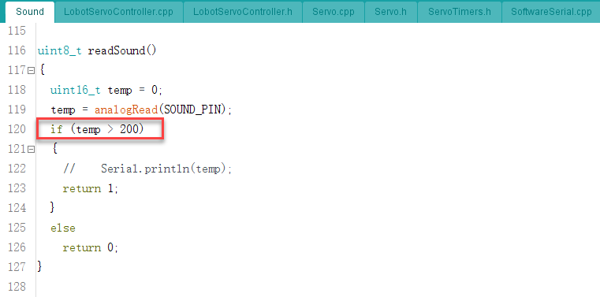

* **Modifying the Robot's Response to Sound Detection**

(1) By default, the program is configured as follows: If one sound is detected within 1000 ms, the robot moves forward. If two sounds are detected within the same 1000 ms interval, the robot moves backward. To change the response behavior after detecting sound, refer to the corresponding sections in the code:

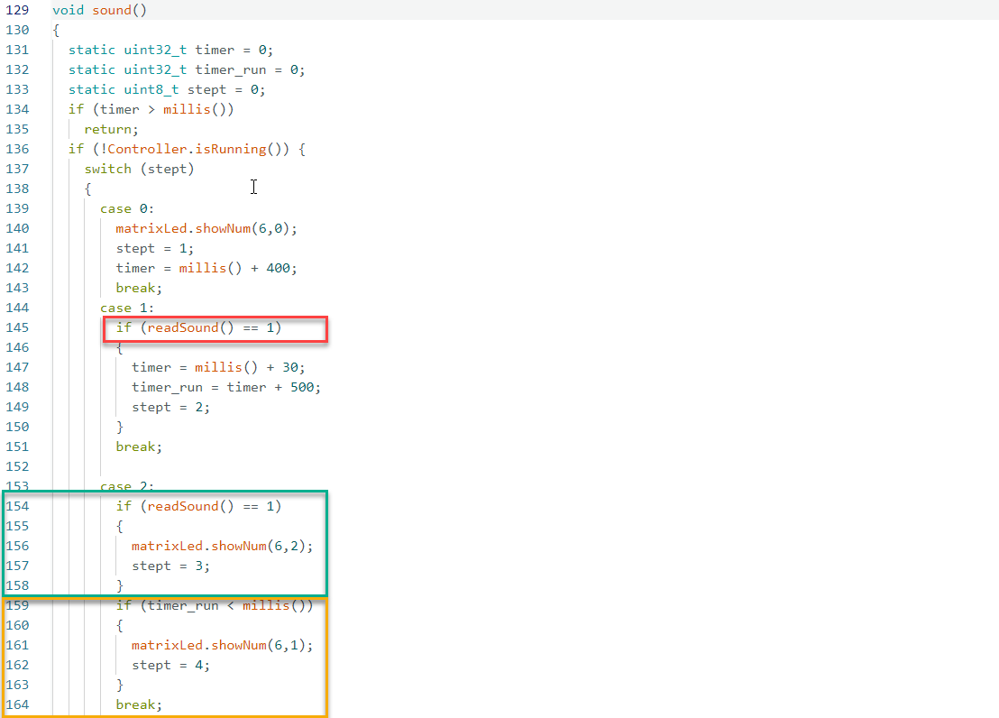

(2) The red-highlighted section determines whether an action should be triggered after the first sound is detected. The green-highlighted section checks for a second sound within the preset 1000 ms interval. The yellow-highlighted section verifies whether the second sound occurred within 500 ms after the first one. If the second sound exceeds this interval, it is not considered part of a continuous sequence.

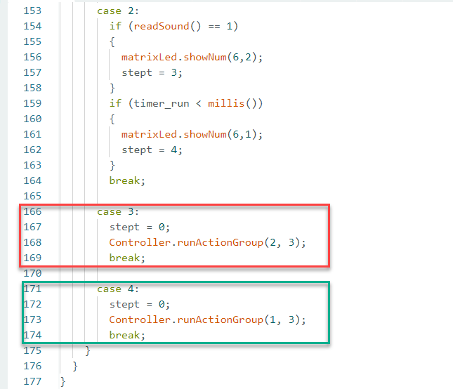

(3) When two sounds are confirmed to be continuous, the red-highlighted code section executes the corresponding action group. If only a single sound is detected, the green-highlighted section handles the response.

(4) The function Controller.runActionGroup(uint8_t NumOfAction, uint16_t Times); is used to execute specific action groups uploaded from PC software and duration in seconds.

## 5.11 Touch Defense

### 5.11.1 Assembly and Wiring

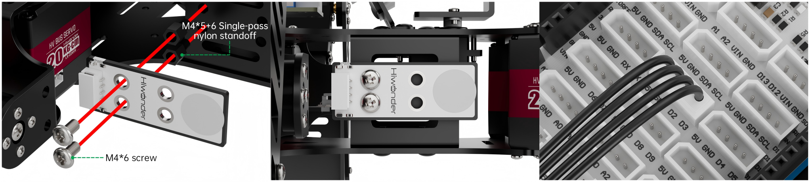

### 5.11.2 Project Introduction

This lesson introduces posture switching for the robot, controlled via a touch sensor.

### 5.11.3 Project Process


### 5.11.4 Module Instruction

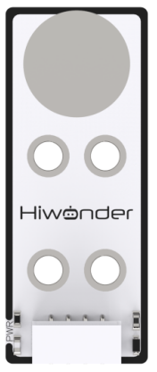

This sensor is based on capacitive sensing technology and is typically used for on/off control in electronic devices. It detects human or metal contact through a gold-plated touch surface. When no contact is made with the metal surface, the sensor outputs a high signal. When touched by a human body or metal, the output switches to a low signal.

The sensor connects to the robot via a 4-pin cable, which should be connected to the 5V, GND, D2, and D3 pins.

### 5.11.5 Program Download

[Source Code](../_static/source_code/intelligent_games_learning.zip)

(1) Open the program file located in the same directory as this lesson:  [Touch Defense Program\touch\touch.ino](../_static/source_code/intelligent_games_learning.zip)

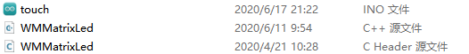

(2) Connect the Arduino UNO to the computer via USB cable.

(3) In the Arduino IDE, click the **"Select Board"** option. The software will automatically detect the connected Arduino serial port.


(4) Then click the upload button  to upload the program to the Arduino. Wait for the upload to complete.


### 5.11.6 Project Outcome

When the metal surface of the touch sensor is touched, the robot will switch to a retracted posture upon first detection. Upon the next detection, it will enter a defensive shaking posture. If the sound sensor detects ambient sound during either the retracted or defensive state, the robot will return to its default posture.


### 5.11.7 Program Brief Analysis

[Source Code](../_static/source_code/intelligent_games_learning.zip)

(1) Several libraries required for this application should be imported, including servo control, sensor, and software serial communication libraries.

{lineno-start=6}

```
#include <Wire.h>
#include "Servo.h"
#include "WMMatrixLed.h"
#include "SoftwareSerial.h"
#include "LobotServoController.h"
```

(2) The communication pins between the Arduino and the servo controller are first defined. Then, instances of the sensor class, software serial class, and other secondary development communication classes are created.

{lineno-start=12}

```
#define rxPin 9  //arduino and servo controller's serial communication port
#define txPin 8  

#define DIN  A0  //dot matrix port
#define CLK  A1

#define LED   13
#define TOUCH 2   //touch sensor port
#define SOUND_PIN  A2  /*IO port where the sound sensor is located*/

#define I2C_ADDR    0x77

//register
#define DISDENCE_L    0//distanceis lower 8 bits, unit mm
#define DISDENCE_H    1

#define RGB_BRIGHTNESS  50//0-255
#define RGB_WORK_MODE 2//RGB light modoe，0：User-defined mode   1：breathing light mode default 0

#define RGB1_R      3//R value of probe 1，0~255，default0
#define RGB1_G      4//default0
#define RGB1_B      5//default255

#define RGB2_R      6//R value of proble，0~255，default0
#define RGB2_G      7//default0
#define RGB2_B      8//default255

#define RGB1_R_BREATHING_CYCLE      9 //when breathing light mode is 1，the breathing period of probe 1,unit 100ms default0,
                                      //if set to period is 3000ms,then the value is 30
#define RGB1_G_BREATHING_CYCLE      10
#define RGB1_B_BREATHING_CYCLE      11

#define RGB2_R_BREATHING_CYCLE      12//No.2 proble
#define RGB2_G_BREATHING_CYCLE      13
#define RGB2_B_BREATHING_CYCLE      14

#define RGB_WORK_SIMPLE_MODE    0
#define RGB_WORK_BREATHING_MODE   1

Servo sonarServo;  //unltrasion stastion servo control examples
SoftwareSerial MySerial(rxPin, txPin);  //soft serial port examples
WMMatrixLed matrixLed(CLK, DIN);  //dot matrix examples
LobotServoController Controller(MySerial); //instantiated secondary development

```

(3) Within the setup() function, I2C communication and two types of serial communication are initialized with appropriate baud rates. Several pin modes are configured, such as setting the LED pin as output and the TOUCH and SOUND_PIN pins as input. Then, the LED matrix is initialized, with its color and brightness set, and the display cleared. The servo is then configured by assigning it to a designated I/O pin and setting its initial position. After a brief delay, the servo is released. A specific action group is executed, and an RGB mode value is written via the I2C bus. Next, two RGB arrays are then configured and written to the LED matrix display.

{lineno-start=157}

```
void setup() {
  // put your setup code here, to run once:
  uint8_t RGB[6];
  uint8_t breathing[6];
  uint8_t value;
  
  Wire.begin();
  MySerial.begin(9600);  //soft serial port for communication with the steering gear, baud rate 9600
  Serial.begin(9600);    //the hardware serial port used for printing and debugging, the baud rate is 9600
  pinMode(LED, OUTPUT);
  pinMode(TOUCH, INPUT);
  pinMode(SOUND_PIN, INPUT);   
  digitalWrite(LED, LOW);
  matrixLed.setColorIndex(1);
  matrixLed.setBrightness(3);
  matrixLed.clearScreen();
  sonarServo.attach(12); //set the servo control io port
  sonarServo.write(90);  //initial position 90 degrees 
  delay(300);
  sonarServo.detach();  //release the servo s after use
  Controller.runActionGroup(0, 1); //run low-postion standing upright movements
  value = RGB_WORK_SIMPLE_MODE;
  WireWriteDataArray(RGB_WORK_MODE,&value,1);
  RGB[0] = 0;RGB[1] = 0;RGB[2] = RGB_BRIGHTNESS;//RGB1
  RGB[3] = 0;RGB[4] = 0;RGB[5] = RGB_BRIGHTNESS;//RGB2
  WireWriteDataArray(RGB1_R,RGB,6);
  uint8_t drawBuffer[16] = {
    0x00, 0x00, 0x00, 0x00, 0x00, 0x00, 0x00, 0x00
  , 0x00, 0x00, 0x00, 0x00, 0x00, 0x00, 0x00, 0x00};
  for (int i = 0; i < 16; i++) {
    drawBuffer[i] = 0xff;
    matrixLed.drawBitmap(0,0,16,drawBuffer);   
    delay(20);
  }  
  
  matrixLed.clearScreen();
}
```

(4) In the loop() function, `Controller.receiveHandle()` is first used to process data received from the servo control board. A digital input named TOUCH is monitored to detect whether the user has triggered a touch point. If a touch state change is consistently detected, different actions will be executed based on the context. On the first touch, the robot executes a predefined action group using `Controller.runActionGroup(16, 1)`. The action_status variable is then set to 1, indicating that the first-touch action is in progress.

{lineno-start=195}

```
void loop() {
  // put your main code here, to run repeatedly:
  static uint8_t touch_status = 0;
  static uint8_t action_status = 0;
  static uint8_t status_ = 0;
  static bool blink_status = false;
  Controller.receiveHandle();  //process the data received from the steering gear control board
  while (!digitalRead(TOUCH)) {
    delay(20);
    status_ = 1;
  }
  
  if (status_ == 1) {
    status_ = 0;
    touch_status = 1;
  }

  if (!Controller.isRunning()) { 
    matrixLed.clearScreen();
    blink_status = false;
//    Serial.print(touch_status);Serial.println(action_status);
    if (touch_status == 1 && action_status == 0) {  
      touch_status = 0;
      action_status = 1;
      Controller.runActionGroup(16, 1); 
    }
    else if (touch_status == 1 && action_status == 1){
      touch_status = 0;
      blink_status = true;
      Controller.runActionGroup(17, 1);
    }
    else if (readSound() == 1) {
      action_status = 0;
      Controller.runActionGroup(0, 1); 
    }
  }
  else {
    if (blink_status)
      MatrixLedBlink(100);     
  }
}
```

(5) Upon a second or continuous touch, a different action group is triggered using `Controller.runActionGroup(17, 1)`, and an LED blinking indicator is activated. This enables the use of two successive touches to trigger a specific action or command.

{lineno-start=195}

```
void loop() {
  // put your main code here, to run repeatedly:
  static uint8_t touch_status = 0;
  static uint8_t action_status = 0;
  static uint8_t status_ = 0;
  static bool blink_status = false;
  Controller.receiveHandle();  //process the data received from the steering gear control board
  while (!digitalRead(TOUCH)) {
    delay(20);
    status_ = 1;
  }
  
  if (status_ == 1) {
    status_ = 0;
    touch_status = 1;
  }

  if (!Controller.isRunning()) { 
    matrixLed.clearScreen();
    blink_status = false;
//    Serial.print(touch_status);Serial.println(action_status);
    if (touch_status == 1 && action_status == 0) {  
      touch_status = 0;
      action_status = 1;
      Controller.runActionGroup(16, 1); 
    }
    else if (touch_status == 1 && action_status == 1){
      touch_status = 0;
      blink_status = true;
      Controller.runActionGroup(17, 1);
    }
    else if (readSound() == 1) {
      action_status = 0;
      Controller.runActionGroup(0, 1); 
    }
  }
  else {
    if (blink_status)
      MatrixLedBlink(100);     
  }
}
```

(6) Simultaneously, the system monitors for sound input using the readSound() function. If a sound signal is detected, such as a clap, the robot resets its action status and executes the default action group using `Controller.runActionGroup(0, 1)`. The program also checks whether the controller is currently active. If it is not running or has completed all tasks, the LED display is cleared or enters a blinking state for visual feedback.

{lineno-start=195}

```
void loop() {
  // put your main code here, to run repeatedly:
  static uint8_t touch_status = 0;
  static uint8_t action_status = 0;
  static uint8_t status_ = 0;
  static bool blink_status = false;
  Controller.receiveHandle();  //process the data received from the steering gear control board
  while (!digitalRead(TOUCH)) {
    delay(20);
    status_ = 1;
  }
  
  if (status_ == 1) {
    status_ = 0;
    touch_status = 1;
  }

  if (!Controller.isRunning()) { 
    matrixLed.clearScreen();
    blink_status = false;
//    Serial.print(touch_status);Serial.println(action_status);
    if (touch_status == 1 && action_status == 0) {  
      touch_status = 0;
      action_status = 1;
      Controller.runActionGroup(16, 1); 
    }
    else if (touch_status == 1 && action_status == 1){
      touch_status = 0;
      blink_status = true;
      Controller.runActionGroup(17, 1);
    }
    else if (readSound() == 1) {
      action_status = 0;
      Controller.runActionGroup(0, 1); 
    }
  }
  else {
    if (blink_status)
      MatrixLedBlink(100);     
  }
}
```

(7) The sound detection function reads analog values from the sound sensor to determine if a sound is present. If the read value exceeds the defined threshold, which is set to 150 in this section, the function returns 1, indicating sound is detected. Otherwise, it returns 0. This enables a basic yet effective method for detecting sound input.

{lineno-start=117}

```
uint8_t readSound()
{
  uint16_t temp = 0;
  temp = analogRead(SOUND_PIN);
  
  if (temp > 150)
  {
    //    Serial.println(temp);
    return 1;
  }
  else
    return 0;
}
```

### 5.11.8 Feature Extensions

* **Modifying Feedback Actions Triggered by Touch**

(1) By default, the program is configured to perform a defensive posture upon detecting the first touch input. If a second touch is detected while the robot is already in the defensive posture, it will trigger a shaking motion. To customize the feedback actions after touch input, adjustments can be made in the following sections of the program.

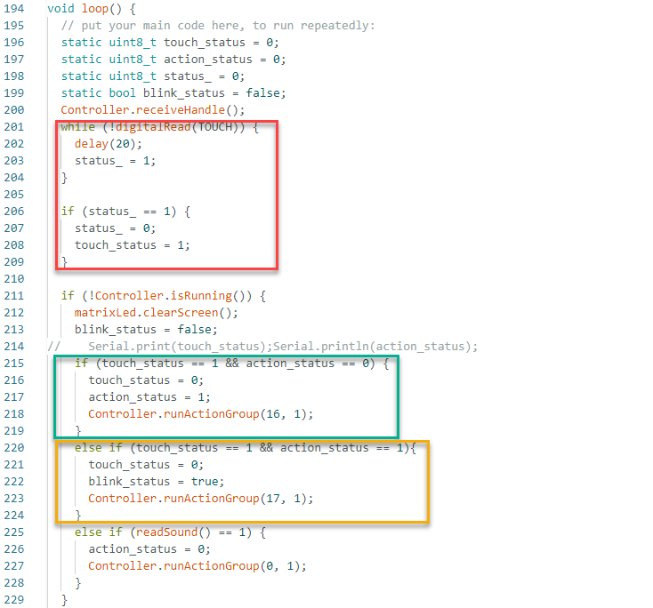

(2) The red-marked section contains the logic that checks whether the touch sensor has been activated. The green-marked section defines the action to be executed after the first touch, switching to a defensive posture. The yellow-marked section handles the behavior when the robot is already in the defensive posture, if another touch input is detected, in which case a shaking motion is performed.

(3) The function Controller.runActionGroup(uint8_t NumOfAction, uint16_t Times); is used to execute specific action groups uploaded from PC software and duration in seconds.

## 5.12 Edge Detection

### 5.12.1 Assembly and Wiring

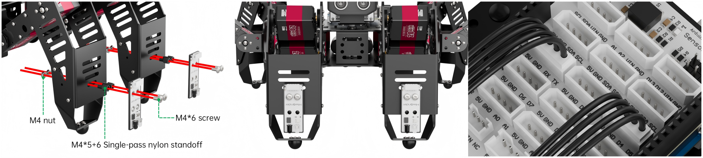

### 5.12.2 Project Introduction

This lesson uses infrared obstacle avoidance sensors to detect distance and prevent the robot from falling off an edge by adjusting its movement accordingly.

### 5.12.3 Project Process


### 5.12.4 Module Instruction

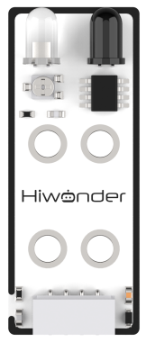

The infrared obstacle avoidance sensor is used to detect whether there is an obstacle in front of it. The sensor consists of an infrared emitter and a receiver. When an object is present, the emitted infrared light is reflected back and detected by the receiver.

Connect the infrared sensors to the ports of 5V, GND, D4, D5 and 5V, GND, D6, D7 respectively.

### 5.12.5 Program Download

[Source Code](../_static/source_code/intelligent_games_learning.zip)

(1) Open the program file located in the same directory as this lesson:  [Edge Detection Program\RF\RF.ino](../_static/source_code/intelligent_games_learning.zip)

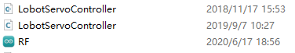

(2) Connect the Arduino UNO to the computer via USB cable.

(3) In the Arduino IDE, click the **"Select Board"** option. The software will automatically detect the connected Arduino serial port.


(4) Then click the upload button  to upload the program to the Arduino. Wait for the upload to complete.


### 5.12.6 Project Outcome

:::{Note}

This project should be conducted indoors. Avoid strong warm light sources such as incandescent bulbs or direct sunlight. Additionally, avoid using excessively high tables and ensure that table edges are flat and stable.

:::

When any leg of the robot fails to detect the ground below, the robot will immediately stop, perform a backward movement, and then turn before continuing to move forward, allowing it to keep scanning the environment safely.


### 5.12.7 Program Brief Analysis

[Source Code](../_static/source_code/intelligent_games_learning.zip)

(1) Several libraries required for this application should be imported, including servo control, sensor, and software serial communication libraries.

{lineno-start=5}

```
#include <Wire.h>
#include "Servo.h"
#include "WMMatrixLed.h"
#include "SoftwareSerial.h"
#include "LobotServoController.h"
```

(2) The communication pins between the Arduino and the servo controller are first defined. Then, instances of the sensor class, software serial class, and other secondary development communication classes are created.

{lineno-start=11}

```
#define rxPin 9  //arduino and servo controller's serial communication port 
#define txPin 8  

#define DIN  A0  //dot matrix port
#define CLK  A1

#define RFR1 6   /*front right infrared sensor*/
#define RFL1 4   /*front left infrared sensor*/

#define GO_FORWARD  43   /*forward action group number*/
#define GO_BACK     44   /*backward action group number*/
#define TURN_LEFT   45   /*turn left action group number*/
#define TURN_RIGHT  46   /*turn right action group number*/

#define L_STAND       0     //low posture, attention

#define I2C_ADDR    0x77

//register
#define DISDENCE_L    0//distanceis lower 8 bits, unit mm
#define DISDENCE_H    1

#define RGB_BRIGHTNESS  50//0-255
#define RGB_WORK_MODE 2//RGB light modoe，0：User-defined mode   1：breathing light mode default 0

#define RGB1_R      3//R value of probe 1，0~255，default0
#define RGB1_G      4//default0
#define RGB1_B      5//default255

#define RGB2_R      6//R value of proble，0~255，default0
#define RGB2_G      7//default0
#define RGB2_B      8//default255

#define RGB1_R_BREATHING_CYCLE      9 //when breathing light mode is 1，the breathing period of probe 1,unit 100ms default0,
                                      //if set to period is 3000ms,then the value is 30
#define RGB1_G_BREATHING_CYCLE      10
#define RGB1_B_BREATHING_CYCLE      11

#define RGB2_R_BREATHING_CYCLE      12//No.2 proble
#define RGB2_G_BREATHING_CYCLE      13
#define RGB2_B_BREATHING_CYCLE      14
```

(3) Several arrays and variables are then defined. First, I2C communication and serial communication are initialized, and the baud rate for communication with the servo controller is set to 9600. Then, the sound input pin is configured as an input. The LED matrix is initialized, with its color and brightness set, and the display cleared.

{lineno-start=275}

```
  WireWriteDataArray(RGB_WORK_MODE,&value,1);
  RGB[0] = 0;RGB[1] = 0;RGB[2] = RGB_BRIGHTNESS;//RGB1
  RGB[3] = 0;RGB[4] = 0;RGB[5] = RGB_BRIGHTNESS;//RGB2
  WireWriteDataArray(RGB1_R,RGB,6);
```

(4) The servo is then configured by binding it to a specific I/O port, and its initial position is set to 90 degrees. A predefined action group is executed, and a value is written to the RGB working mode via the I2C bus. Next, two RGB values are set and transmitted to the LED matrix's RGB channels through the I2C interface.

{lineno-start=269}

```
  sonarServo.attach(12); //set the servo control io port
  sonarServo.write(90);  //initial position 90 degrees 
  delay(300);
  sonarServo.detach();  //release the servo s after use
  Controller.runActionGroup(0, 1); //run No.0 action group
```

(5) A drawing buffer is then created and filled with zero values. This buffer is displayed on the LED matrix to produce a fully lit effect for a brief moment before the screen is cleared.

{lineno-start=280}

```
  uint8_t drawBuffer[16] = {
    0x00, 0x00, 0x00, 0x00, 0x00, 0x00, 0x00, 0x00
  , 0x00, 0x00, 0x00, 0x00, 0x00, 0x00, 0x00, 0x00};
  for (int i = 0; i < 16; i++) {
    drawBuffer[i] = 0xff;
    matrixLed.drawBitmap(0,0,16,drawBuffer);   
    delay(20);
  }  
```

(6) In the loop() function, the system first calls Controller.receiveHandle() to retrieve and process data from the serial buffer, allowing it to respond to control instructions sent via the serial port. The body() function is then called to manage robot behavior.

{lineno-start=292}

```
void loop() { //main loop
  Controller.receiveHandle(); //receive processing function, fetch data from the receive buffer
  body();    //subject logic
//  Serial.print(digitalRead(RFR1));
//  Serial.println(digitalRead(RFL1));
}
```

(7) At the beginning of each cycle, the function checks if any action group is currently running. If not, it reads values from the front-left (RFL1) and front-right (RFR1) infrared sensors to assess the surrounding environment. 

Step 1: If both sensors confirm no edge detected, the robot moves forward. The LED matrix is cleared, relevant indicators are displayed, and a timer is set to control action duration.

{lineno-start=173}

```
    case 1:    //step1
      if (!Controller.isRunning()) {   //if no action group is running
        int RFR1_VALUE = digitalRead(RFR1);
        int RFL1_VALUE = digitalRead(RFL1);
        if ((!RFR1_VALUE) && (!RFL1_VALUE)) { //if the front left, front right infrared sensors are not suspended
          matrixLed.clearScreen();
          Controller.runActionGroup(71, 1);    //run forward the first step
          stept = 0;                            //step moves to step 1
          timer = millis() + 300;              //delay 300ms
        } 
```

Step 2: If only the front-right sensor detects no drop, the robot displays a specific pattern, transitions to a designated action step, and updates its status.

{lineno-start=183}

```
        else if ((RFR1_VALUE) && (!RFL1_VALUE)){ //if the front right infrared sensor does not detect the desktop
          uint8_t drawBuffer[16] = {
            0xff, 0xff, 0xff, 0xff, 0xff, 0xff, 0xff, 0xff
          , 0x00,  0x00, 0x00,  0x00, 0x00,  0x00, 0x00,  0x00};
          matrixLed.drawBitmap(0,0,16,drawBuffer);
          laststept = 1;                        //the last step is assigned value is 0
          rf_status= 1;
          stept = 3;                            //step moves to step 3
          timer = millis() + 200;              //delay 300ms
        }
        else if ((!RFR1_VALUE) && (RFL1_VALUE)){ //if the front left infrared sensor does not detect the desktop
          uint8_t drawBuffer[16] = {
            0x00,  0x00, 0x00,  0x00, 0x00, 0x00, 0x00, 0x00
            , 0xff, 0xff, 0xff, 0xff, 0xff, 0xff, 0xff, 0xff};
          matrixLed.drawBitmap(0,0,16,drawBuffer);
          laststept = 1;                        //the last step is assigned value is 0
          rf_status = 2;
          stept = 3;                            //move to step 3
          timer = millis() + 200;              //delay 300ms
        }
        else if ((RFR1_VALUE) && (RFL1_VALUE)){ //if the two infrared sensors do not detect the desktop
          uint8_t drawBuffer[16] = {
            0xff, 0xff, 0xff, 0xff, 0xff, 0xff, 0xff, 0xff
          , 0xff, 0xff, 0xff, 0xff, 0xff, 0xff, 0xff, 0xff};
```

Step 3: The current action is stopped in preparation for the next step.

{lineno-start=215}

```
    case 3:  //step3
      Controller.stopActionGroup();      //send stop action group command
      stept = 4;                          //move to step 4
      timer = millis() + 200;            //delay 300ms
      break; 
```

Step 4: A reverse movement action is selected and the system prepares for the next step.

{lineno-start=220}

```
    case 4:  //step4
      matrixLed.clearScreen();
      if (laststept == 0) {                //if the last step is 0
        Controller.runActionGroup(81, 1); //run No. 81 action group, No.81 is forward 1 step or the reverse action of No. 71 action group
      }
      if (laststept == 1) {                //if the last step is 0
        Controller.runActionGroup(61, 1); //run No. 61 action group, No.81 is forward s steps or the reverse action of No. 51 action group
      }
      timer = millis() + 300;     //delay 300ms
      stept = 5;                   //move to step 5
      break;                      //end switch statement
```

Step 5: The robot performs a backward movement and prepares to proceed step 6.

{lineno-start=231}

```
    case 5:
      if (!Controller.isRunning()) {  //if no action group is running
        Controller.runActionGroup(2, 1); //run the No.2 action group twice, and the No.2 is the backward action
        timer = millis() + 300;    //delay 300ms
        stept = 6;                  //move to step 6
      }
      break;                     //end switch statement
```

Step 6: Based on the current state, the robot determines a turning direction, executes the appropriate turning action, and returns to Step 0 to begin a new cycle.

{lineno-start=203}

```
        else if ((RFR1_VALUE) && (RFL1_VALUE)){ //if the two infrared sensors do not detect the desktop
          uint8_t drawBuffer[16] = {
            0xff, 0xff, 0xff, 0xff, 0xff, 0xff, 0xff, 0xff
          , 0xff, 0xff, 0xff, 0xff, 0xff, 0xff, 0xff, 0xff};
          matrixLed.drawBitmap(0,0,16,drawBuffer);
          laststept = 1;                        //the last step is assigned value is 0
          rf_status = 3;
          stept = 3;                            //move to step 3
          timer = millis() + 200;              //delay 300ms
        }
```

### 5.12.8 Feature Extensions

* **Modifying Actions Triggered by Infrared Obstacle Detection**

(1) By default, the program is configured as follows:  

When both infrared obstacle-avoidance sensors installed on the robot's legs detect obstacles, the robot performs a forward movement. If either sensor fails to detect an obstacle, the robot executes a sequence of backward and turning actions.

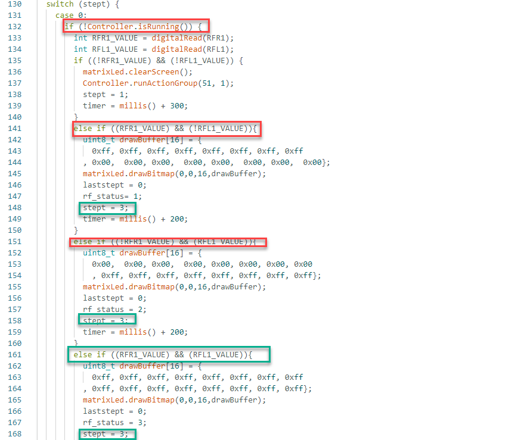

(2) Specifically, when both sensors detect obstacles, the program sets stept = 1. When either sensor detects no obstacle, the program sets stept = 3.

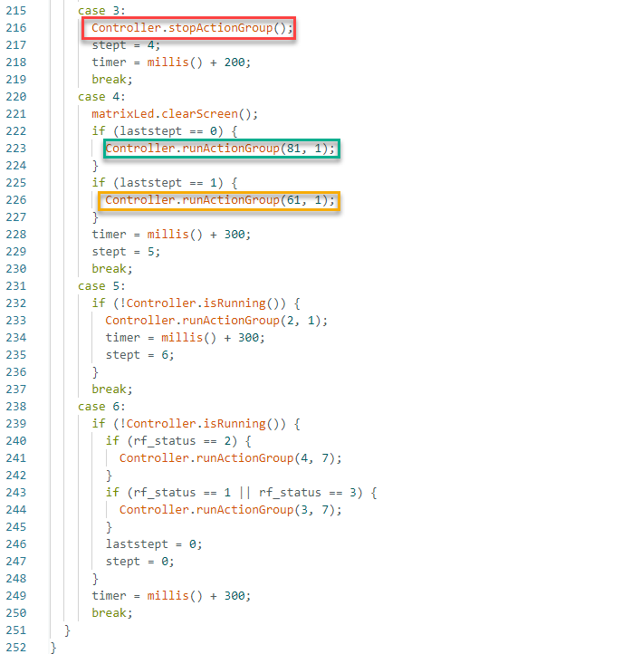

(3) At stept = 3, the command `Controller.stopActionGroup()` is called to stop the robot's current action. Then the program proceeds to stept = 4.

(4) If `stept = 1` was not executed before reaching stept = 4, the robot runs action group 81 via `Controller.runActionGroup(81, 1)`.

(5) If `stept = 1` was previously executed, the robot instead runs action group 61 with `Controller.runActionGroup(61, 1)`. These action groups correspond to pre-uploaded movement routines from the PC software.

(6) After completing the routine at `stept = 4`, the robot proceeds to stept = 5, executing a backward movement via `Controller.runActionGroup(2, 1)`.

(7) Once the backward action is complete, the robot enters stept = 6, where it executes a turn. By default, a right turn uses `Controller.runActionGroup(4, 7)`, or a left turn with `Controller.runActionGroup(3, 7)`, which can be modified to any other action group as needed.

(8) By default: After completing the routine at stept = 5, the robot proceeds to stept = 6, executing a right turn via `Controller.runActionGroup(4, 7)`. For instance, to replace the right turn with a contraction movement, the command can be changed to `Controller.runActionGroup(16, 7)` to trigger action group 16 at step 6.

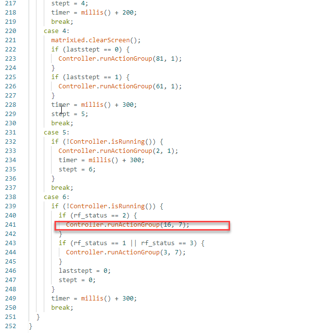

* **Adjusting Infrared Sensor Sensitivity**

:::{Note}

For a visual guide, refer to the video tutorial in directory of 2 Software Tools & Source Code → 5. Debug Instructions.

:::

Each infrared obstacle-avoidance sensor is equipped with an adjustable potentiometer for setting detection sensitivity. If the detection performance is suboptimal during use, the sensitivity can be tuned using a small Phillips-head screwdriver.

Turning the red knob clockwise increases the infrared emission strength and extends the detection range. Turning it counterclockwise reduces the emission strength and shortens the detection distance.

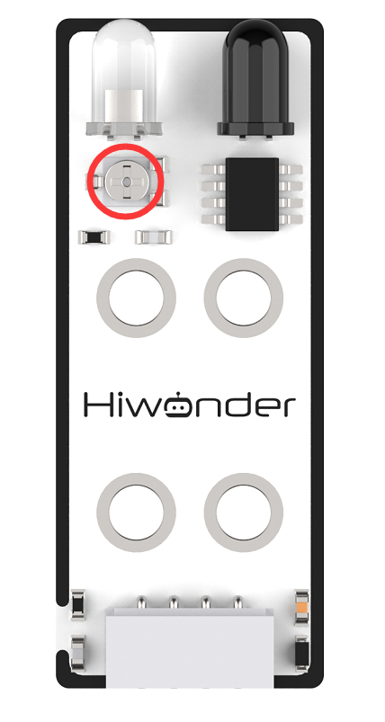

:::{Note}
* Due to the nature of the sensor, detection accuracy can be negatively affected by warm light sources, such as incandescent bulbs and sunlight, which emit significant infrared radiation. These can interfere with the sensor's signal, so environmental lighting must be carefully considered, and adjusting the sensitivity alone may not suffice.

* Sensitivity adjustment is not linear. Each sensor has a built-in threshold point that functions like a boundary. If adjusted beyond this point, the sensor may reset to its original state.

* Therefore, sensitivity should be tuned based on practical requirements, rather than being maximized or minimized arbitrarily.
:::