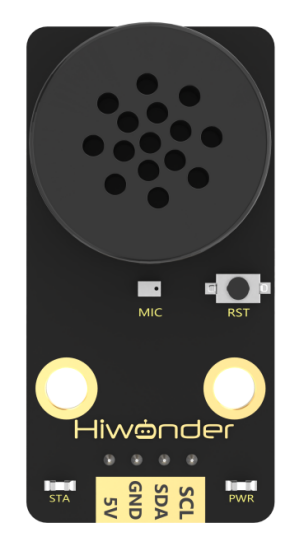

# 6. Voice Interaction Course

## 6.1 Introduction and Installation of Voice Interaction Module

### 6.1.1 Voice Interaction Module

* **Voice Interaction Module Instruction**

(1) Introduction


WonderEcho, the integrated voice interaction module, is built on the CI1302 chip and supports both voice recognition and voice playback. It features offline neural network (NN) acceleration and hardware-accelerated voice signal processing. Through advanced noise reduction and neural network models, voice inputs are analyzed to produce recognition results.

The CI1302 chip includes a Brain Neural Processing Unit (BNPU), enabling efficient offline NN computation and voice signal hardware acceleration. With a CPU frequency of up to 220 MHz, it supports far-field offline voice recognition. The chip is equipped with 2MB of onboard flash memory and can store up to 300 voice command entries.

The module is easy to operate and delivers excellent voice recognition performance, making it widely applicable in scenarios such as smart home systems, conversational robots, educational robots, and in-vehicle dispatch terminals.

(2) Working Principle

The module uses a wake word-based activation mechanism. A specific wake word must be spoken to activate the voice interaction system before any command can be recognized. By default, the system operates in English, and the default English wake word is "**Hello Hiwonder**." To switch to Chinese recognition, the corresponding Chinese firmware must be flashed. Once switched, the Chinese wake word becomes "小幻小幻" (Xiao Huan Xiao Huan). If no valid voice input is detected within 15 seconds, the module automatically enters sleep mode. To resume operation, the wake word must be spoken again.

When the CI1302 chip successfully recognizes a voice command, the corresponding command is sent to the IIC chip and played back via voice feedback. The IIC chip stores the recognized command and transmits it through the IIC target device protocol. A complete list of supported voice commands and playback phrases can be found in the "Command Word and Playback Phrase Protocol List" located in the same directory as this document.

* **Notice**

A 5V power supply must be used. Supplying incorrect voltage may damage the module.

The operating environment should be quiet. Excessive background noise may affect recognition performance.

When speaking command words, ensure the voice is clear and loud, and avoid speaking too quickly. A distance of less than 5 meters between the user and the module is recommended.

* **Hardware Interface Description**


| **No.** |        **Component**        |                       **Description**                        |
| :-----: | :-------------------------: | :----------------------------------------------------------: |
|    1    |           Speaker           |          Converts analog signals into audible sound          |
|    2    |         Microphone          |              Converts sound into analog signals              |
|    3    |         RST Button          |                         Reset button                         |
|    4    | Signal Indicator (Blue LED) |   Remains on and flashes once when a command is recognized   |
|    5    |  Power Indicator (Red LED)  |        Remains on when the module is properly powered        |
|    6    |          IIC Port           | Functions as an IIC target device and is used for power supply and communication with a host controller |
|    7    |         Type-C Port         | Used for power supply and firmware updates for the CI1302 chip |
|    8    |         CI1302 Chip         | High-performance voice recognition chip that processes voice input and outputs signals |
|    9    |          IIC Chip           | Converts instructions from the voice recognition chip into IIC protocol commands |
|   10    |    Audio Amplifier Chip     | Converts digital signals into analog signals to drive the speaker |

### 6.1.2 WonderEcho Firmware Flashing Guide

* **Notice**

By default, the voice interaction module is pre-flashed with English voice recognition firmware, and the wake word is **"Hello Hiwonder."** The Chinese factory firmware is located in the same directory as this document, where the wake word is "**小幻小幻**" (Xiao Huan Xiao Huan). If you need to re-flash the firmware to Chinese version, please follow the instructions below.

* **Firmware Flashing Steps**

(1) Connect the voice interaction module to your computer using a Type-C data cable.


(2) Open the [PACK_UPDATE_TOOL.exe](Appendix.md) located in the same directory as this document. In the tool, select the **"CI1302"** chip model, then click **"Upgrade."**


(3) Click **"Select firmware"**, and choose the firmware file named [CI1302_Chinese_SingleMic_V00729_UART1_115200_2M.bin](Appendix.md) found in the same directory as this document.


(4) Locate and select the appropriate serial port.


(5) Press the RST button on the voice interaction module to enter flashing mode and wait for the flashing process to complete successfully.


[Command Word and Playback Phrase Protocol List-V3_20250305.xlsx](Appendix.md)

### 6.1.3 Installation Diagram for Voice Interaction Module


## 6.2 Introduction to Voice-Related Library Files

During the development of the voice recognition module, the HWSensor library is used to facilitate program calls. This section provides an overview of the key functions used in the voice interaction tutorials.

### 6.2.1 HWSensor Library

The HWSensor library includes functions for reading from and writing to the voice recognition module. The explanation of the two main functions involved is shown as following:

* **Member Function (HWSensor::ultrasoundGetDistance)**

{lineno-start=63}

```
unsigned char HWSensor::asrGetResult(void)
{
  unsigned char result;
  
  wireReadDataArray(ASR_IIC_ADDR, ASR_RESULT_ADDR,&result,1);
  return result;
}
```

This member function of the HWSensor class is used to read voice recognition data, primarily to retrieve the voice recognition data. Description of the function refers to the table below.

<table  class="docutils-nobg" border="1">
<colgroup>
<col/>
<col/>
<col/>
<col/>
</colgroup>
<tbody>
<tr>
<td colspan="4" ><strong>HWSensor::asrGetResult()</strong></td>
</tr>
<tr>
<td>Description</td>
<td colspan="3" >Retrieves the recognized voice command ID</td>
</tr>
<tr>
<td>Parameters</td>
<td>None</td>
<td>Return Value</td>
<td>voice command ID of uint8_t type</td>
</tr>
<tr>
<td>Usage Explanation</td>
<td colspan="3" >
<p>HWSensor hws; (Create a sensor object)</p>
<p>hws.asrGetResult();</p>
</td>
</tr>
</tbody>
</table>

This function uses wireReadDataArray to read data from the IIC address of the voice recognition module. It sends a request to the ASR_RESULT_ADDR register of the device at address ASR_IIC_ADDR to read one byte of data, and returns the result as a uint8_t value.

(2) Member Function (HWSensor::asr_speak)

{lineno-start=71}

```
static uint8_t send[2];
void HWSensor::asr_speak(uint8_t cmd , uint8_t id)
{
  if(cmd == 0xFF || cmd == 0x00)
  {
    send[0] = cmd;
    send[1] = id;
    wireWriteDataArray(ASR_IIC_ADDR , ASR_SPEAK_ADDR , send , 2);
  }
}
```

This function is used to write data to the voice recognition module by using the wireWriteDataArray function to send data to the module's I2C address. By writing two bytes of data to the ASR_SPEAK_ADDR register, it triggers the module to play the corresponding voice entry.

<table  class="docutils-nobg" border="1">
<colgroup>
<col/>
<col/>
<col/>
<col/>
</colgroup>
<tbody>
<tr>
<td colspan="4" ><strong>HWSensor::asr_speak()</strong></td>
</tr>
<tr>
<td>Description</td>
<td colspan="3" >Triggers the voice module to speak the given entry</td>
</tr>
<tr>
<td>Parameters</td>
<td><p>uint8_t cmd</p>
<p>uint8_t id</p></td>
<td>Return Value</td>
<td>None</td>
</tr>
<tr>
<td>Usage Explanation</td>
<td colspan="3" >
<p>HWSensor hws; (Create a sensor object)</p>
<p>hws.asr_speak(cmd, id);(Play entry with specified command and ID)</p>
</td>
</tr>
</tbody>
</table>

[Command Word and Playback Phrase Protocol List-V3_20250305.xlsx](Appendix.md)

## 6.3 Distance Measurement and Voice Broadcast

### 6.3.1 Project Introduction

In this lesson, a glowy ultrasonic sensor is used to detect the distance of obstacle. Based on the measured distance, the voice recognition module will broadcast corresponding messages and trigger the robot to execute predefined action groups.

### 6.3.2 Project Process


### 6.3.3 Module Instruction


This is a distance-measuring ultrasonic sensor module equipped with an RGB light feature. It adopts an IIC communication interface and can read distance measurements from the ultrasonic sensor via IIC.

During distance measurement, the module automatically sends out 8 pulses of 40 kHz square waves and waits for a signal to return. If a signal is returned, the module outputs a high-level signal, and the duration of the high-level signal corresponds to the time it takes for the ultrasound to travel to the object and back.


The voice recognition module is based on embedded voice recognition technology. It consists of a dedicated voice recognition chip along with supporting circuits. The module can easily communicate with a host microcontroller and supports both speech recognition and voice playback. This makes it easy for developers to integrate the module into robots for implementing voice interaction features.

In this setup, the voice recognition module is mounted on the rear bracket of the Spiderbot. A 4-pin cable is used to connect the module to the IIC interface on the Spiderbot controller.


<p id="anchor_6_3_4"></p>

### 6.3.4 Program Download

[Source Code](Appendix.md)

(1) Open the file named [Distance Measurement and Voice Broadcast Program\say_hello\say_hello.ino](Appendix.md) located in the corresponding lesson folder.


(2) Connect the Arduino UNO to the computer via USB cable.

(3) In the Arduino IDE, click the **"Select Board"** option. The software will automatically detect the connected Arduino serial port.


(4) Then click the upload button  to upload the program to the Arduino. Wait for the upload to complete.


### 6.3.5 Project Outcome

After powering on the Spiderbot, slowly move an object toward the ultrasonic sensor. When the object is detected within 200 mm, the robot will perform Action Group 12 (Greeting) and play the voice message "Hello, welcome!"

### 6.3.6 Program Brief Analysis

[Source Code](Appendix.md)

(1) Several libraries required for this application should be imported, including servo control, sensor, and software serial communication libraries.

{lineno-start=1}

```
#include <Wire.h>
#include "Servo.h"
#include "WMMatrixLed.h"
#include "SoftwareSerial.h"
#include "LobotServoController.h"
#include "Ultrasound.h"
#include "HWSensor.h"
```

(2) First, a detection distance of 200 mm is defined. Then, the communication pins between the Arduino and the servo controller are configured. Instances are created for the servo control class, sensor class, software serial class, and custom communication class.

{lineno-start=9}

```
#define MIN_DISTANCE 200

#define rxPin 9  //Serial communication interface between Arduino and servo controller board.（arduino与舵机控制板的串口通信接口）
#define txPin 8  

#define DIN  A0  //Dot matrix interface.（点阵接口）
#define CLK  A1

Ultrasound ult;
Servo sonarServo;  //Ultrasonic pan-tilt servo control class instance.（超声波云台舵机控制类实例）
SoftwareSerial MySerial(rxPin, txPin);  //Instantiate software serial.（软串口实例化）
WMMatrixLed matrixLed(CLK, DIN);  //Instantiate dot matrix.（点阵实例化）
LobotServoController Controller(MySerial); //Instantiate for secondary development.（实例化二次开发）
HWSensor hwsensor;
```

(3) The sonar() function is responsible for handling the ultrasonic sensor data. If the detected distance is less than MIN_DISTANCE (200 mm) and greater than 0, the ultrasonic module's RGB LED will turn blue, the robot will perform Action Group 12 (Greeting), and the voice module will broadcast "Hello, welcome!"

{lineno-start=24}

```
bool have_move = true;
void sonar()
{
  float distance;
  if (!Controller.isRunning())
  {
    distance = ult.GetDistance();
    if (distance < MIN_DISTANCE && distance > 0)
    {
      have_move = true;
      ult.Color(0, 0, 50, 0, 0, 50);
      Controller.runActionGroup(12, 1);
      delay(500);
      hwsensor.asr_speak(ASR_ANNOUNCER , 0x0F); // Hello, welcome!（你好，欢迎光临）
    } else {
```

(4) Otherwise, the RGB LED will turn green, and the robot will perform Action Group 0 (Attention-low).

{lineno-start=38}

```
    } else {
      if (have_move) {
        have_move = false;
        ult.Breathing(0, 20, 0, 0, 20, 0);
        Controller.runActionGroup(0, 1);
      }
    }
  }
}
```

(5) In the setup() function, hardware initialization is performed. The serial port is set to a baud rate of 9600, while the software serial port is set to 9600. The head servo is set to 90 degrees, the Spiderbot executes Action Group 0 once using Controller.runActionGroup(0, 1).

{lineno-start=48}

```
void setup() {
  // Wire.begin();
  Serial.begin(115200);   //Initialize Serial0 with baud rate 115200.（初始化串口0，波特率115200）
  MySerial.begin(9600); //Initialize software serial.（初始化软串）

  matrixLed.setBrightness(3);
  matrixLed.clearScreen();
  sonarServo.attach(12); //Set servo control IO pins.（设定舵机控制io口）
  sonarServo.write(90);  
  delay(300);
  sonarServo.detach();  //Release servo after use.（使用完之后就释放舵机）

  Controller.runActionGroup(0, 1); //Run action group 0 to make the robot stand at attention.（运行0号动作组，让机器人立正站好）
  ult.Color(0,0,0,0,0,0);
  delay(1000);
  Serial.println("start");
}
```

(6) In the loop() function, the Controller.receiveHandle() function is called to receive the data from the controller. Then, the sonar() function is called to monitor the distance and trigger the voice response.

{lineno-start=72}

```
void loop()
{
  Controller.receiveHandle(); //Receive and process function, extract data from serial buffer.（接收处理函数，从串口接收缓存中取出数据）
  sonar();
}
```

### 6.3.7 Feature Extensions

This example demonstrates by changing the voice broadcast message "Hello, welcome!" to "Obstacle ahead" when an object is within 200 mm.

Locate the command line responsible for voice playback.

{lineno-start=37}

```
     hwsensor.asr_speak(ASR_ANNOUNCER , 0x0F); // Hello, welcome!（你好，欢迎光临）
```

Refer to the voice module's broadcast ID table and update the ID to 0x05 for the new message.

{lineno-start=37}

```
     hwsensor.asr_speak(ASR_ANNOUNCER , 0x05);  
```

Reflash the updated code to the Spiderbot by following the usual programming steps at section [6.3.4 Program Download](#anchor_6_3_4).

### 6.3.8  Frequently Asked Questions

Q: The voice recognition module is not playing any messages.

A: Please ensure the 4-pin cable is connected to the correct IIC port on the controller.

Q: The ultrasonic sensor sometimes gives inaccurate distance readings.

A: For best results, use a smooth and flat object as the target. Avoid prolonged close-range detection, as this can affect accuracy.

## 6.4 Human-Robot Interaction

### 6.4.1 Project Introduction

In this lesson, the voice recognition module is used to control the Spiderbot to execute various action groups via voice commands.

### 6.4.2 Project Process


### 6.4.3 Module Instruction



The voice recognition module is based on embedded voice recognition technology. It consists of a dedicated voice recognition chip along with supporting circuits. The module can easily communicate with a host microcontroller and supports both speech recognition and voice playback. This makes it easy for developers to integrate the module into robots for implementing voice interaction features.

In this setup, the voice recognition module is mounted on the rear bracket of the Spiderbot. A 4-pin cable is used to connect the module to the IIC interface on the Spiderbot controller.


### 6.4.4 Program Download

[Source Code](Appendix.md)

(1) Open the program file located in the same directory as this lesson: [Human-Robot Interaction Program\Communicate\Communicate.ino](Appendix.md)


(2) Connect the Arduino UNO to the computer via USB cable.

(3) In the Arduino IDE, click the **"Select Board"** option. The software will automatically detect the connected Arduino serial port.


(4) Then click the upload button  to upload the program to the Arduino. Wait for the upload to complete.


### 6.4.5 Project Outcome

Activate the voice recognition module by saying the wake word "**Hello Hiwonder**", then speak one of the following commands to control the Spiderbot and trigger different action groups:

| Command      | Return Value | Command            | Return Value |
| :----------- | :----------- | :----------------- | :----------- |
| Hello        | 0x1A         | Introduce Yourself | 0x1B         |
| Show a Skill | 0x1C         | March              | 0x1D         |
| Shake Head   | 0x1E         |                    |              |

### 6.4.6 Program Brief Analysis

[Source Code](Appendix.md)

(1) Several libraries required for this application should be imported, including servo control, sensor, and software serial communication libraries.

{lineno-start=1}

```
#include <Wire.h>
#include "Servo.h"
#include "WMMatrixLed.h"
#include "SoftwareSerial.h"
#include "LobotServoController.h"
#include "Ultrasound.h"
#include "HWSensor.h"
```

(2) The communication pins between the Arduino and the servo controller are first defined. Then, instances of the servo control class, sensor class, software serial class, and other secondary development communication classes are created.

{lineno-start=9}

```
#define MIN_DISTANCE 200

#define rxPin 9  //Serial communication interface between Arduino and servo controller board.（arduino与舵机控制板的串口通信接口）
#define txPin 8  

#define DIN  A0  //Dot matrix interface.（点阵接口）
#define CLK  A1

Ultrasound ult;
Servo sonarServo;  //Ultrasonic pan-tilt servo control class instance.（超声波云台舵机控制类实例）
SoftwareSerial MySerial(rxPin, txPin);  //Instantiate software serial.（软串口实例化）
WMMatrixLed matrixLed(CLK, DIN);  //Instantiate dot matrix.（点阵实例化）
LobotServoController Controller(MySerial); //Instantiate for secondary development.（实例化二次开发）
HWSensor hwsensor;
```

(3) The program is designed to receive data from the voice recognition module and control the robot to perform corresponding actions based on voice commands. The `hwsensor.asrGetResult()` function is used to retrieve data from the voice recognition module, using `Controller.isRunning()` to check whether the robot is currently executing an action group.

{lineno-start=24}

```
void communicate()
{
  unsigned char result;
  static bool have_move = true;

  delay(1);
  result = hwsensor.asrGetResult();
```

(4) If no action group is executing, the program prints the recognized voice command ID and evaluates the result. Returned ID 0x1A indicates that the command word **"Hello"** is recognized and Action Group 12 is executed.

{lineno-start=33}

```
  if(result)
  {
    Serial.print("ASR result is:");
    Serial.println(result);
 
    if(result==0x1A) //Hello（你好）
    {
      have_move = true;
      Controller.runActionGroup(12, 1);
    } 
```

(5) Returned ID 0x1B indicates that the command word **"Introduce Yourself"** is recognized, the voice module automatically plays the voice message, and Action Group 0 is executed.

{lineno-start=43}

```
    else if(result==0x1B) //Introduce yourself（介绍自己）
    {
      have_move = true;
      Controller.runActionGroup(0, 1); 
      delay(1000);
    }
```

(6) Returned ID 0x1C indicates that the command word **"Show a Skill"** is recognized and Action Group 10 is executed once.

{lineno-start=50}

```
    else if(result==0x1C) //Show a skill（露一手）
   {
      have_move = true;
      Controller.runActionGroup(10, 1);
      delay(300);
    }
```

(7) Returned ID 0x1D indicates that the command word **"March"** is recognized and Action Group 1 is executed twice.

{lineno-start=56}

```
    else if(result==0x1D) //March（走倆步）
   {
      have_move = true;
      delay(1000);
      Controller.runActionGroup(1, 2);
   }
```

(8) Returned ID 0x1E indicates that the command word **"Shake Head"** is recognized and the servo of the ultrasonic sensor rotates left and right.

{lineno-start=62}

```
    else if(result==0x1E) //Shake Head（摇头）
   {
      sonarServo.attach(12); 
      delay(1000);
      sonarServo.write(135);
      delay(400);
      sonarServo.write(45);
      delay(400);
      sonarServo.write(135);
      delay(400);
      sonarServo.write(90);
      delay(400);
      sonarServo.detach();
   }
```

(9) In the `setup()` function, hardware initialization is performed. The serial port is set to a baud rate of 9600, while the software serial port is set to 9600. Then, the ultrasonic module's RGB LED is set to blue, the servo of the ultrasonic module is initialized to 90 degrees, and the Spiderbot executes Action Group 0 once using Controller.runActionGroup(0, 1).

{lineno-start=86}

```
void setup() {
  // Wire.begin();
  Serial.begin(115200);   //Initialize Serial0 with baud rate 115200.（初始化串口0，波特率115200）
  MySerial.begin(9600); //Initialize software serial.（初始化软串）

  matrixLed.setBrightness(3);
  matrixLed.clearScreen();
  sonarServo.attach(12); //Set servo control IO pins.（设定舵机控制io口）
  sonarServo.write(90);  
  delay(300);
  sonarServo.detach();  //Release servo after use.（使用完之后就释放舵机）
  Controller.runActionGroup(0, 1); //Run action group 0 to make the robot stand at attention.（运行0号动作组，让机器人立正站好）
  ult.Color(0,0,0,0,0,0);
  delay(1000);
  Serial.println("start");
}
```

(10) After initialization, the program enters the loop() function, where the function `Controller.receiveHandle()` is called to receive data from the controller. Then, the `communicate()` function is called to process voice commands and trigger appropriate responses.

{lineno-start=103}

```
void loop()
{
  Controller.receiveHandle(); //Receive and process function, extract data from serial buffer.（接收处理函数，从串口接收缓存中取出数据）
  communicate();
}
```

### 6.4.7 Frequently Asked Questions

Q: The voice recognition module is not recognizing any commands.

A: Please make sure you've activated the module by saying the wake word "Hello Hiwonder". If it has already been activated, double-check the module's wiring and connection to the controller.

## 6.5 Voice Control

### 6.5.1 Project Introduction

In this lesson, you will learn how to use the voice recognition module to control the Spiderbot to perform movements such as moving forward, backward, turning left, and turning right.

### 6.5.2 Project Process


### 6.5.3 Module Instruction


The voice recognition module is based on embedded voice recognition technology. It consists of a dedicated voice recognition chip along with supporting circuits. The module can easily communicate with a host microcontroller and supports both speech recognition and voice playback. This makes it easy for developers to integrate the module into robots for implementing voice interaction features.

In this setup, the voice recognition module is mounted on the rear bracket of the Spiderbot. A 4-pin cable is used to connect the module to the IIC interface on the Spiderbot controller.


### 6.5.4 Program Download

[Source Code](Appendix.md)

(1) Open the program file located in the same directory as this lesson:  

[Voice Control Program\ASRcontrol\ASRcontrol.ino](Appendix.md)


(2) Connect the Arduino UNO to the computer via USB cable.

(3) In the Arduino IDE, click the **"Select Board"** option. The software will automatically detect the connected Arduino serial port.


(4) Then click the upload button  to upload the program to the Arduino. Wait for the upload to complete.


<p id="anchor_6_5_5"></p>

### 6.5.5 Project Outcome

Activate the voice recognition module by saying the wake word **"Hello Hiwonder",** then speak specific commands such as **"Move forward,"** **"Move backward,"** **"Turn left,"** or **"Turn right"** to control the Spiderbot's actions. The full list of command keywords and their corresponding return values is shown below:

| Command      | Return Value | Command       | Return Value |
| :----------- | :----------- | :------------ | :----------- |
| Go Straight  | 0x01         | Go Backward   | 0x02         |
| Turn Left    | 0x03         | Turn Right    | 0x04         |
| Dive Forward | 0x1F         | Dive Backward | 0x20         |
| Twist        | 0x71         | Combat Mode   | 0x21         |
| Wave Hand    | 0x75         | Squat Down    | 0x22         |
| Shake It Off | 0x23         | Attention     | 0x0A         |

### 6.5.6 Program Brief Analysis

(1) Several libraries required for this application should be imported, including servo control, sensor, and software serial communication libraries.

{lineno-start=1}

```
#include <Wire.h>
#include "Servo.h"
#include "WMMatrixLed.h"
#include "SoftwareSerial.h"
#include "LobotServoController.h"
#include "Ultrasound.h"
#include "HWSensor.h"
```

(2) The communication pins between the Arduino and the servo controller are first defined. Then, instances of the servo control class, sensor class, software serial class, and other secondary development communication classes are created.

{lineno-start=9}

```
#define MIN_DISTANCE 200

#define rxPin 9  //Serial communication interface between Arduino and servo controller board.（arduino与舵机控制板的串口通信接口）
#define txPin 8  

#define DIN  A0  //Dot matrix interface.（点阵接口）
#define CLK  A1

Ultrasound ult;
Servo sonarServo;  //Ultrasonic pan-tilt servo control class instance.（超声波云台舵机控制类实例）
SoftwareSerial MySerial(rxPin, txPin);  //Instantiate software serial.（软串口实例化）
WMMatrixLed matrixLed(CLK, DIN);  //Instantiate dot matrix.（点阵实例化）
LobotServoController Controller(MySerial); //Instantiate for secondary development.（实例化二次开发）
HWSensor hwsensor;
```

(3) The program is designed to receive data from the voice recognition module and control the robot to perform corresponding actions based on voice commands. The `hwsensor.asrGetResult()` function is used to retrieve data from the voice recognition module, using `Controller.isRunning()` to check whether the robot is currently executing an action group.

{lineno-start=24}

```
void ASRrunAction()
{
  unsigned char result , last_result;
  static bool have_move = true;
  
  result = hwsensor.asrGetResult();
  if (!Controller.isRunning()) {
```

(4) If no action group is executing, the program prints the recognized voice command ID and evaluates the result. Returned ID 0x22 indicates that the command word **"Crouch Down"** is recognized and Action Group 0 is executed.

{lineno-start=31}

```
    if(result)
    {
      Serial.print("ASR result is:");
      Serial.println(result);//Return the recognized result, that is the recognized Command Word number.(返回识别结果，即识别到的词条编号)
      if (last_result == 0x22 || last_result == 0x23) { //Squat Down\Shake It Off(蹲下来\抖一抖)
        Controller.runActionGroup(0, 1);
        delay(2000);
      }
```

(5) Returned ID 0x01 indicates that the command word **"Move Forward"** is recognized and the Spiderbot moves forward.

{lineno-start=39}

```
      if(result==0x01) //Go Straight(前进)
      {
        Controller.runActionGroup(1, 4); 
        uint8_t drawBuffer[16] = {
        0x0,0x0,0x0,0x0,0x8,0xc,0xfe,0xff
        ,0xfe,0xc,0x8,0x0,0x0,0x0,0x0,0x0};
        matrixLed.drawBitmap(0,0,16,drawBuffer); 
      }
```

The remaining command words are recognized in the same way. For details, refer to the command table under [6.5.5 Project Outcome](#anchor_6_5_5).

(6) In the `setup()` function, hardware initialization is performed. The serial port is set to a baud rate of 9600, while the software serial port is set to 9600. Then, the ultrasonic module's RGB LED is set to blue, the servo of the ultrasonic module is initialized to 90 degrees, and the Spiderbot executes Action Group 0 once using `Controller.runActionGroup(0, 1)`.

{lineno-start=118}

```
void setup() {
  // Wire.begin();
  Serial.begin(115200);   //Initialize Serial0 with baud rate 115200.（初始化串口0，波特率115200）
  MySerial.begin(9600); //Initialize software serial(初始化软串)
  matrixLed.setBrightness(3);
  matrixLed.clearScreen();
  sonarServo.attach(12); //Set servo control IO pins.（设定舵机控制io口）
  sonarServo.write(90);  
  delay(300);
  sonarServo.detach();  //Release servo after use.（使用完之后就释放舵机）

  Controller.runActionGroup(0, 1); //Run action group 0 to make the robot stand at attention.（运行0号动作组，让机器人立正站好）
  ult.Color(0,0,0,0,0,0);
  delay(1000);
  Serial.println("start");
}
```

(7) After initialization, the program enters the loop() function, where the function `Controller.receiveHandle()` is called to receive data from the controller. Then, the `ASRrunAction()` function is called to process voice commands and trigger appropriate responses.

{lineno-start=135}

```
void loop()
{
  Controller.receiveHandle(); //Receive and process function, extract data from serial buffer.（接收处理函数，从串口接收缓存中取出数据）
  ASRrunAction();
}
```

### 6.5.7 Frequently Asked Questions

Q: The voice recognition module is not recognizing any commands.

A: Please make sure you've activated the module by saying the wake word **"Hello Hiwonder"**. If it has already been activated, double-check the module's wiring and connection to the controller.