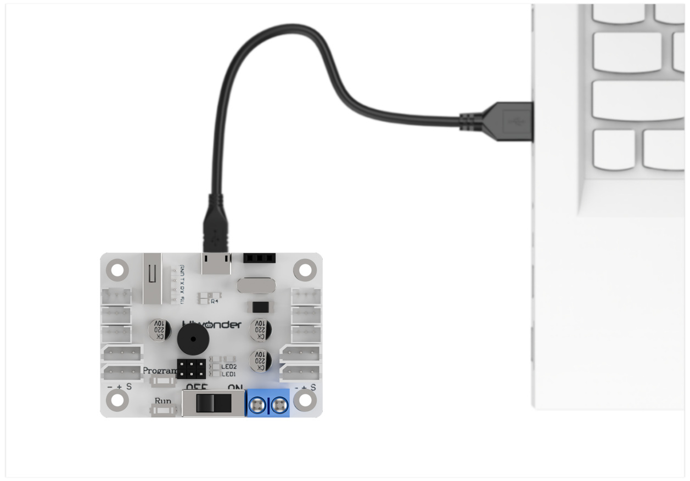

# 7. Serial Communication Course

## 7.1 Communication Principles Between Controller and Device

This section introduces how Spiderbot communicates with various external platforms, such as STM32, 51 microcontrollers, Arduino, Raspberry Pi, etc., explaining how Spiderbot operates as a device and how other systems act as controllers to issue commands and interact with it.

In this section, Spiderbot always acts as a device communicating with external controllers via the UART serial interface.

### 7.1.1 Controller–Device Relationship

In a controller–device communication system, the Spiderbot acts as the device, while other microcontroller boards or computing units serve as controllers.

* **Functions of Spiderbot as a Device**

(1) Receiving and Parsing Signals from the Controller

The Spiderbot continuously monitors its serial interface. When data is received, it parses the serial data based on the communication protocol and invokes the corresponding functionality accordingly.

(2) Performing Actions Based on Incoming Commands:

Once the signal is decoded, the Spiderbot executes the relevant functions, such as triggering an action group or reading sensor data.

(3) Data Packaging and Response

For data requests, Spiderbot invokes the relevant read function, packages the result into a protocol-compliant data packet, and returns it to the controller.

* **Functions of Other Devices as the Controller**

(1) Command Construction and Transmission

The controller must format control commands and data into data packets according to the protocol and transmit them to the device Spiderbot.

(2) Coordination and Management

The controller is responsible for managing system coordination, ensuring stable communication and smooth operation between Spiderbot and other components.

(3) Receiving and Processing Data

When retrieving status information from Spiderbot, the controller sends a read command, receives the returned data, verifies its integrity, and extracts the needed information from the data packet.

### 7.1.2 Hardware Connection

Example: Connecting Spiderbot to a PC

Connect the TXD, RXD, and GND pins from a USB-to-serial adapter to the Spiderbot's D6, D7, and GND pins respectively using jumper wires. Then, plug the USB adapter into your PC. Note: The 5V connection is optional, but GND must be connected to establish a common ground.

:::{Note}

* Even if the controller and Spiderbot use different power sources, they must share a common ground (GND) to maintain stable communication voltage levels.

* Also, ensure that the TX and RX pins are cross-connected (TX to RX, RX to TX) between the controller and Spiderbot to enable proper communication.

:::

### 7.1.3 Data Transmission Format

Spiderbot uses the following default UART serial communication settings:

| Baud Rate  | 9600 |
| :--------- | :--- |
| Data Bits  | 8    |
| Parity Bit | None |
| Stop Bit   | 1    |

### 7.1.4 Communication Protocol

Commands sent from the controller to the Spiderbot should follow the format by starting with CMD, separating parameters using \|, and end with \$.

## 7.2 Serial Port Control via PC

This section demonstrates how to use a PC serial port to control Spiderbot, including calling action groups, controlling the servo of the ultrasonic sensor, reading battery level, and retrieving ultrasonic sensor data.

### 7.2.1 Principle of Operation

:::{Note}

This section requires the secondary-side program for Spiderbot to be preloaded. Please first upload the **"Spiderbot Secondary-side Program"** located in the same folder as this document.

:::

(1) After Spiderbot is connected to the PC via a USB-to-TTL adapter, serial communication can be established. This enables the PC to control Spiderbot via UART serial commands. The default UART configuration is as follows:

| Baud Rate  | 9600 |
| ---------- | ---- |
| Data Bits  | 8    |
| Parity Bit | None |
| Stop Bit   | 1    |

(2) Communication Protocol

The format of a command packet should start with CMD, be separated by \|, and end with \$.

### 7.2.2 Getting Started

* **Hardware Preparation**

Ensure that Spiderbot is properly connected to the PC to enable stable communication.

Connect the USB-to-TTL adapter to Spiderbot port 3 using jumper wires as follows: TXD to IO33, RXD to IO32, and GND to GND.

:::{Note}

The 5V connection is optional, but GND must be connected to establish a common ground.

:::

* **Software Preparation**

(1) Open the [Serial Port Debug Tool](Appendix.md) included in the same folder as this section.

(2) Set the tool to use a baud rate of 9600, parity of NONE, 8 data bits, 1 stop bit, and ensure data is sent as ASCII characters.

### 7.2.3 Function Outcome

To control Spiderbot, send formatted commands through the serial port.

(1) Command: Run Action Group

Function Code: 1

Data: Action group number, the value ranges from 0 to 255 corresponding to action group 0 to 255.

Description: Executes a specific action group on Spiderbot.

Example: Sending "**CMD\|1\|0\|\$**" to executes action group 0, which may correspond to a "**stand at attention**" pose.

(2) Command: Control Head Servo

Function Code: 2

Data: Servo angle, the value ranges from 0 to 180 corresponding to 0 to 180 degrees.

Description: Rotates the servo of the ultrasonic sensor to a specified angle.

Example: Sending "**CMD\|2\|90\|\$**" to set the head servo to 90 degrees.

(3) Command: Read Battery Voltage

Function Code: 3

Description: Requests current battery voltage from Spiderbot, in millivolts.

Data: Not required

Example: Sending "**CMD\|3\|\$**",

Spiderbot will respond with a packet like CMD\|Function Code\|Data\|\$, where the data is the needed battery voltage value.

(4) Command: Read Ultrasonic Sensor Data

Function Code: 4

Description: Retrieves the distance measured by the ultrasonic sensor.

Data: Not required

Example: Sending "**CMD\|4\|\$**" to retrieve the distance measured by the ultrasonic sensor in millimeters

Spiderbot will respond with a packet like CMD\|Function Code\|Data\|\$, where the data is the needed battery voltage value.

